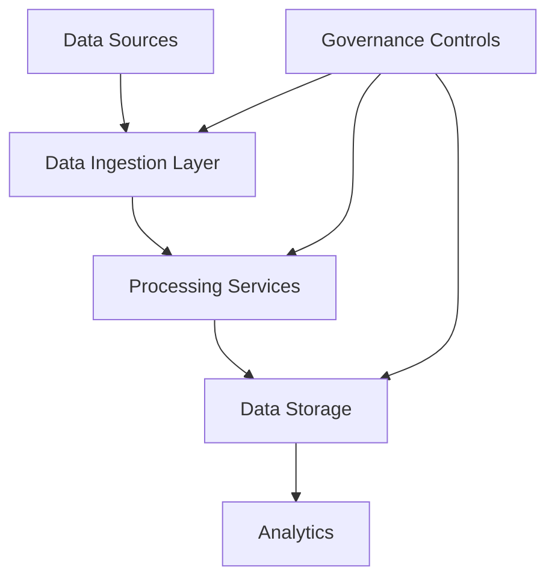
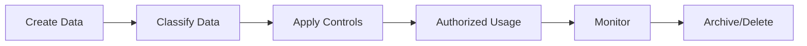

# Agent Platform Data Governance Strategy

**Document Version:** 1.0
**Project:** AI Voice Agent SaaS Platform
**Status:** Draft
**Last Updated:** 2026-07-23

---

# 1. Overview

This document defines the data governance strategy for the AI Voice Agent SaaS Platform.

Data governance establishes the policies, processes, ownership, and controls required to manage platform data securely and effectively.

The strategy ensures:

* Data quality
* Data security
* Data ownership
* Data lifecycle management
* Regulatory readiness
* Responsible AI operations

---

# 2. Data Governance Objectives

The platform must ensure:

* Accurate and reliable data
* Controlled data access
* Secure storage and processing
* Proper retention policies
* Clear ownership responsibilities

---

# 3. Data Governance Architecture



---

# 4. Data Domains

The platform manages:

```text
Data Domains

├── Identity Data

├── Tenant Data

├── Agent Data

├── Conversation Data

├── Voice Data

├── Knowledge Data

├── Operational Data

├── Billing Data

└── Audit Data
```

---

# 5. Data Ownership Model

Each data domain requires:

* Business owner
* Technical owner
* Access owner
* Security responsibility

Example:

| Data Domain         | Owner         |
| ------------------- | ------------- |
| Customer Data       | Product       |
| Agent Data          | AI Team       |
| Infrastructure Logs | DevOps        |
| Security Events     | Security Team |

---

# 6. Data Classification

Data classification levels:

```text
Classification

├── Public

├── Internal

├── Confidential

└── Restricted
```

---

# 7. Customer Data Classification

Examples:

## Confidential

* Customer profiles
* Conversation history
* Agent configurations

## Restricted

* Authentication credentials
* API keys
* Sensitive recordings

---

# 8. Data Lifecycle Management

Lifecycle:

```text
Creation

↓

Storage

↓

Processing

↓

Usage

↓

Archiving

↓

Deletion
```

---

# 9. Data Retention Strategy

Retention policies define:

* How long data is stored
* Who can access it
* When it is archived
* When it is deleted

---

Example:

```text
Conversation Records

↓

Active Storage

↓

Archive

↓

Deletion Policy
```

---

# 10. Data Access Governance

Access must follow:

* Least privilege
* Role-based access control
* Tenant isolation
* Audit tracking

---

Example:

```text
User Request

↓

Permission Check

↓

Data Access

↓

Audit Record
```

---

# 11. Multi-Tenant Data Governance

Tenant data must remain isolated.

Controls:

* Tenant identifiers
* Row-level security
* Database policies
* Authorization checks

---

# 12. Data Quality Management

Monitor:

* Completeness
* Accuracy
* Consistency
* Timeliness

---

Example:

```text
Data Created

↓

Validation

↓

Quality Check

↓

Approved Storage
```

---

# 13. Conversation Data Governance

Conversation data includes:

* Messages
* Transcripts
* Summaries
* Metadata
* Call events

Controls:

* Access permissions
* Retention policies
* Encryption
* Audit logging

---

# 14. Voice Data Governance

Voice data includes:

* Audio recordings
* Transcriptions
* Call metadata

Requirements:

* Recording policies
* Storage controls
* Customer consent handling
* Deletion workflows

---

# 15. Knowledge Data Governance

RAG documents require:

* Ownership
* Version control
* Approval process
* Expiration management

---

Example:

```text
Document Upload

↓

Validation

↓

Embedding Generation

↓

Knowledge Availability
```

---

# 16. AI Data Governance

AI systems require governance over:

* Training data
* Prompts
* Retrieved context
* Agent memory

Controls:

* Data filtering
* Access restrictions
* Quality validation

---

# 17. Data Security Controls

Required controls:

* Encryption at rest
* Encryption in transit
* Secret management
* Access logging
* Backup protection

---

# 18. Data Privacy Controls

Implement:

* Data minimization
* Access transparency
* Retention enforcement
* Data deletion workflows

---

# 19. Data Audit Requirements

Track:

```text
Audit Events

├── Data Access

├── Data Modification

├── Data Export

├── Data Deletion

└── Permission Changes
```

---

# 20. Data Governance Database Entities

Recommended tables:

```text
data_assets

data_classifications

data_owners

data_access_logs

retention_policies

data_quality_checks

deletion_requests
```

---

# 21. Data Governance Workflow



---

# 22. Data Governance Metrics

Measure:

* Data quality score
* Access violations
* Retention compliance
* Data incidents
* Classification coverage

---

# 23. Governance Reviews

Review:

Monthly:

* Data quality
* Access reports

Quarterly:

* Security controls
* Retention policies

---

# 24. Automation Opportunities

Automate:

* Data classification
* Access reviews
* Retention enforcement
* Compliance reporting

---

# 25. Future Enhancements

Potential improvements:

* AI data governance assistant
* Automated privacy monitoring
* Data lineage platform
* Advanced governance analytics

---

# 26. Related Documents

| Document                                    | Purpose    |
| ------------------------------------------- | ---------- |
| 40_Agent_Platform_Security_Threat_Model.md  | Security   |
| 33_Agent_Platform_Compliance_Framework.md   | Compliance |
| 43_Agent_Platform_Governance_Operations.md  | Governance |
| 37_Agent_Platform_Observability_Strategy.md | Monitoring |

---

# 27. Conclusion

The Agent Platform Data Governance Strategy establishes the framework for managing data responsibly across the AI Voice Agent SaaS Platform.

It enables:

* Secure data operations
* Better data quality
* Customer trust
* Enterprise readiness

---

**End of Document**
