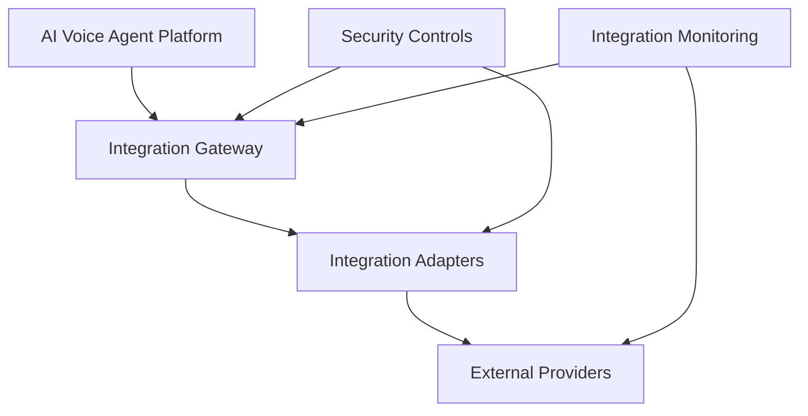
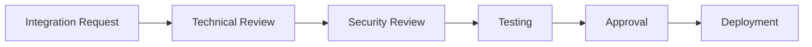

# Agent Platform Integration Governance Strategy

**Document Version:** 1.0
**Project:** AI Voice Agent SaaS Platform
**Status:** Draft
**Last Updated:** 2026-07-23

---

# 1. Overview

This document defines the integration governance strategy for the AI Voice Agent SaaS Platform.

The platform depends on multiple external and internal integrations, including:

* Telephony providers
* AI providers
* CRM systems
* Calendar systems
* Payment services
* Enterprise applications

Integration governance ensures integrations are:

* Secure
* Reliable
* Maintainable
* Scalable
* Properly controlled

---

# 2. Integration Governance Objectives

The objectives are:

* Standardize integration development
* Protect data exchange
* Improve reliability
* Control third-party risks
* Enable faster onboarding

---

# 3. Integration Architecture



---

# 4. Integration Categories

```text id="k9l2e5"
Integrations

├── Communication

│   ├── Twilio

│   └── SIP Providers


├── AI Services

│   ├── LLM Providers

│   ├── STT Providers

│   └── TTS Providers


├── Business Systems

│   ├── CRM

│   ├── Calendar

│   └── ERP


├── Payments

│   └── Billing Providers


└── Infrastructure

    ├── Cloud Services

    └── Monitoring Systems
```

---

# 5. Integration Lifecycle

```text id="n3p9m8"
Request Integration

↓

Technical Evaluation

↓

Security Review

↓

Development

↓

Testing

↓

Approval

↓

Deployment

↓

Monitoring
```

---

# 6. Integration Registration

Every integration requires:

```text id="u9m3ar"
Integration Record

├── Name

├── Provider

├── Purpose

├── Owner

├── Security Classification

├── API Details

├── Credentials

├── Version

└── Status
```

---

# 7. Integration Ownership

Each integration must have:

| Responsibility           | Owner         |
| ------------------------ | ------------- |
| Business Purpose         | Product       |
| Technical Implementation | Engineering   |
| Security Review          | Security      |
| Operations               | Platform Team |

---

# 8. Security Governance

All integrations require:

* Authentication review
* Permission analysis
* Data flow analysis
* Secret management
* Audit logging

---

# 9. API Credential Management

Credentials must:

* Never be stored in code
* Use secret management systems
* Have rotation policies
* Have limited permissions

Example:

```text id="d4k2m1"
Integration Request

↓

Credential Retrieval

↓

Authenticated Call

↓

Audit Log
```

---

# 10. Data Exchange Governance

Every integration must define:

* Data exchanged
* Data owner
* Data sensitivity
* Retention rules

---

Example:

```text id="w7v9t4"
Customer Data

↓

CRM Integration

↓

Synchronization

↓

Audit Record
```

---

# 11. Third-Party Risk Assessment

Evaluate:

* Provider reliability
* Security practices
* Compliance posture
* Service availability
* Cost impact

---

# 12. Integration Reliability Requirements

Monitor:

* API availability
* Response time
* Error rate
* Rate limits
* Failure recovery

---

# 13. Integration Failure Handling

Failures should support:

* Retry logic
* Timeout handling
* Circuit breakers
* Fallback strategies

---

Example:

```text id="p6q2sw"
External Failure

↓

Retry

↓

Fallback

↓

Alert

↓

Recovery
```

---

# 14. Version Management

Track:

* API versions
* SDK versions
* Provider changes
* Migration plans

---

# 15. Integration Testing

Testing includes:

## Functional Testing

* Request validation
* Response handling
* Business logic

## Security Testing

* Authentication
* Authorization
* Data protection

## Reliability Testing

* Failures
* Timeouts
* Recovery

---

# 16. Integration Monitoring

Track:

```text id="m8x0vq"
Integration Metrics

├── Availability

├── Latency

├── Error Rate

├── Usage

├── Cost

└── Provider Health
```

---

# 17. Integration Approval Workflow



---

# 18. Integration Documentation Requirements

Every integration requires:

* Architecture diagram
* API documentation
* Authentication method
* Data mapping
* Error handling
* Support procedure

---

# 19. Integration Database Entities

Recommended tables:

```text id="4n5k8b"
integrations

integration_versions

integration_credentials

integration_events

integration_health

integration_mappings
```

---

# 20. Integration Governance Dashboard

Monitor:

```text id="g1q8pu"
Dashboard

├── Active Integrations

├── Health Status

├── Failures

├── Usage

├── Costs

└── Security Status
```

---

# 21. Integration Change Management

Changes require:

* Impact analysis
* Testing
* Approval
* Documentation update

---

# 22. Vendor Management

Maintain:

* Vendor information
* Contracts
* SLA agreements
* Security reviews
* Renewal dates

---

# 23. Automation Opportunities

Automate:

* Health checks
* Credential rotation
* Integration testing
* Failure detection
* Documentation updates

---

# 24. Future Enhancements

Potential improvements:

* Integration marketplace
* Self-service connectors
* AI integration assistant
* Automated compatibility testing

---

# 25. Related Documents

| Document                                      | Purpose         |
| --------------------------------------------- | --------------- |
| 43_Agent_Platform_Governance_Operations.md    | Governance      |
| 40_Agent_Platform_Security_Threat_Model.md    | Security        |
| 47_Agent_Platform_Service_Level_Objectives.md | Reliability     |
| 49_Agent_Platform_Data_Governance_Strategy.md | Data governance |

---

# 26. Conclusion

The Agent Platform Integration Governance Strategy ensures all integrations are securely designed, properly managed, and operationally reliable.

It enables:

* Faster integration development
* Reduced third-party risk
* Better platform stability
* Enterprise-grade operations

---

**End of Document**
