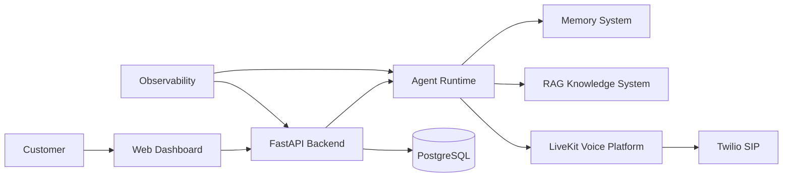
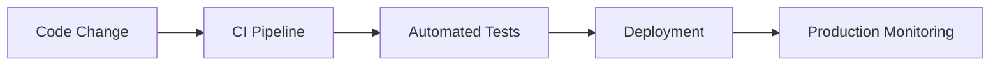

# Agent Platform End-to-End Test Strategy

**Document Version:** 1.0
**Project:** AI Voice Agent SaaS Platform
**Status:** Draft
**Last Updated:** 2026-07-23

---

# 1. Overview

This document defines the end-to-end testing strategy for the AI Voice Agent SaaS Platform.

The objective is to validate that all platform components work together correctly across the complete customer journey.

The testing strategy covers:

* SaaS application flows
* Voice communication
* AI agent execution
* Knowledge retrieval
* Integrations
* Data processing
* Production workflows

---

# 2. Testing Objectives

The testing strategy ensures:

* Functional correctness
* System reliability
* AI quality
* Security validation
* Performance readiness
* Production confidence

---

# 3. End-to-End System Flow



---

# 4. Testing Levels

```text
Testing Strategy

├── Unit Testing

├── Integration Testing

├── API Testing

├── Workflow Testing

├── Voice Testing

├── AI Evaluation Testing

├── Security Testing

├── Performance Testing

└── Production Validation
```

---

# 5. Test Environment Strategy

Required environments:

```text
Development

↓

Testing

↓

Staging

↓

Production
```

Each environment should have:

* Separate databases
* Separate credentials
* Separate configurations
* Controlled access

---

# 6. User Journey Testing

Validate complete workflows.

Example:

```text
Customer Signup

↓

Create Organization

↓

Configure Agent

↓

Upload Knowledge

↓

Assign Phone Number

↓

Receive Call

↓

AI Handles Conversation

↓

Store Conversation

↓

Generate Analytics
```

---

# 7. Authentication Testing

Validate:

* User registration
* Login
* Logout
* Password reset
* MFA
* Session handling

---

# 8. Multi-Tenant Testing

Critical tests:

* Tenant isolation
* Organization permissions
* User roles
* Data separation

Example:

```text
Tenant A

↓

Request Data

↓

Only Tenant A Data Returned
```

---

# 9. Agent Configuration Testing

Validate:

* Agent creation
* Prompt updates
* Tool assignment
* Workflow changes
* Version management

---

# 10. Voice Call Testing

Test:

## Inbound Calls

* Call routing
* Agent assignment
* Audio quality
* Conversation flow

## Outbound Calls

* Campaign execution
* Dialing logic
* Retry handling

---

# 11. SIP and Telephony Testing

Validate:

* SIP connection
* Call setup
* Call termination
* Provider failures
* Transfer handling

---

# 12. LiveKit Testing

Validate:

* Room creation
* Agent joining
* Audio streaming
* Session recovery

---

# 13. AI Agent Testing

Test:

* Response accuracy
* Instruction following
* Tool execution
* Error handling
* Conversation memory

---

# 14. Prompt Evaluation Testing

Evaluate:

* Correctness
* Safety
* Consistency
* Tone
* Compliance

---

# 15. Tool Execution Testing

Validate:

```text
Agent Decision

↓

Tool Selection

↓

Permission Check

↓

Execution

↓

Result Handling
```

---

# 16. Memory System Testing

Validate:

* Short-term memory
* Long-term memory
* Context retrieval
* Memory isolation

---

# 17. RAG Testing

Test:

* Document ingestion
* Embedding creation
* Vector search
* Retrieval accuracy
* Context generation

---

# 18. Database Testing

Validate:

* Schema correctness
* Migration scripts
* Transactions
* Constraints
* Index performance

---

# 19. API End-to-End Testing

Validate:

* Authentication
* Request handling
* Business logic
* Response formats
* Error handling

---

# 20. Integration Testing

Test external systems:

```text
Integrations

├── Twilio

├── LiveKit

├── AI Providers

├── CRM Systems

├── Calendar Systems

└── Payment Systems
```

---

# 21. Security Testing

Validate:

* Authentication security
* Authorization rules
* Data access
* Secret handling
* Injection protection

---

# 22. Performance Testing

Measure:

* Response latency
* Concurrent calls
* API throughput
* Agent processing time

---

# 23. Load Testing Model

Example:

```text
100 Calls

↓

500 Calls

↓

1000 Calls

↓

Measure Stability
```

---

# 24. Failure Testing

Test:

* Provider outage
* Database failure
* Network interruption
* Agent crash
* Service restart

---

# 25. Recovery Testing

Validate:

* Automatic recovery
* Data consistency
* Service restoration
* Rollback procedures

---

# 26. AI Quality Metrics

Measure:

| Metric          | Purpose             |
| --------------- | ------------------- |
| Task Completion | Agent effectiveness |
| Accuracy        | Response quality    |
| Latency         | User experience     |
| Safety          | Risk control        |

---

# 27. Test Automation Strategy

Automate:

* API tests
* Regression tests
* Integration tests
* Deployment validation

---

# 28. Test Data Management

Maintain:

* Synthetic users
* Test organizations
* Sample documents
* Mock conversations

---

# 29. Test Reporting

Generate:

* Test results
* Coverage reports
* Failure analysis
* Quality trends

---

# 30. End-to-End Test Checklist

```text
[ ] User onboarding

[ ] Authentication

[ ] Agent creation

[ ] Knowledge upload

[ ] Voice call flow

[ ] AI response validation

[ ] Tool execution

[ ] Data persistence

[ ] Analytics generation

[ ] Security validation

[ ] Performance validation
```

---

# 31. Test Database Entities

Recommended tables:

```text
test_cases

test_runs

test_results

test_scenarios

quality_metrics

defect_records
```

---

# 32. Continuous Testing Pipeline



---

# 33. Future Enhancements

Potential improvements:

* AI-generated test scenarios
* Automated conversation evaluation
* Synthetic customer simulation
* Self-healing test automation

---

# 34. Related Documents

| Document                                         | Purpose     |
| ------------------------------------------------ | ----------- |
| 44_Agent_Platform_Release_Management.md          | Releases    |
| 48_Agent_Platform_Incident_Management_Process.md | Incidents   |
| 47_Agent_Platform_Service_Level_Objectives.md    | Reliability |
| 40_Agent_Platform_Security_Threat_Model.md       | Security    |

---

# 35. Conclusion

The Agent Platform End-to-End Test Strategy ensures the AI Voice Agent SaaS Platform is validated across the entire system lifecycle.

It provides:

* Higher confidence releases
* Better customer experience
* Reduced production failures
* Continuous quality improvement

---

**End of Document**
