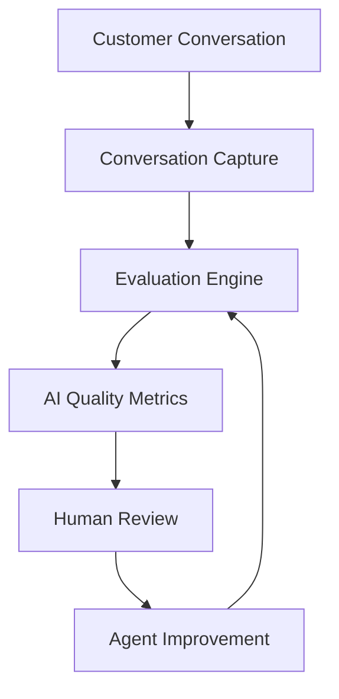
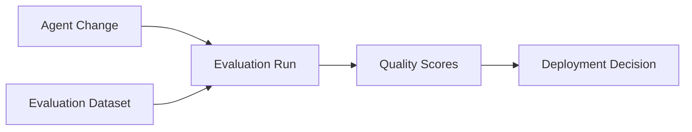

# Agent Platform AI Evaluation Framework

**Document Version:** 1.0
**Project:** AI Voice Agent SaaS Platform
**Status:** Draft
**Last Updated:** 2026-07-23

---

# 1. Overview

This document defines the AI evaluation framework for the AI Voice Agent SaaS Platform.

The purpose of this framework is to measure, validate, and continuously improve AI agent performance across:

* Conversation quality
* Task completion
* Accuracy
* Safety
* Reliability
* Customer satisfaction

AI agents must be evaluated as production systems, not only as model outputs.

---

# 2. Evaluation Objectives

The framework ensures:

* Reliable AI behavior
* Consistent customer experience
* Safe tool usage
* Improved agent performance
* Data-driven optimization

---

# 3. AI Evaluation Architecture



---

# 4. Evaluation Areas

```text
AI Evaluation

├── Response Quality

├── Task Completion

├── Accuracy

├── Safety

├── Tool Usage

├── Memory Quality

├── RAG Quality

├── Latency

└── Customer Satisfaction
```

---

# 5. Evaluation Lifecycle

```text
Conversation

↓

Capture Data

↓

Run Evaluation

↓

Generate Scores

↓

Analyze Failures

↓

Improve Agent

↓

Deploy Updated Version
```

---

# 6. Agent Quality Dimensions

Every agent is evaluated on:

| Dimension   | Description                  |
| ----------- | ---------------------------- |
| Accuracy    | Correct information provided |
| Relevance   | Response matches user intent |
| Completion  | Task successfully finished   |
| Safety      | Avoids harmful behavior      |
| Speed       | Response latency             |
| Consistency | Stable behavior              |

---

# 7. Conversation Evaluation

Evaluate:

* User intent detection
* Response quality
* Conversation flow
* Resolution outcome

Example:

```text
Customer Request

↓

Agent Understanding

↓

Agent Response

↓

Task Result
```

---

# 8. Task Completion Evaluation

Measure whether the agent completed the intended action.

Examples:

* Booking appointment
* Answering questions
* Creating ticket
* Collecting information
* Transferring call

---

# 9. Response Accuracy Evaluation

Validate:

* Facts
* Business rules
* Policies
* Retrieved information

Sources:

* Knowledge base
* APIs
* Business rules

---

# 10. Hallucination Detection

Identify:

* Unsupported answers
* Invented information
* Incorrect claims

Process:

```text
Agent Response

↓

Fact Verification

↓

Confidence Score

↓

Accept / Review
```

---

# 11. RAG Evaluation

Measure:

## Retrieval Quality

* Relevant documents found
* Correct ranking
* Missing information

## Generation Quality

* Correct use of context
* No unsupported claims

---

# 12. Memory Evaluation

Evaluate:

* Correct memory retrieval
* Context continuity
* User preference handling
* Memory isolation

---

# 13. Tool Usage Evaluation

Measure:

* Correct tool selection
* Correct parameters
* Permission compliance
* Successful execution

Example:

```text
Agent Decision

↓

Tool Selection

↓

Parameter Validation

↓

Execution Result
```

---

# 14. Voice Agent Evaluation

Voice-specific metrics:

* Speech recognition accuracy
* Response timing
* Interruption handling
* Natural conversation flow

---

# 15. Latency Evaluation

Measure:

```text
User Speech

↓

STT Processing

↓

LLM Processing

↓

TTS Generation

↓

Audio Response
```

Track:

* First response latency
* Total response time
* Network delay

---

# 16. Safety Evaluation

Test:

* Prompt injection resistance
* Data protection
* Unauthorized actions
* Unsafe responses

---

# 17. Human Evaluation Process

Human reviewers evaluate:

* Conversation quality
* Customer experience
* Agent usefulness

Review criteria:

* Clear instructions
* Correct behavior
* Professional communication

---

# 18. Automated Evaluation

Automate:

* Response scoring
* Regression testing
* Safety checks
* Quality monitoring

---

# 19. Evaluation Metrics

Recommended metrics:

| Metric            | Purpose               |
| ----------------- | --------------------- |
| Task Success Rate | Agent effectiveness   |
| Accuracy Score    | Correctness           |
| Safety Score      | Risk control          |
| CSAT              | Customer satisfaction |
| Latency           | Speed                 |
| Escalation Rate   | Failure measurement   |

---

# 20. Agent Benchmarking

Compare:

* Agent versions
* Prompt versions
* Model versions
* Workflow changes

Example:

```text
Agent Version A

vs

Agent Version B

↓

Quality Comparison
```

---

# 21. Evaluation Dataset

Maintain:

* Real conversations
* Synthetic conversations
* Edge cases
* Failure scenarios

Dataset categories:

```text
Evaluation Data

├── Normal Cases

├── Difficult Cases

├── Security Cases

├── Failure Cases

└── Regression Cases
```

---

# 22. Regression Testing

Before deployment:

Validate:

* Previous capabilities still work
* No quality degradation
* No new failures introduced

---

# 23. AI Evaluation Pipeline



---

# 24. Evaluation Database Entities

Recommended tables:

```text
ai_evaluations

evaluation_runs

evaluation_metrics

conversation_scores

agent_versions

evaluation_feedback
```

---

# 25. Monitoring AI Quality

Track:

* Quality trends
* Failure patterns
* Customer complaints
* Agent degradation

---

# 26. AI Improvement Loop

```text
Measure

↓

Analyze

↓

Identify Problem

↓

Improve Prompt/Model/Workflow

↓

Evaluate

↓

Release
```

---

# 27. Governance Integration

AI evaluations support:

* Agent approval
* Risk assessment
* Release decisions
* Compliance reviews

---

# 28. Future Enhancements

Potential improvements:

* Automated AI judge systems
* Real-time quality scoring
* Self-improving agents
* AI reliability dashboards

---

# 29. Related Documents

| Document                                      | Purpose     |
| --------------------------------------------- | ----------- |
| 51_Agent_Platform_End_to_End_Test_Strategy.md | Testing     |
| 43_Agent_Platform_Governance_Operations.md    | Governance  |
| 40_Agent_Platform_Security_Threat_Model.md    | Security    |
| 47_Agent_Platform_Service_Level_Objectives.md | Reliability |

---

# 30. Conclusion

The Agent Platform AI Evaluation Framework establishes a systematic approach to measuring and improving AI agent quality.

It enables:

* Reliable AI behavior
* Better customer interactions
* Safer automation
* Continuous AI improvement

---

**End of Document**
