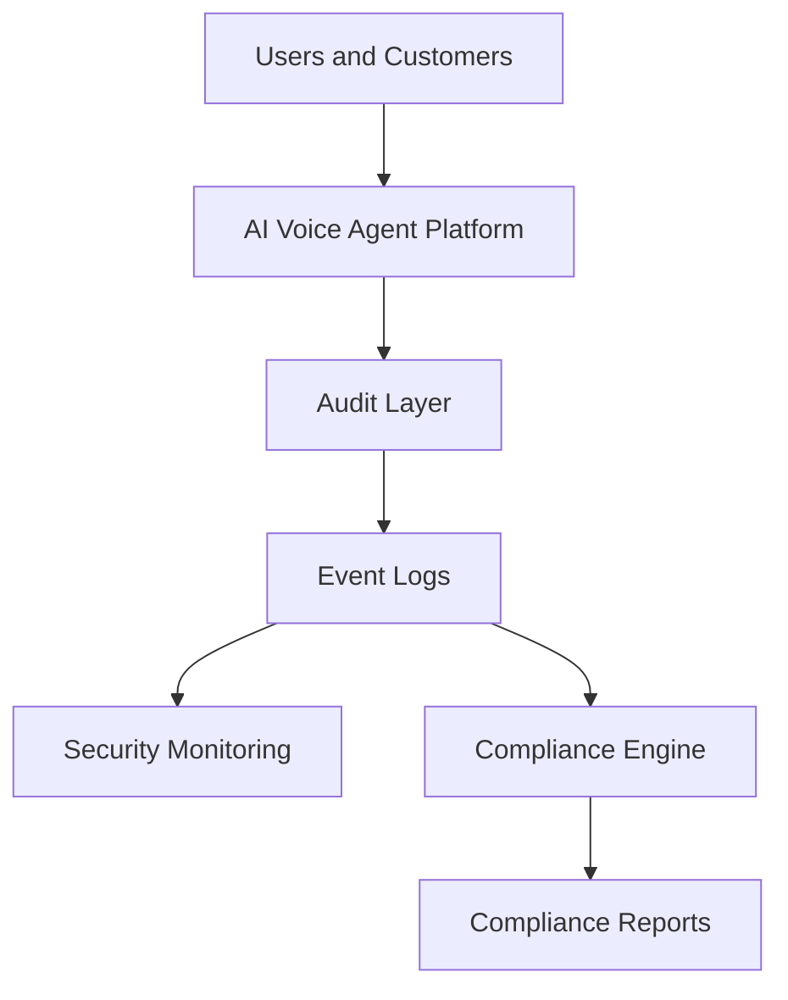

# Agent Platform Audit and Compliance Operations

**Document Version:** 1.0
**Project:** AI Voice Agent SaaS Platform
**Status:** Draft
**Last Updated:** 2026-07-23

---

# 1. Overview

This document defines the audit and compliance operations framework for the AI Voice Agent SaaS Platform.

The purpose is to ensure that platform activities, AI operations, data processing, security controls, and business processes remain:

* Traceable
* Auditable
* Secure
* Compliant
* Transparent

The framework supports enterprise customers and regulated environments.

---

# 2. Compliance Objectives

The platform must provide:

* Complete audit visibility
* Evidence collection
* Policy enforcement
* Security accountability
* Operational transparency

---

# 3. Audit and Compliance Architecture



---

# 4. Audit Domains

```text
Audit Domains

├── User Activity

├── Authentication Events

├── Authorization Changes

├── Agent Actions

├── Data Access

├── Configuration Changes

├── API Activity

├── Security Events

└── Infrastructure Events
```

---

# 5. Audit Event Model

Every audit event should capture:

```text
Audit Event

├── Event ID

├── Timestamp

├── Actor

├── Organization

├── Action

├── Resource

├── Result

├── IP Information

└── Metadata
```

---

# 6. Audit Logging Requirements

Audit logs must be:

* Immutable
* Searchable
* Time-stamped
* Protected from modification
* Retained according to policy

---

# 7. User Activity Auditing

Track:

* Login attempts
* Password changes
* Role changes
* Account updates
* Administrative actions

Example:

```text
User Login

↓

Authentication Check

↓

Success / Failure

↓

Audit Record
```

---

# 8. Agent Activity Auditing

Track:

* Agent creation
* Agent updates
* Prompt changes
* Tool assignments
* Workflow changes
* Deployment events

---

# 9. AI Decision Auditing

AI systems should record:

* Agent version
* Model used
* Tools called
* Retrieved context
* Final action

Example:

```text
Customer Request

↓

Agent Reasoning

↓

Tool Execution

↓

Final Response

↓

Audit Record
```

---

# 10. Data Access Auditing

Monitor:

* Data reads
* Data updates
* Data exports
* Data deletion

Critical data:

* Conversations
* Recordings
* Customer information
* Knowledge documents

---

# 11. Security Audit Operations

Security audits review:

* Access controls
* Authentication
* Permissions
* Vulnerabilities
* Security events

---

# 12. Compliance Framework Support

The platform should support requirements from:

* Data privacy frameworks
* Security standards
* Enterprise compliance programs

Examples:

```text
Compliance Areas

├── Privacy

├── Security

├── Data Retention

├── Access Control

└── Incident Management
```

---

# 13. Compliance Evidence Management

Maintain evidence:

* Policies
* Logs
* Reports
* Security reviews
* Testing results

---

# 14. Audit Review Process

```text
Audit Planning

↓

Evidence Collection

↓

Control Testing

↓

Findings

↓

Remediation

↓

Final Report
```

---

# 15. Compliance Control Management

Controls should define:

* Control owner
* Purpose
* Implementation
* Testing method
* Evidence source

Example:

```text
Control

↓

Implementation

↓

Evidence

↓

Validation
```

---

# 16. Access Review Process

Regularly review:

* User permissions
* Admin access
* Service accounts
* API credentials

---

# 17. Configuration Auditing

Track changes to:

* Agent settings
* Infrastructure
* Security policies
* Integrations
* Database configuration

---

# 18. Change Audit Trail

Every change should include:

```text
Change Request

↓

Approval

↓

Implementation

↓

Validation

↓

Audit Entry
```

---

# 19. Audit Reporting

Generate:

* Security reports
* Compliance reports
* User activity reports
* Agent activity reports

---

# 20. Compliance Dashboard

Required views:

```text
Compliance Dashboard

├── Audit Events

├── Control Status

├── Security Findings

├── Access Reviews

├── Policy Compliance

└── Evidence Status
```

---

# 21. Audit Database Entities

Recommended tables:

```text
audit_events

audit_logs

compliance_controls

compliance_reviews

evidence_records

policy_documents

access_reviews
```

---

# 22. Data Retention for Audit Records

Define:

* Retention period
* Storage location
* Access permissions
* Archive strategy

---

# 23. Audit Security

Protect audit records using:

* Encryption
* Access restrictions
* Integrity verification
* Backup protection

---

# 24. Automated Compliance Monitoring

Automate:

* Policy checks
* Access reviews
* Evidence collection
* Compliance reports

---

# 25. Incident and Audit Relationship

Incidents generate audit evidence.

Flow:

```text
Incident

↓

Investigation

↓

Evidence Collection

↓

Root Cause

↓

Compliance Report
```

---

# 26. Compliance Metrics

Measure:

| Metric           | Purpose            |
| ---------------- | ------------------ |
| Audit Coverage   | Control visibility |
| Compliance Score | Readiness          |
| Open Findings    | Risk level         |
| Resolution Time  | Improvement        |

---

# 27. Governance Integration

Audit operations support:

* Governance reviews
* Security decisions
* Release approvals
* Risk management

---

# 28. Future Enhancements

Potential improvements:

* AI compliance assistant
* Automated evidence generation
* Continuous compliance monitoring
* Policy-as-code enforcement

---

# 29. Related Documents

| Document                                         | Purpose             |
| ------------------------------------------------ | ------------------- |
| 49_Agent_Platform_Data_Governance_Strategy.md    | Data governance     |
| 40_Agent_Platform_Security_Threat_Model.md       | Security            |
| 43_Agent_Platform_Governance_Operations.md       | Governance          |
| 48_Agent_Platform_Incident_Management_Process.md | Incident management |

---

# 30. Conclusion

The Agent Platform Audit and Compliance Operations framework provides the foundation for enterprise-grade accountability and regulatory readiness.

It enables:

* Transparent operations
* Strong security posture
* Compliance readiness
* Customer trust

---

**End of Document**
