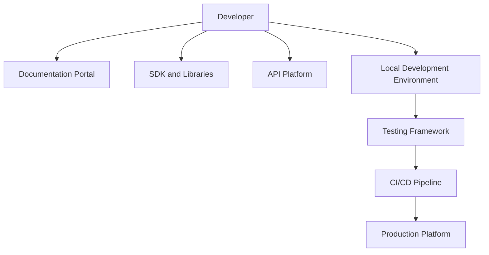
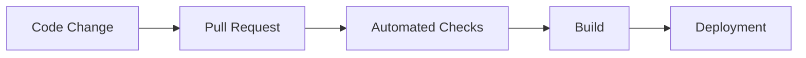

# Agent Platform Developer Experience Strategy

**Document Version:** 1.0
**Project:** AI Voice Agent SaaS Platform
**Status:** Draft
**Last Updated:** 2026-07-23

---

# 1. Overview

This document defines the Developer Experience (DevEx) strategy for the AI Voice Agent SaaS Platform.

The goal is to make it easy for engineers, partners, and future developers to:

* Understand the platform
* Build new capabilities
* Create integrations
* Debug issues
* Deploy safely
* Extend AI agent functionality

A strong developer experience improves:

* Engineering velocity
* Code quality
* Platform adoption
* Long-term maintainability

---

# 2. Developer Experience Objectives

The platform should provide:

* Clear architecture
* Consistent development workflows
* Excellent documentation
* Powerful developer tools
* Fast feedback loops

---

# 3. Developer Experience Architecture



---

# 4. Developer Personas

The platform supports:

```text
Developer Types

├── Backend Engineers

├── Frontend Engineers

├── AI Engineers

├── Integration Developers

├── DevOps Engineers

└── External Developers
```

---

# 5. Development Environment Strategy

Developers should have:

* Local environment setup
* Development database
* Test credentials
* Mock services
* Local AI testing

---

Recommended setup:

```text
Developer Machine

↓

Docker Environment

↓

Local Services

↓

Testing Environment
```

---

# 6. Repository Structure Standards

Recommended structure:

```text
project/

├── frontend/

├── backend/

├── agents/

├── integrations/

├── infrastructure/

├── docs/

├── tests/

└── scripts/
```

---

# 7. Backend Developer Experience

Backend developers should have:

* FastAPI templates
* API standards
* Database migrations
* Testing utilities
* Local debugging tools

---

# 8. Frontend Developer Experience

Frontend developers should have:

* Component library
* Design system
* API client generation
* UI guidelines
* Testing tools

---

# 9. AI Developer Experience

AI developers should have:

* Agent templates
* Prompt management
* Evaluation tools
* Model testing tools
* RAG utilities

---

# 10. Agent Development Workflow

```text
Create Agent

↓

Configure Prompt

↓

Add Tools

↓

Connect Knowledge

↓

Run Evaluation

↓

Deploy Version
```

---

# 11. API Developer Experience

APIs should provide:

* OpenAPI specifications
* Authentication examples
* Request examples
* Error documentation
* SDK generation support

---

# 12. SDK Strategy

Future SDKs may support:

```text
SDKs

├── Python SDK

├── JavaScript SDK

├── TypeScript SDK

├── Mobile SDK

└── Partner SDK
```

---

# 13. Documentation Strategy

Documentation includes:

## Platform Documentation

* Architecture
* Services
* Operations

## Developer Documentation

* APIs
* SDKs
* Tutorials

## AI Documentation

* Agents
* Tools
* Prompts

---

# 14. Developer Portal

The developer portal should provide:

```text
Developer Portal

├── Getting Started

├── API Reference

├── SDK Documentation

├── Examples

├── Tutorials

├── Changelog

└── Support
```

---

# 15. Local Development Experience

Provide:

* One-command startup
* Environment templates
* Docker support
* Database initialization
* Test data generation

Example:

```bash
make dev
```

---

# 16. Testing Experience

Developers should easily run:

* Unit tests
* Integration tests
* Agent evaluations
* API tests

---

# 17. Debugging Experience

Provide:

* Structured logs
* Request tracing
* Agent traces
* Conversation replay
* Error context

---

# 18. AI Debugging Tools

AI developers need:

* Prompt inspection
* Tool execution history
* Retrieved documents
* Model response analysis

---

# 19. Development Standards

Follow:

* Code formatting
* Type checking
* Security rules
* Documentation requirements

---

# 20. CI/CD Developer Workflow



---

# 21. Developer Productivity Metrics

Measure:

| Metric               | Purpose              |
| -------------------- | -------------------- |
| Build Time           | Feedback speed       |
| Deployment Frequency | Delivery speed       |
| Setup Time           | Developer onboarding |
| Issue Resolution     | Productivity         |

---

# 22. Developer Onboarding Process

New developers should complete:

```text
Account Setup

↓

Environment Setup

↓

Architecture Training

↓

First Contribution

↓

Production Access
```

---

# 23. Internal Developer Tools

Recommended tools:

* CLI utilities
* Code generators
* Database tools
* Agent testing tools
* Deployment tools

---

# 24. Integration Developer Experience

External developers need:

* API keys
* Sandbox environment
* Documentation
* Examples
* Support channels

---

# 25. Developer Feedback Loop

Collect:

* Developer feedback
* Documentation issues
* Tooling problems
* Workflow improvements

---

# 26. Developer Experience Database Entities

Recommended tables:

```text
developer_accounts

api_keys

sdk_versions

developer_feedback

documentation_versions

developer_access_logs
```

---

# 27. Automation Opportunities

Automate:

* Project setup
* Documentation generation
* SDK generation
* Environment creation
* Testing workflows

---

# 28. Future Enhancements

Potential improvements:

* AI coding assistant integration
* Agent development studio
* Visual workflow builder
* Marketplace SDK
* Self-service developer onboarding

---

# 29. Related Documents

| Document                                             | Purpose        |
| ---------------------------------------------------- | -------------- |
| 51_Agent_Platform_End_to_End_Test_Strategy.md        | Testing        |
| 50_Agent_Platform_Integration_Governance_Strategy.md | Integrations   |
| 30_Agent_Platform_Implementation_Plan.md             | Implementation |
| 42_Agent_Platform_Master_Index.md                    | Documentation  |

---

# 30. Conclusion

The Agent Platform Developer Experience Strategy creates a foundation for efficient and scalable platform development.

It enables:

* Faster engineering cycles
* Easier onboarding
* Better collaboration
* Stronger platform extensibility

---

**End of Document**
