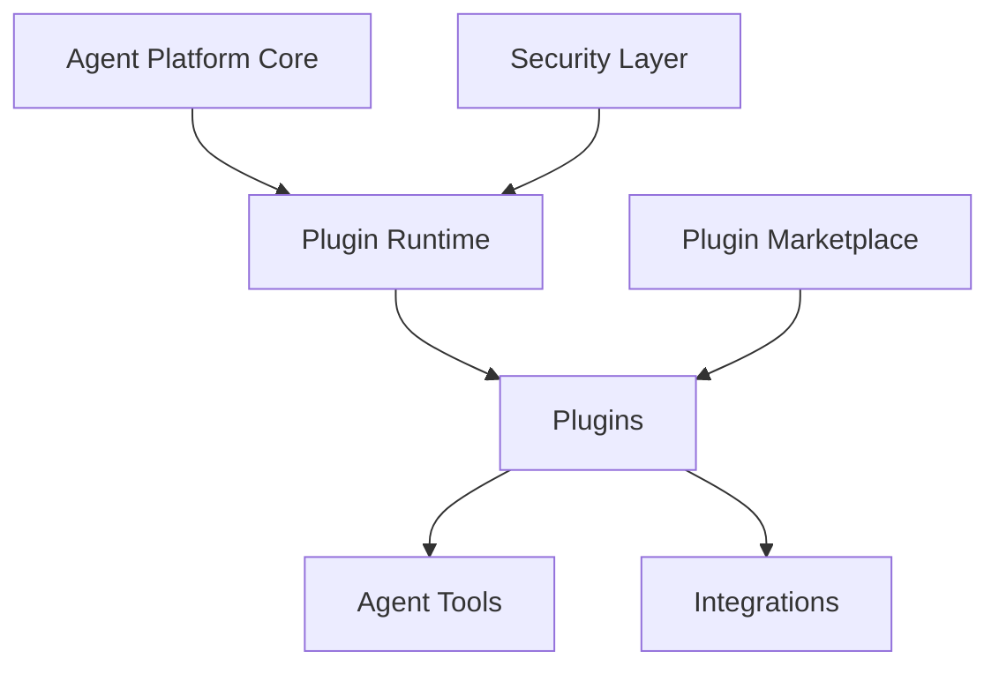

# Agent Platform Plugin and Extensibility Framework

**Document Version:** 1.0
**Project:** AI Voice Agent SaaS Platform
**Status:** Draft
**Last Updated:** 2026-07-23

---

# 1. Overview

This document defines the plugin and extensibility framework for the AI Voice Agent SaaS Platform.

The framework enables the platform to be extended through:

* Custom agent capabilities
* External integrations
* Business-specific tools
* Workflow extensions
* Marketplace components

The goal is to build a flexible platform ecosystem without modifying the core platform.

---

# 2. Extensibility Objectives

The framework provides:

* Modular architecture
* Safe extensions
* Version management
* Developer-friendly APIs
* Enterprise customization

---

# 3. Plugin Architecture



---

# 4. Plugin Categories

```text
Plugin Types

├── Agent Tools

├── Knowledge Connectors

├── Workflow Extensions

├── Voice Extensions

├── CRM Connectors

├── Data Processors

└── Analytics Extensions
```

---

# 5. Plugin Lifecycle

```text
Create Plugin

↓

Register Plugin

↓

Security Review

↓

Test Plugin

↓

Approve

↓

Deploy

↓

Monitor
```

---

# 6. Plugin Registration Model

Every plugin requires:

```text
Plugin Record

├── Plugin ID

├── Name

├── Version

├── Developer

├── Permissions

├── Configuration

├── Dependencies

└── Status
```

---

# 7. Plugin Runtime

The runtime manages:

* Loading plugins
* Executing plugins
* Handling failures
* Managing permissions
* Monitoring performance

---

Example:

```text
Agent Request

↓

Plugin Selection

↓

Permission Check

↓

Plugin Execution

↓

Result Returned
```

---

# 8. Agent Tool Plugins

Tool plugins extend agent abilities.

Examples:

* Booking systems
* CRM lookup
* Payment processing
* Notification services

---

# 9. Workflow Plugins

Workflow plugins provide:

* Custom business logic
* Approval flows
* Automated actions
* Industry-specific processes

---

Example:

```text
Customer Request

↓

Workflow Plugin

↓

Business Rules

↓

Action
```

---

# 10. Knowledge Plugins

Knowledge plugins connect external knowledge sources:

* Websites
* Databases
* Documents
* Enterprise systems

---

# 11. Voice Plugins

Voice extensions may provide:

* Custom voice providers
* Audio processing
* Call routing logic
* Voice analytics

---

# 12. Integration Plugins

Integration plugins connect:

* CRM platforms
* Calendars
* ERP systems
* Messaging platforms

---

# 13. Plugin Security Model

Plugins must define:

* Required permissions
* Data access scope
* API access
* External communication rules

---

Security principles:

```text
Least Privilege

↓

Permission Validation

↓

Execution Control

↓

Audit Logging
```

---

# 14. Plugin Isolation

Plugins should run with:

* Resource limits
* Permission boundaries
* Failure isolation
* Monitoring

---

# 15. Plugin Version Management

Track:

* Plugin versions
* Compatibility
* Dependencies
* Migration requirements

---

Example:

```text
Plugin v1

↓

Update Available

↓

Compatibility Check

↓

Upgrade
```

---

# 16. Plugin Configuration

Plugins require:

* Settings
* Credentials
* Environment variables
* Tenant configuration

---

# 17. Multi-Tenant Plugin Management

Each tenant can have:

* Enabled plugins
* Custom configuration
* Permission settings
* Usage limits

---

Example:

```text
Tenant A

↓

CRM Plugin Enabled


Tenant B

↓

Calendar Plugin Enabled
```

---

# 18. Plugin Testing Requirements

Test:

## Functional

* Plugin behavior
* Input/output handling

## Security

* Permissions
* Data access

## Performance

* Execution time
* Resource usage

---

# 19. Plugin Monitoring

Track:

```text
Plugin Metrics

├── Usage

├── Errors

├── Latency

├── Resource Usage

├── Version

└── Health
```

---

# 20. Plugin Marketplace Concept

Future marketplace features:

* Plugin discovery
* Installation
* Reviews
* Licensing
* Updates

---

# 21. Plugin API Standards

Plugins should follow:

* API contracts
* Authentication standards
* Event standards
* Error handling rules

---

# 22. Plugin Events

Supported events:

```text
Events

├── Agent Created

├── Call Started

├── Call Completed

├── Message Received

├── Tool Executed

└── Workflow Completed
```

---

# 23. Plugin Database Entities

Recommended tables:

```text
plugins

plugin_versions

plugin_permissions

plugin_installations

plugin_configurations

plugin_events

plugin_usage_metrics
```

---

# 24. Plugin Governance

Govern:

* Approval process
* Security review
* Ownership
* Lifecycle management

---

# 25. Developer Experience

Provide:

* Plugin SDK
* Templates
* Documentation
* Testing tools
* Sandbox environment

---

# 26. Automation Opportunities

Automate:

* Plugin validation
* Security scanning
* Deployment
* Compatibility testing

---

# 27. Future Enhancements

Potential improvements:

* AI-generated plugins
* Visual plugin builder
* Community marketplace
* Enterprise plugin ecosystem

---

# 28. Related Documents

| Document                                             | Purpose              |
| ---------------------------------------------------- | -------------------- |
| 54_Agent_Platform_Developer_Experience_Strategy.md   | Developer experience |
| 50_Agent_Platform_Integration_Governance_Strategy.md | Integrations         |
| 52_Agent_Platform_AI_Evaluation_Framework.md         | AI quality           |
| 49_Agent_Platform_Data_Governance_Strategy.md        | Data governance      |

---

# 29. Conclusion

The Agent Platform Plugin and Extensibility Framework provides the foundation for a scalable ecosystem around the AI Voice Agent SaaS Platform.

It enables:

* Custom capabilities
* Faster innovation
* Partner integrations
* Enterprise customization

---

**End of Document**
