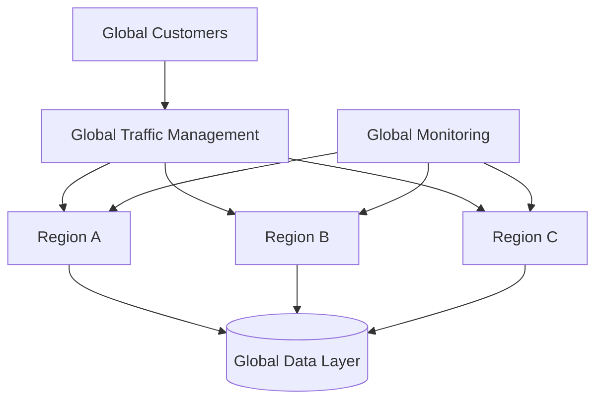

# Agent Platform Multi-Region Deployment Strategy

**Document Version:** 1.0
**Project:** AI Voice Agent SaaS Platform
**Status:** Draft
**Last Updated:** 2026-07-23

---

# 1. Overview

This document defines the multi-region deployment strategy for the AI Voice Agent SaaS Platform.

The objective is to design a globally scalable platform capable of providing:

* Low latency customer experiences
* Regional availability
* Disaster resilience
* Data locality support
* Enterprise-grade reliability

---

# 2. Multi-Region Objectives

The deployment strategy provides:

* Geographic scalability
* Reduced network latency
* Regional fault isolation
* Business continuity
* Compliance flexibility

---

# 3. Multi-Region Architecture



---

# 4. Regional Components

Each region may contain:

```text id="f7m8cw"
Regional Deployment

├── API Services

├── Agent Runtime

├── Voice Workers

├── Cache Layer

├── Database Services

├── Storage

├── Monitoring Agents

└── Security Controls
```

---

# 5. Deployment Models

Supported models:

## Active-Passive

```text id="n1xm2k"
Primary Region

↓

Backup Region
```

Advantages:

* Lower cost
* Simple operations

---

## Active-Active

```text id="h5g8tw"
Region A

+

Region B

+

Region C
```

Advantages:

* High availability
* Better latency
* Global scaling

---

# 6. Regional Selection Strategy

Users should connect to the closest suitable region.

Factors:

* Geographic distance
* Network latency
* Availability
* Data requirements

---

# 7. Voice Platform Regional Strategy

Voice workloads require:

* Low latency
* Regional SIP connectivity
* Local media processing

Flow:

```text id="m7v2pu"
Customer Call

↓

Nearest Voice Region

↓

Agent Runtime

↓

AI Processing

↓

Response
```

---

# 8. Agent Runtime Deployment

Deploy agent workers per region:

Benefits:

* Faster responses
* Regional scaling
* Fault isolation

---

# 9. Database Strategy

Possible approaches:

## Regional Databases

Each region maintains local data.

## Global Database

Centralized database with regional access.

## Hybrid Model

Critical data centralized, operational data regional.

---

# 10. Data Replication Strategy

Replication includes:

* User data
* Agent configuration
* Conversation metadata
* Analytics data

---

Example:

```text id="3j7m4x"
Region A Data

↓

Replication

↓

Region B Data
```

---

# 11. Storage Strategy

Storage includes:

* Call recordings
* Documents
* Logs
* Backups

Consider:

* Regional storage
* Lifecycle rules
* Encryption
* Replication

---

# 12. Cache Strategy

Redis deployment options:

* Regional cache
* Distributed cache
* Session replication

---

# 13. Traffic Management

Use:

* Global load balancing
* DNS routing
* Health checks
* Failover rules

---

# 14. Regional Failover

Failover process:

```text id="d4h7np"
Region Failure

↓

Health Detection

↓

Traffic Redirect

↓

Service Recovery
```

---

# 15. Disaster Recovery Integration

Multi-region supports:

* Backup recovery
* Service continuity
* Regional outage handling

---

# 16. Security Strategy

Each region requires:

* Identity controls
* Network security
* Encryption
* Audit logging

---

# 17. Observability Strategy

Monitor:

```text id="r0z7mv"
Regional Metrics

├── Availability

├── Latency

├── Errors

├── Capacity

├── Cost

└── Security Events
```

---

# 18. Deployment Automation

Use:

* Infrastructure as Code
* Automated pipelines
* Configuration management

Example:

```text id="9fjw8v"
Terraform

↓

Kubernetes

↓

Deployment Pipeline

↓

Regional Platform
```

---

# 19. Configuration Management

Maintain:

* Region-specific settings
* Secrets
* Feature flags
* Service configurations

---

# 20. Compliance Considerations

Support:

* Data residency
* Regional regulations
* Customer requirements
* Audit requirements

---

# 21. Multi-Region Testing

Test:

* Failover
* Data replication
* Regional recovery
* Traffic routing

---

# 22. Capacity Planning

Each region requires:

* CPU capacity
* Memory capacity
* Voice worker capacity
* Database capacity

---

# 23. Cost Optimization

Optimize:

* Regional resources
* Storage
* Data transfer
* Compute usage

---

# 24. Multi-Region Database Entities

Recommended tables:

```text id="x1v3sm"
regions

region_services

regional_configs

failover_events

replication_status

deployment_records
```

---

# 25. Operational Ownership

| Area                    | Owner         |
| ----------------------- | ------------- |
| Regional Infrastructure | DevOps        |
| Voice Platform          | Voice Team    |
| Data Replication        | Database Team |
| Security                | Security Team |
| Monitoring              | SRE           |

---

# 26. Future Enhancements

Potential improvements:

* Autonomous regional scaling
* AI-based traffic routing
* Edge agent execution
* Global AI workload optimization

---

# 27. Related Documents

| Document                                         | Purpose     |
| ------------------------------------------------ | ----------- |
| 46_Agent_Platform_Capacity_Planning_Strategy.md  | Capacity    |
| 47_Agent_Platform_Service_Level_Objectives.md    | Reliability |
| 48_Agent_Platform_Incident_Management_Process.md | Operations  |
| 32_Agent_Platform_Deployment_Architecture.md     | Deployment  |

---

# 28. Conclusion

The Agent Platform Multi-Region Deployment Strategy provides the foundation for global-scale operation of the AI Voice Agent SaaS Platform.

It enables:

* High availability
* Global performance
* Regional resilience
* Enterprise scalability

---

**End of Document**
