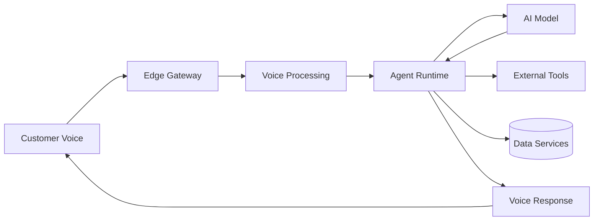

# Agent Platform Edge and Low Latency Strategy

**Document Version:** 1.0
**Project:** AI Voice Agent SaaS Platform
**Status:** Draft
**Last Updated:** 2026-07-23

---

# 1. Overview

This document defines the edge computing and low-latency strategy for the AI Voice Agent SaaS Platform.

Real-time voice AI requires extremely fast processing between:

* User speech
* Speech recognition
* Agent reasoning
* Tool execution
* Text-to-speech generation

The objective is to minimize response delays and provide natural human-like conversations.

---

# 2. Low Latency Objectives

The platform should optimize:

* Audio processing delay
* Network latency
* AI inference time
* Tool execution time
* Data retrieval speed

---

# 3. Latency Architecture



---

# 4. Latency Sources

Total response latency includes:

```text id="q3c6pk"
Total Latency

=

Network Delay

+

STT Processing

+

Agent Processing

+

LLM Generation

+

Tool Execution

+

TTS Processing
```

---

# 5. Edge Computing Strategy

Edge locations provide:

* Regional processing
* Faster connections
* Reduced network hops
* Better user experience

---

# 6. Edge Components

```text id="m4r9vz"
Edge Layer

├── Traffic Routing

├── Voice Gateway

├── Session Management

├── Media Processing

└── Regional Cache
```

---

# 7. Voice Latency Optimization

Optimize:

* Audio streaming
* Packet handling
* Codec selection
* Connection stability

---

Target:

```text id="c4yxw8"
Human Conversation Experience

↓

Minimal Perceived Delay
```

---

# 8. Agent Runtime Optimization

Improve:

* Agent startup time
* Workflow execution
* Tool routing
* Memory access

---

Techniques:

* Warm workers
* Connection pooling
* Cached context

---

# 9. AI Model Latency Optimization

Optimize:

* Model selection
* Token usage
* Context size
* Prompt efficiency

---

Example:

```text id="4mxwq9"
Large Model

↓

Complex Tasks


Small Model

↓

Simple Tasks
```

---

# 10. Streaming Response Strategy

Use streaming for:

* Speech recognition
* Model responses
* Voice generation

Flow:

```text id="9k7v3m"
User Speech

↓

Partial Processing

↓

Immediate Response

↓

Continuous Conversation
```

---

# 11. RAG Latency Optimization

Improve retrieval speed using:

* Vector indexes
* Metadata filtering
* Cached results
* Optimized embeddings

---

# 12. Memory Optimization

Reduce latency through:

* Short-term context caching
* Efficient retrieval
* Memory summarization

---

# 13. Tool Execution Optimization

Tools should support:

* Async execution
* Timeout handling
* Parallel calls
* Result caching

---

Example:

```text id="w8m3j7"
Agent Request

↓

Parallel Tool Calls

↓

Combined Result

↓

Response
```

---

# 14. Database Latency Optimization

Optimize:

* Query performance
* Indexes
* Connection pools
* Read replicas

---

# 15. Cache Strategy

Use caching for:

* Agent configuration
* User context
* Frequently used knowledge
* Integration metadata

---

# 16. Network Optimization

Optimize:

* Routing
* Bandwidth
* Connection reuse
* Regional placement

---

# 17. Latency Monitoring

Track:

```text id="6o2j0q"
Latency Metrics

├── First Response Time

├── Speech Processing Time

├── AI Processing Time

├── Tool Latency

├── TTS Latency

└── End-to-End Delay
```

---

# 18. Performance Budgets

Define latency budgets:

Example:

```text id="8c1x8a"
Voice Pipeline

STT

+

LLM

+

TTS

=

Allowed Response Time
```

---

# 19. Low Latency Testing

Test:

* Real voice calls
* Network variations
* Concurrent sessions
* Regional differences

---

# 20. Edge Failure Handling

Handle:

* Edge node failure
* Network interruption
* Regional overload

Process:

```text id="4f9m2s"
Failure

↓

Detect

↓

Redirect

↓

Recover
```

---

# 21. Deployment Strategy

Deploy:

* Regional services
* Edge workers
* Local caches
* Monitoring agents

---

# 22. Capacity Considerations

Monitor:

* Edge CPU
* Memory
* Active sessions
* Network utilization

---

# 23. Security Considerations

Edge systems require:

* Secure communication
* Authentication
* Encryption
* Access control

---

# 24. Low Latency Database Entities

Recommended tables:

```text id="g6k1s2"
edge_locations

latency_metrics

regional_nodes

routing_rules

performance_events
```

---

# 25. Operational Monitoring

Create dashboards for:

* Regional latency
* Voice quality
* Agent response time
* Network health

---

# 26. Future Enhancements

Potential improvements:

* AI-driven routing
* Edge AI inference
* Autonomous optimization
* Global latency prediction

---

# 27. Related Documents

| Document                                              | Purpose             |
| ----------------------------------------------------- | ------------------- |
| 56_Agent_Platform_Multi_Region_Deployment_Strategy.md | Regional deployment |
| 46_Agent_Platform_Capacity_Planning_Strategy.md       | Capacity            |
| 37_Agent_Platform_Observability_Strategy.md           | Monitoring          |
| 52_Agent_Platform_AI_Evaluation_Framework.md          | AI quality          |

---

# 28. Conclusion

The Agent Platform Edge and Low Latency Strategy ensures the AI Voice Agent SaaS Platform delivers fast, natural, and reliable real-time conversations.

It enables:

* Better voice experiences
* Faster AI responses
* Global scalability
* Improved customer satisfaction

---

**End of Document**
