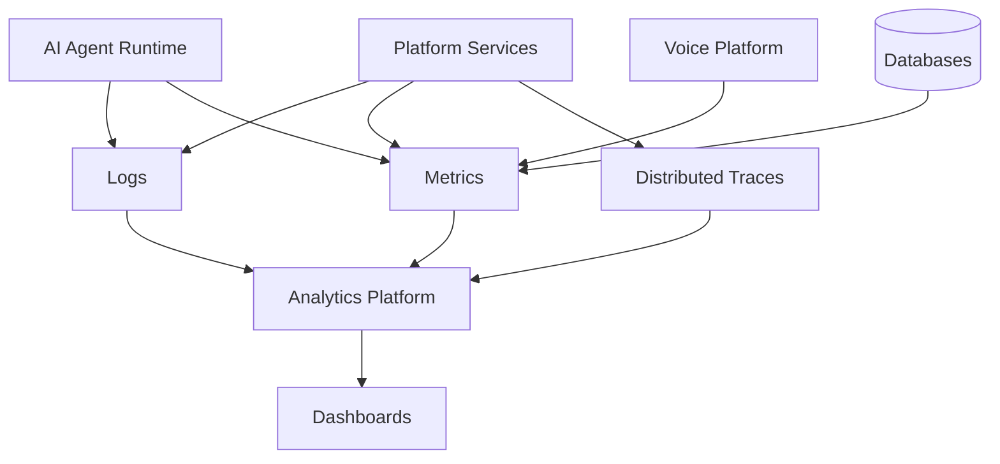
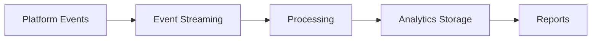

# Agent Platform Observability and Analytics Strategy

**Document Version:** 1.0
**Project:** AI Voice Agent SaaS Platform
**Status:** Draft
**Last Updated:** 2026-07-23

---

# 1. Overview

This document defines the observability and analytics strategy for the AI Voice Agent SaaS Platform.

Observability provides visibility into the complete platform lifecycle, including:

* Application performance
* Voice operations
* AI agent behavior
* Infrastructure health
* Customer experience
* Business metrics

The objective is to detect issues early, understand system behavior, and continuously improve platform performance.

---

# 2. Observability Objectives

The platform must provide:

* Complete system visibility
* Fast troubleshooting
* Performance optimization
* AI quality monitoring
* Operational intelligence

---

# 3. Observability Architecture



---

# 4. Observability Pillars

The platform follows the three core pillars:

```text id="q6s8v1"
Observability

├── Logs

├── Metrics

└── Traces
```

Additional AI-specific signals:

```text
├── AI Quality Signals

├── Conversation Analytics

└── Business Metrics
```

---

# 5. Logging Strategy

Logs provide detailed system events.

Sources:

```text id="w7p4k2"
Logs

├── API Services

├── Agent Runtime

├── Voice Workers

├── Database

├── Integrations

├── Security Systems

└── Infrastructure
```

---

# 6. Structured Logging Standards

Logs should include:

```text id="c3m7n9"
Log Entry

├── Timestamp

├── Service Name

├── Request ID

├── Tenant ID

├── User ID

├── Event Type

├── Severity

└── Metadata
```

---

# 7. Metrics Strategy

Track:

## Infrastructure Metrics

* CPU
* Memory
* Network
* Storage

## Application Metrics

* Requests
* Errors
* Latency
* Throughput

## AI Metrics

* Response quality
* Token usage
* Agent success rate

---

# 8. Distributed Tracing

Tracing follows requests across:

```text id="h4x2q8"
Customer Request

↓

API

↓

Agent Runtime

↓

LLM

↓

Tools

↓

Database

↓

Response
```

---

# 9. Voice Analytics

Monitor:

* Call volume
* Call duration
* Call success rate
* Audio quality
* Transfer rate

---

# 10. AI Agent Analytics

Measure:

```text id="k8v3n5"
Agent Analytics

├── Conversations

├── Tasks Completed

├── Tool Usage

├── Failures

├── Escalations

└── Quality Scores
```

---

# 11. Conversation Analytics

Analyze:

* Customer intent
* Resolution status
* Sentiment
* Topics
* Frequently asked questions

---

# 12. Business Analytics

Track:

* Customer usage
* Agent adoption
* Revenue metrics
* Cost metrics
* Customer engagement

---

# 13. Real-Time Monitoring

Real-time dashboards should display:

```text id="d9p2q5"
Live Monitoring

├── Active Calls

├── Agent Status

├── System Health

├── API Performance

└── Errors
```

---

# 14. Alerting Strategy

Alerts should trigger on:

* Availability issues
* High latency
* Error spikes
* Resource exhaustion
* AI degradation

---

# 15. Alert Severity Model

| Level       | Meaning                   |
| ----------- | ------------------------- |
| Critical    | Immediate action required |
| Warning     | Investigation needed      |
| Information | Normal event              |

---

# 16. AI Quality Monitoring

Track:

* Hallucination rate
* Task completion
* Accuracy
* Customer satisfaction
* Agent confidence

---

# 17. Cost Analytics

Monitor:

```text id="z5v7x1"
AI Costs

├── Token Usage

├── Model Usage

├── Voice Minutes

├── Storage

└── Infrastructure
```

---

# 18. Tenant Analytics

Provide tenant-level insights:

* Usage
* Performance
* Costs
* Agent effectiveness

---

# 19. Analytics Data Pipeline



---

# 20. Observability Data Storage

Store:

* Logs
* Metrics
* Traces
* Analytics events

Requirements:

* Searchability
* Retention policies
* Access controls

---

# 21. Observability Database Entities

Recommended tables:

```text id="v2s9kd"
observability_events

metrics_records

trace_records

alert_events

dashboard_configs

analytics_reports
```

---

# 22. Dashboard Strategy

Required dashboards:

## Platform Dashboard

* System health
* Infrastructure metrics

## Voice Dashboard

* Calls
* Quality
* Failures

## AI Dashboard

* Agent performance
* Quality metrics

## Business Dashboard

* Usage
* Revenue
* Costs

---

# 23. Incident Integration

Observability supports incidents:

```text id="p8q3m1"
Metric Alert

↓

Incident Creation

↓

Investigation

↓

Resolution
```

---

# 24. Observability Automation

Automate:

* Alert detection
* Root cause analysis
* Report generation
* Anomaly detection

---

# 25. Security Monitoring

Monitor:

* Authentication events
* Access violations
* Suspicious behavior
* Data access

---

# 26. Future Enhancements

Potential improvements:

* AI operations assistant
* Predictive monitoring
* Automated root cause analysis
* Self-healing systems

---

# 27. Related Documents

| Document                                         | Purpose           |
| ------------------------------------------------ | ----------------- |
| 37_Agent_Platform_Observability_Strategy.md      | Core monitoring   |
| 48_Agent_Platform_Incident_Management_Process.md | Incident handling |
| 52_Agent_Platform_AI_Evaluation_Framework.md     | AI quality        |
| 46_Agent_Platform_Capacity_Planning_Strategy.md  | Capacity          |

---

# 28. Conclusion

The Agent Platform Observability and Analytics Strategy provides complete visibility into platform health, AI performance, and business operations.

It enables:

* Faster issue detection
* Better decision making
* Improved AI quality
* Reliable scaling

---

**End of Document**
