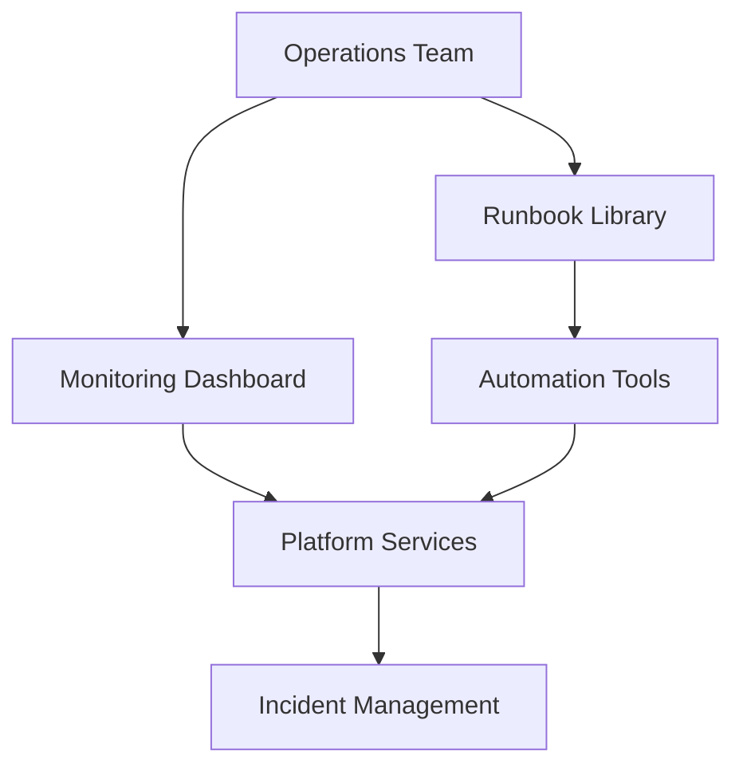

# Agent Platform Operational Runbook Framework

**Document Version:** 1.0
**Project:** AI Voice Agent SaaS Platform
**Status:** Draft
**Last Updated:** 2026-07-23

---

# 1. Overview

This document defines the operational runbook framework for the AI Voice Agent SaaS Platform.

Runbooks provide standardized procedures for operating, monitoring, troubleshooting, and recovering platform services.

The purpose is to ensure:

* Consistent operations
* Faster incident resolution
* Reduced human error
* Better knowledge sharing
* Reliable platform management

---

# 2. Runbook Objectives

Operational runbooks provide:

* Step-by-step procedures
* Troubleshooting guidance
* Recovery actions
* Escalation paths
* Maintenance workflows

---

# 3. Runbook Architecture



---

# 4. Runbook Categories

```text
Runbooks

├── Infrastructure Operations

├── Application Operations

├── Voice Operations

├── AI Agent Operations

├── Database Operations

├── Security Operations

├── Deployment Operations

└── Disaster Recovery Operations
```

---

# 5. Runbook Structure Standard

Every runbook should contain:

```text
Runbook

├── Purpose

├── Scope

├── Preconditions

├── Required Access

├── Procedure

├── Validation Steps

├── Rollback Steps

├── Escalation

└── References
```

---

# 6. Service Operations Runbooks

Each major service requires:

* Health checks
* Restart procedures
* Configuration management
* Troubleshooting steps

---

# 7. API Service Runbook

Covers:

* API availability
* Error investigation
* Performance issues
* Deployment recovery

Example:

```text
API Issue

↓

Check Health Endpoint

↓

Review Logs

↓

Check Dependencies

↓

Recover Service
```

---

# 8. Voice Platform Runbook

Covers:

* SIP connectivity
* Call failures
* Media issues
* Agent connection problems

Flow:

```text
Call Failure

↓

Check Telephony Provider

↓

Check LiveKit

↓

Check Agent Worker

↓

Restore Service
```

---

# 9. AI Agent Runbook

Covers:

* Agent failures
* Prompt issues
* Tool failures
* Memory problems
* RAG issues

---

Example:

```text
Agent Problem

↓

Review Conversation Trace

↓

Check Agent Version

↓

Validate Tools

↓

Apply Fix
```

---

# 10. Database Operations Runbook

Covers:

* Connection issues
* Slow queries
* Migration problems
* Backup restoration

---

# 11. Redis Operations Runbook

Covers:

* Cache failures
* Memory issues
* Expiration problems
* Session recovery

---

# 12. RAG Knowledge System Runbook

Covers:

* Document ingestion failures
* Embedding problems
* Vector search issues
* Index rebuilds

---

# 13. Deployment Runbook

Deployment workflow:

```text
Release

↓

Pre-checks

↓

Deploy

↓

Validate

↓

Monitor

↓

Rollback if Required
```

---

# 14. Rollback Procedures

Every production change requires:

* Rollback plan
* Previous version availability
* Data impact analysis

---

# 15. Monitoring Runbook

Covers:

* Dashboard checks
* Alert validation
* Metric investigation
* Escalation

---

# 16. Security Operations Runbook

Includes:

* Credential rotation
* Security alerts
* Access reviews
* Incident response

---

# 17. Disaster Recovery Runbook

Covers:

* Backup restoration
* Service recovery
* Regional failover
* Data validation

---

# 18. Common Troubleshooting Framework

```text
Detect

↓

Identify Scope

↓

Collect Evidence

↓

Apply Fix

↓

Validate

↓

Document
```

---

# 19. Operational Checklists

Daily checks:

```text
[ ] Platform Health

[ ] Voice Service Status

[ ] Database Health

[ ] Error Monitoring

[ ] Security Events
```

---

Weekly checks:

```text
[ ] Performance Review

[ ] Capacity Review

[ ] Backup Validation

[ ] Dependency Updates
```

---

# 20. Automation Strategy

Automate:

* Health checks
* Service restarts
* Diagnostics
* Report generation
* Maintenance tasks

---

# 21. Runbook Ownership

| Area           | Owner         |
| -------------- | ------------- |
| Infrastructure | DevOps        |
| Voice Platform | Voice Team    |
| AI Runtime     | AI Team       |
| Database       | Backend Team  |
| Security       | Security Team |

---

# 22. Runbook Database Entities

Recommended tables:

```text
runbooks

runbook_versions

runbook_steps

runbook_executions

operational_tasks

maintenance_records
```

---

# 23. Runbook Quality Management

Review:

* Accuracy
* Completeness
* Freshness
* Operational usefulness

---

# 24. Knowledge Management

Runbooks should integrate with:

* Internal documentation
* Incident records
* Engineering knowledge base

---

# 25. Future Enhancements

Potential improvements:

* AI troubleshooting assistant
* Automated remediation
* Interactive runbooks
* Self-healing operations

---

# 26. Related Documents

| Document                                              | Purpose           |
| ----------------------------------------------------- | ----------------- |
| 48_Agent_Platform_Incident_Management_Process.md      | Incident response |
| 58_Agent_Platform_Observability_Analytics_Strategy.md | Monitoring        |
| 56_Agent_Platform_Multi_Region_Deployment_Strategy.md | Deployment        |
| 53_Agent_Platform_Audit_and_Compliance_Operations.md  | Compliance        |

---

# 27. Conclusion

The Agent Platform Operational Runbook Framework establishes a consistent operational model for managing the AI Voice Agent SaaS Platform.

It enables:

* Faster troubleshooting
* Reliable operations
* Better incident response
* Operational scalability

---

**End of Document**
