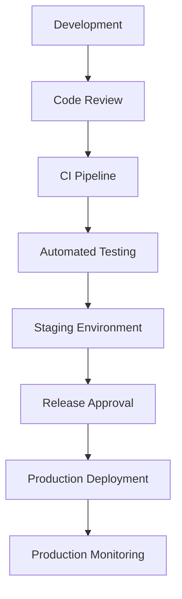

# Agent Platform Release Management Strategy

**Document Version:** 1.0
**Project:** AI Voice Agent SaaS Platform
**Status:** Draft
**Last Updated:** 2026-07-23

---

# 1. Overview

This document defines the release management strategy for the AI Voice Agent SaaS Platform.

Release management ensures that new features, improvements, AI model changes, infrastructure updates, and bug fixes are delivered safely and consistently.

The strategy covers:

* Release planning
* Version control
* Deployment workflows
* Testing requirements
* Rollback procedures
* Production validation

---

# 2. Release Management Objectives

The release process ensures:

* Predictable deployments
* Reduced production risk
* Faster delivery cycles
* Better change visibility
* Reliable customer experience

---

# 3. Release Management Architecture



---

# 4. Release Types

The platform supports:

```text id="k5q1hm"
Release Types

├── Major Release

├── Minor Feature Release

├── Patch Release

├── Security Release

└── Emergency Release
```

---

# 5. Version Management

Follow semantic versioning:

```text id="v2w9ms"
MAJOR.MINOR.PATCH
```

Example:

```text
2.5.1

2 = Major

5 = Minor

1 = Patch
```

---

# 6. Release Lifecycle

```text id="n8s4qr"
Planning

↓

Development

↓

Testing

↓

Approval

↓

Deployment

↓

Monitoring

↓

Review
```

---

# 7. Release Planning

Each release requires:

* Release scope
* Feature list
* Risk assessment
* Dependencies
* Rollback plan

---

# 8. Development Workflow

Standard workflow:

```text id="r7q3lm"
Feature Branch

↓

Code Changes

↓

Pull Request

↓

Review

↓

Merge

↓

Build
```

---

# 9. Code Review Requirements

Review checks:

* Code quality
* Security impact
* Performance impact
* Test coverage
* Documentation updates

---

# 10. Continuous Integration

CI pipeline validates:

* Code formatting
* Unit tests
* Integration tests
* Security scans
* Build process

---

# 11. Testing Requirements

Before release:

```text id="g4m8yx"
Required Tests

├── Unit Tests

├── Integration Tests

├── API Tests

├── AI Evaluation Tests

├── Security Tests

└── Performance Tests
```

---

# 12. AI Release Management

AI changes require additional validation:

* Prompt changes
* Model changes
* Agent workflow updates
* Knowledge updates

---

Example:

```text id="s7z2pk"
AI Change

↓

Evaluation Dataset

↓

Quality Score

↓

Approval

↓

Production
```

---

# 13. Voice Platform Release Process

Voice changes require testing:

* Call flows
* SIP connectivity
* Audio quality
* Agent behavior

---

# 14. Database Release Management

Database changes require:

* Migration scripts
* Backup verification
* Rollback strategy
* Data validation

---

# 15. Deployment Strategy

Supported strategies:

## Blue-Green Deployment

```text id="e6m3sa"
Current Version

↓

New Version

↓

Traffic Switch
```

---

## Canary Deployment

```text id="p4n7vx"
Small Traffic

↓

Monitor

↓

Full Deployment
```

---

# 16. Feature Flags

Use feature flags for:

* Gradual rollout
* Customer-specific features
* A/B testing
* Emergency disabling

---

# 17. Release Approval Process

Approval requires:

* Testing completion
* Security review
* Operational readiness
* Release notes

---

# 18. Production Deployment

Deployment steps:

```text id="w6q2kc"
Pre-check

↓

Deploy

↓

Health Check

↓

Traffic Validation

↓

Monitor
```

---

# 19. Rollback Strategy

Rollback triggers:

* Critical failures
* Performance degradation
* Customer impact

Process:

```text id="h9v5xz"
Problem Detected

↓

Stop Deployment

↓

Restore Previous Version

↓

Validate Recovery
```

---

# 20. Release Monitoring

Monitor:

* Errors
* Latency
* Resource usage
* AI quality
* Customer impact

---

# 21. Release Documentation

Every release includes:

* Release notes
* Changes
* Known issues
* Migration notes
* Rollback instructions

---

# 22. Release Database Entities

Recommended tables:

```text id="x9q3nt"
releases

release_versions

deployment_records

release_approvals

feature_flags

rollback_events
```

---

# 23. Emergency Release Process

Emergency releases handle:

* Security vulnerabilities
* Critical production failures
* Urgent customer issues

Flow:

```text id="b5r8cu"
Issue

↓

Emergency Fix

↓

Fast Validation

↓

Deploy

↓

Review
```

---

# 24. Release Metrics

Track:

| Metric               | Purpose         |
| -------------------- | --------------- |
| Deployment Frequency | Delivery speed  |
| Failure Rate         | Release quality |
| Rollback Rate        | Stability       |
| Recovery Time        | Resilience      |

---

# 25. Release Calendar

Maintain:

* Planned releases
* Maintenance windows
* Major milestones

---

# 26. Release Ownership

| Area           | Owner         |
| -------------- | ------------- |
| Application    | Engineering   |
| AI Agents      | AI Team       |
| Infrastructure | DevOps        |
| Database       | Backend Team  |
| Security       | Security Team |

---

# 27. Automation Opportunities

Automate:

* Version creation
* Release notes
* Testing
* Deployment
* Rollback

---

# 28. Future Enhancements

Potential improvements:

* AI-assisted release validation
* Automated risk scoring
* Progressive delivery
* Self-service deployments

---

# 29. Related Documents

| Document                                              | Purpose         |
| ----------------------------------------------------- | --------------- |
| 51_Agent_Platform_End_to_End_Test_Strategy.md         | Testing         |
| 59_Agent_Platform_Operational_Runbook_Framework.md    | Operations      |
| 58_Agent_Platform_Observability_Analytics_Strategy.md | Monitoring      |
| 44_Agent_Platform_Release_Management.md               | Release process |

---

# 30. Conclusion

The Agent Platform Release Management Strategy establishes a controlled and reliable method for delivering platform changes.

It enables:

* Faster innovation
* Safer deployments
* Better operational control
* Higher customer confidence

---

**End of Document**
