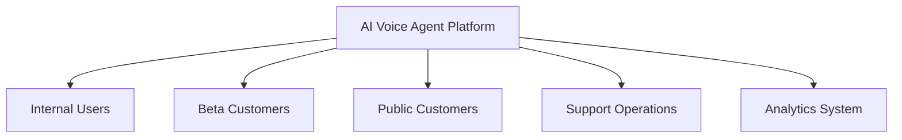

# Agent Platform Launch Strategy

**Document Version:** 1.0
**Project:** AI Voice Agent SaaS Platform
**Status:** Draft
**Last Updated:** 2026-07-23

---

# 1. Overview

This document defines the launch strategy for the AI Voice Agent SaaS Platform.

The purpose of this strategy is to provide a structured approach for introducing the platform to customers while ensuring:

* Technical stability
* Customer success
* Operational readiness
* Controlled growth
* Continuous improvement

---

# 2. Launch Objectives

The launch strategy aims to:

* Successfully onboard initial customers
* Validate product-market fit
* Monitor platform performance
* Collect customer feedback
* Establish operational processes

---

# 3. Launch Phases

```text
Launch Strategy

├── Internal Validation

├── Private Beta

├── Early Access

├── General Availability

└── Growth Phase
```

---

# 4. Launch Architecture



---

# 5. Phase 1: Internal Validation

Objective:

Validate the platform internally before customer exposure.

Activities:

```text
[ ] Complete system testing

[ ] Validate voice workflows

[ ] Test AI agents

[ ] Verify monitoring

[ ] Train internal teams
```

---

# 6. Phase 2: Private Beta

Objective:

Launch with selected customers.

Focus:

* Limited users
* Controlled environments
* Frequent feedback

Checklist:

```text
[ ] Select beta customers

[ ] Configure customer agents

[ ] Monitor usage

[ ] Collect feedback

[ ] Resolve issues
```

---

# 7. Phase 3: Early Access

Objective:

Expand customer adoption while maintaining control.

Activities:

* Increase customer count
* Improve onboarding
* Validate scalability
* Refine pricing model

---

# 8. Phase 4: General Availability

Objective:

Make the platform publicly available.

Requirements:

```text
[ ] Production readiness approved

[ ] Support processes active

[ ] Documentation published

[ ] Billing operational

[ ] Monitoring active
```

---

# 9. Customer Onboarding Strategy

Customer journey:

```text
Customer Signup

↓

Organization Creation

↓

Agent Configuration

↓

Knowledge Upload

↓

Phone Integration

↓

Testing

↓

Production Activation
```

---

# 10. Agent Launch Process

Each customer agent follows:

```text
Create Agent

↓

Configure Personality

↓

Add Knowledge

↓

Assign Tools

↓

Test Conversations

↓

Deploy
```

---

# 11. Voice Number Deployment

Process:

```text
Phone Number

↓

SIP Configuration

↓

Agent Assignment

↓

Call Testing

↓

Activation
```

---

# 12. Customer Migration Strategy

For customers moving from existing systems:

Steps:

* Requirement analysis
* Data migration
* Workflow mapping
* Testing
* Production cutover

---

# 13. Launch Support Model

Support levels:

```text
Support

├── Self-Service

├── Technical Support

├── Customer Success

└── Engineering Escalation
```

---

# 14. Launch Monitoring

Track:

## Technical Metrics

* Availability
* Latency
* Errors
* Call quality

## AI Metrics

* Task completion
* Accuracy
* Escalation rate

## Business Metrics

* Customer adoption
* Usage
* Retention

---

# 15. Customer Feedback Loop

Process:

```text
Customer Feedback

↓

Analysis

↓

Prioritization

↓

Development

↓

Release
```

---

# 16. Launch Risk Management

Common risks:

| Risk               | Mitigation           |
| ------------------ | -------------------- |
| System instability | Controlled rollout   |
| AI quality issues  | Evaluation framework |
| Scaling problems   | Load testing         |
| Customer confusion | Documentation        |

---

# 17. Launch Communication Plan

Prepare:

* Customer announcements
* Documentation updates
* Training material
* Support information

---

# 18. Pricing and Billing Readiness

Validate:

```text
[ ] Subscription plans

[ ] Usage tracking

[ ] Invoice generation

[ ] Payment processing

[ ] Customer billing portal
```

---

# 19. Partner Launch Strategy

Support:

* Integration partners
* Technology partners
* Solution providers

Provide:

* Documentation
* APIs
* Sandbox environments

---

# 20. Launch Analytics

Track:

```text
Launch Metrics

├── Signups

├── Activated Customers

├── Active Agents

├── Call Volume

├── Revenue

└── Retention
```

---

# 21. Launch Database Entities

Recommended tables:

```text
launch_campaigns

customer_launches

onboarding_tasks

feedback_records

activation_metrics

launch_events
```

---

# 22. Post-Launch Review

After launch:

Review:

* Platform performance
* Customer feedback
* Operational issues
* Product improvements

---

# 23. Launch Success Criteria

Success indicators:

```text
[ ] Stable production platform

[ ] Successful customer onboarding

[ ] Positive customer feedback

[ ] Reliable AI performance

[ ] Sustainable operations
```

---

# 24. Future Enhancements

Potential improvements:

* Automated onboarding
* AI-generated agent setup
* Self-service deployment
* Marketplace launch

---

# 25. Related Documents

| Document                                            | Purpose                 |
| --------------------------------------------------- | ----------------------- |
| 62_Agent_Platform_Production_Readiness_Checklist.md | Production readiness    |
| 64_Agent_Platform_Post_Launch_Operations.md         | Operations after launch |
| 52_Agent_Platform_AI_Evaluation_Framework.md        | AI quality              |
| 60_Agent_Platform_Release_Management_Strategy.md    | Release process         |

---

# 26. Conclusion

The Agent Platform Launch Strategy provides a controlled path from development to successful customer adoption.

It enables:

* Safer product introduction
* Better customer experience
* Operational confidence
* Sustainable platform growth

---

**End of Document**
