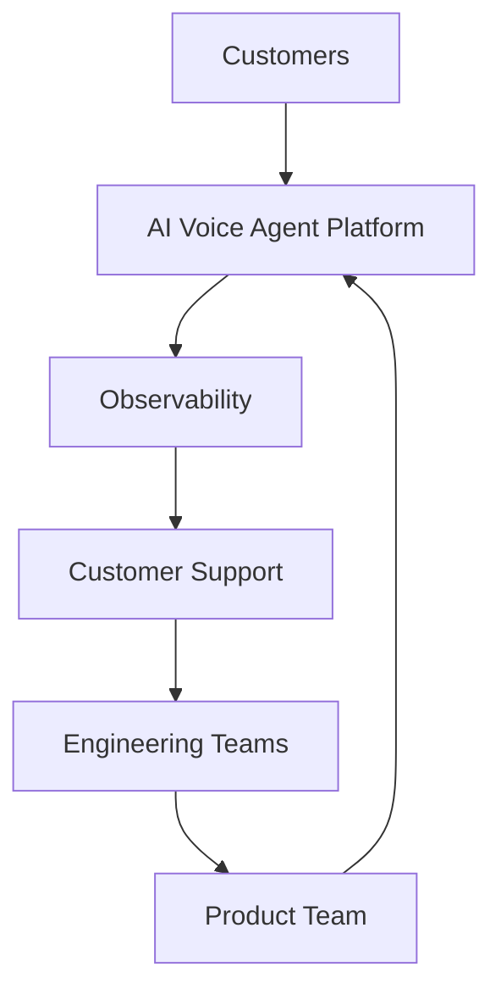

# Agent Platform Post-Launch Operations

**Document Version:** 1.0
**Project:** AI Voice Agent SaaS Platform
**Status:** Draft
**Last Updated:** 2026-07-23

---

# 1. Overview

This document defines the post-launch operational strategy for the AI Voice Agent SaaS Platform.

After production launch, the focus shifts from deployment readiness to:

* Platform reliability
* Customer success
* Continuous improvement
* Performance optimization
* Operational excellence

---

# 2. Post-Launch Objectives

The operational objectives are:

* Maintain service reliability
* Improve customer experience
* Monitor AI quality
* Optimize infrastructure costs
* Continuously enhance platform capabilities

---

# 3. Post-Launch Operating Model

```text id="j5k8rm"
Post-Launch Operations

├── Monitoring

├── Incident Management

├── Customer Support

├── AI Improvement

├── Platform Optimization

└── Product Evolution
```

---

# 4. Operational Architecture



---

# 5. Daily Operations

Daily activities:

```text id="n8q4pc"
[ ] Review platform health

[ ] Check active incidents

[ ] Monitor voice quality

[ ] Review AI performance

[ ] Check customer issues

[ ] Verify integrations
```

---

# 6. Weekly Operations Review

Review:

* Platform metrics
* Customer feedback
* AI performance
* Infrastructure usage
* Open issues

---

# 7. Monthly Platform Review

Evaluate:

```text id="c6m9wk"
Monthly Review

├── Reliability

├── Performance

├── Costs

├── Security

├── AI Quality

└── Product Improvements
```

---

# 8. Customer Success Operations

Monitor:

* Customer adoption
* Agent usage
* Call volume
* Success rate
* Customer satisfaction

---

# 9. Customer Health Metrics

Track:

```text id="p4x7vm"
Customer Health

├── Active Agents

├── Conversation Volume

├── Task Completion

├── Support Requests

├── Satisfaction Score

└── Retention
```

---

# 10. AI Agent Operations

Continuous activities:

* Prompt improvements
* Workflow optimization
* Knowledge updates
* Model evaluation

---

# 11. AI Performance Monitoring

Monitor:

```text id="w6m2qa"
AI Metrics

├── Accuracy

├── Completion Rate

├── Hallucination Rate

├── Response Time

├── Escalation Rate

└── Customer Feedback
```

---

# 12. Knowledge Base Operations

Maintain:

* Documents
* Embeddings
* Retrieval quality
* Knowledge versions

Process:

```text id="r5q8zn"
Knowledge Update

↓

Validation

↓

Embedding Update

↓

Agent Testing

↓

Deployment
```

---

# 13. Incident Management Integration

Post-launch operations use:

* Incident response process
* Root cause analysis
* Postmortems
* Corrective actions

---

# 14. Performance Optimization

Optimize:

* API latency
* Voice response time
* Database queries
* AI inference costs
* Infrastructure resources

---

# 15. Capacity Management

Monitor:

```text id="k7v4mx"
Capacity

├── CPU

├── Memory

├── Database Size

├── Active Calls

├── AI Usage

└── Storage
```

---

# 16. Cost Optimization

Review:

* AI model costs
* Voice provider costs
* Cloud infrastructure
* Storage costs

---

# 17. Security Operations

Continuous activities:

```text id="m3p8vz"
Security Operations

├── Access Reviews

├── Vulnerability Checks

├── Audit Review

├── Credential Rotation

└── Threat Monitoring
```

---

# 18. Release Operations

Manage:

* Feature releases
* Bug fixes
* AI improvements
* Infrastructure updates

---

# 19. Customer Communication

Maintain:

* Release notes
* Service announcements
* Maintenance notices
* Support documentation

---

# 20. Operational Dashboards

Required dashboards:

## Platform Dashboard

* Availability
* Errors
* Performance

## Voice Dashboard

* Calls
* Quality
* Failures

## AI Dashboard

* Agent metrics
* Quality scores

## Business Dashboard

* Usage
* Revenue
* Retention

---

# 21. Post-Launch Data Model

Recommended entities:

```text id="s8n4qc"
customer_health

operational_reviews

platform_metrics

ai_quality_history

optimization_tasks

maintenance_records
```

---

# 22. Continuous Improvement Loop

```text id="z3m6vp"
Measure

↓

Analyze

↓

Improve

↓

Release

↓

Measure Again
```

---

# 23. Operational Ownership

| Area                 | Owner            |
| -------------------- | ---------------- |
| Platform Reliability | SRE              |
| AI Quality           | AI Team          |
| Customer Experience  | Customer Success |
| Security             | Security Team    |
| Product Direction    | Product Team     |

---

# 24. Future Enhancements

Potential improvements:

* AI operations assistant
* Automated optimization
* Predictive incident detection
* Self-healing platform operations

---

# 25. Related Documents

| Document                                              | Purpose         |
| ----------------------------------------------------- | --------------- |
| 63_Agent_Platform_Launch_Strategy.md                  | Launch          |
| 59_Agent_Platform_Operational_Runbook_Framework.md    | Operations      |
| 58_Agent_Platform_Observability_Analytics_Strategy.md | Monitoring      |
| 65_Agent_Platform_Future_Roadmap.md                   | Future planning |

---

# 26. Conclusion

The Agent Platform Post-Launch Operations framework ensures the AI Voice Agent SaaS Platform remains reliable, scalable, and continuously improving after launch.

It enables:

* Stable customer operations
* Better AI performance
* Continuous optimization
* Long-term platform growth

---

**End of Document**
