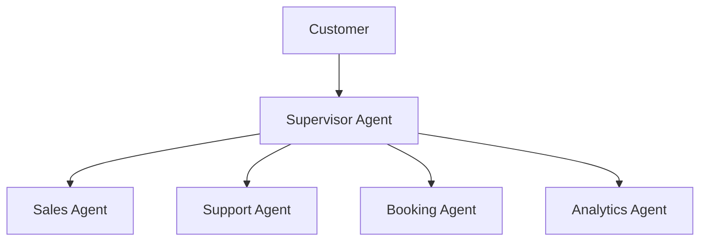

# Agent Platform Future Roadmap

**Document Version:** 1.0
**Project:** AI Voice Agent SaaS Platform
**Status:** Draft
**Last Updated:** 2026-07-23

---

# 1. Overview

This document defines the future roadmap for the AI Voice Agent Platform.

The roadmap describes planned evolution of the platform beyond the initial production release.

The focus areas include:

* Advanced AI capabilities
* Global scalability
* Enterprise features
* Developer ecosystem
* Automation
* Intelligent operations

---

# 2. Roadmap Vision

The long-term vision is to create a fully autonomous AI agent platform capable of:

* Understanding business processes
* Executing complex workflows
* Learning from interactions
* Integrating with enterprise systems
* Operating at global scale

---

# 3. Strategic Roadmap Areas

```text id="n4k8px"
Future Platform Evolution

├── AI Intelligence

├── Agent Automation

├── Enterprise Capabilities

├── Developer Ecosystem

├── Global Infrastructure

├── Analytics Intelligence

└── Autonomous Operations
```

---

# 4. Roadmap Timeline

```text id="v7m2qa"
Phase 1

Production Foundation

↓

Phase 2

Platform Expansion

↓

Phase 3

Enterprise Scale

↓

Phase 4

Autonomous AI Platform
```

---

# 5. Phase 1: Production Foundation

Current priority:

## Platform Stability

Objectives:

* Production reliability
* Customer onboarding
* Operational maturity

Capabilities:

```text id="k3q8mv"
[ ] Multi-tenant platform

[ ] Voice agents

[ ] RAG knowledge system

[ ] Agent workflows

[ ] Monitoring

[ ] Billing foundation
```

---

# 6. Phase 2: Platform Expansion

Future capabilities:

## Advanced Agent Features

* Multi-agent collaboration
* Advanced workflows
* Agent templates
* Industry solutions

---

# 7. Multi-Agent Intelligence

Future architecture:



---

# 8. Autonomous Workflow Engine

Future capabilities:

* Business process automation
* Agent planning
* Long-running tasks
* Event-driven workflows

Example:

```text id="q7n2mx"
Customer Request

↓

AI Planning

↓

Multiple Actions

↓

Business Outcome
```

---

# 9. Enterprise Platform Features

Planned:

```text id="p4k8vz"
Enterprise Features

├── SSO

├── Advanced Permissions

├── Audit Controls

├── Custom Deployment

├── SLA Management

└── Compliance Packages
```

---

# 10. Developer Ecosystem

Future:

* Public SDKs
* Plugin marketplace
* Developer portal
* Community extensions

---

# 11. AI Model Evolution

Future improvements:

* Model routing
* Specialized models
* Local AI deployment
* Custom fine-tuned models

---

# 12. Advanced Memory System

Future memory capabilities:

* Personalization
* Business memory
* Long-term reasoning
* Knowledge graphs

---

# 13. Advanced RAG Evolution

Future improvements:

```text id="w6p3kr"
Basic RAG

↓

Hybrid Search

↓

Knowledge Graph RAG

↓

Autonomous Knowledge Management
```

---

# 14. Voice Intelligence Roadmap

Future voice capabilities:

* Emotional understanding
* Real-time translation
* Voice personalization
* Advanced interruption handling

---

# 15. Global Infrastructure Expansion

Future:

* More regions
* Edge AI processing
* Regional compliance
* Global traffic optimization

---

# 16. AI Analytics Platform

Future analytics:

```text id="c9v5mz"
AI Analytics

├── Conversation Intelligence

├── Customer Insights

├── Business Predictions

├── Agent Optimization

└── Revenue Intelligence
```

---

# 17. Autonomous Operations

Future platform capabilities:

* Self-monitoring
* Self-diagnosis
* Automated recovery
* AI operations assistant

---

# 18. Marketplace Vision

Long-term ecosystem:

```text id="h7q4nx"
Developers

↓

Plugins

↓

Marketplace

↓

Customers

↓

Platform Growth
```

---

# 19. Industry Solutions

Future vertical solutions:

```text id="m8x2qc"
Industry Agents

├── Healthcare

├── Real Estate

├── Home Services

├── Financial Services

├── Education

└── Customer Support
```

---

# 20. Research and Innovation Areas

Explore:

* Agent reasoning
* AI safety
* Autonomous systems
* Human-AI collaboration
* Advanced multimodal AI

---

# 21. Roadmap Prioritization Framework

Prioritize using:

| Factor                | Description           |
| --------------------- | --------------------- |
| Customer Value        | Business impact       |
| Technical Feasibility | Implementation effort |
| Strategic Fit         | Platform alignment    |
| Revenue Potential     | Business opportunity  |

---

# 22. Roadmap Governance

Maintain:

* Quarterly reviews
* Customer feedback analysis
* Technology evaluation
* Market analysis

---

# 23. Future Data Entities

Potential tables:

```text id="x5m9qp"
roadmap_items

feature_requests

innovation_projects

technology_reviews

strategic_initiatives
```

---

# 24. Success Metrics

Measure:

```text id="z8q4mv"
Platform Growth

├── Customers

├── Active Agents

├── Call Volume

├── Revenue

├── AI Quality

└── Developer Adoption
```

---

# 25. Final Agent Platform Completion Status

Agent Platform documentation now includes:

```text id="b7n3kx"
Architecture

✓ Agent Runtime

✓ Voice Integration

✓ AI Evaluation

✓ Security

✓ Governance

✓ Operations

✓ Testing

✓ Deployment

✓ Production Readiness

✓ Future Roadmap
```

---

# 26. Related Documents

| Document                                            | Purpose             |
| --------------------------------------------------- | ------------------- |
| 62_Agent_Platform_Production_Readiness_Checklist.md | Production          |
| 63_Agent_Platform_Launch_Strategy.md                | Launch              |
| 64_Agent_Platform_Post_Launch_Operations.md         | Operations          |
| 42_Agent_Platform_Master_Index.md                   | Documentation index |

---

# 27. Conclusion

The Agent Platform Future Roadmap defines the long-term evolution path for the AI Voice Agent SaaS Platform.

The roadmap transforms the platform from a voice automation system into a complete AI agent ecosystem capable of:

* Intelligent automation
* Enterprise adoption
* Global scale
* Autonomous operations

---

**End of Document**
