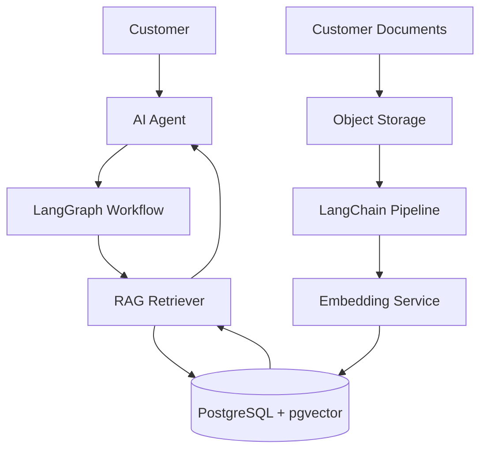

# RAG Knowledge Platform System Architecture

**Document Version:** 1.0
**Project:** AI Voice Agent SaaS Platform
**Phase:** 03 - RAG Knowledge Platform
**Status:** Draft
**Last Updated:** 2026-07-23

---

# 1. Overview

This document defines the system architecture of the RAG (Retrieval Augmented Generation) Knowledge Platform.

The RAG platform provides AI agents with access to customer-specific knowledge, documents, business data, and operational information.

The goal is to enable AI agents to:

* Retrieve accurate information
* Reduce hallucinations
* Provide customer-specific responses
* Maintain knowledge isolation
* Support enterprise-scale knowledge management

---

# 2. RAG Platform Objectives

The RAG platform provides:

* Document ingestion
* Knowledge processing
* Embedding generation
* Vector search
* Context retrieval
* Knowledge versioning
* Agent integration

---

# 3. High-Level RAG Architecture



---

# 4. RAG Request Flow

A user request follows:

```text
Customer Question

↓

AI Agent

↓

Intent Detection

↓

Knowledge Retrieval

↓

Relevant Documents

↓

Context Construction

↓

LLM Generation

↓

Voice Response
```

---

# 5. Core RAG Components

```text
RAG Platform

├── Document Management

├── Ingestion Pipeline

├── Text Processing

├── Embedding Service

├── Vector Database

├── Retrieval Engine

├── Context Builder

├── Evaluation System

└── Monitoring System
```

---

# 6. LangChain Role

LangChain is responsible for:

* Document loaders
* Text splitting
* Embedding workflows
* Retrieval chains
* Tool integration
* Agent communication

Architecture:

```text
Document

↓

LangChain Loader

↓

Text Splitter

↓

Embedding Model

↓

Vector Store
```

---

# 7. Document Ingestion Architecture

Supported sources:

```text
Documents

├── PDF

├── DOCX

├── TXT

├── CSV

├── Web Pages

├── Knowledge Articles

└── APIs
```

Processing flow:

```text
Upload

↓

Validation

↓

Extraction

↓

Cleaning

↓

Chunking

↓

Embedding

↓

Indexing
```

---

# 8. Embedding Architecture

The embedding system converts text into numerical representations.

Flow:

```text
Text

↓

Embedding Model

↓

Vector Representation

↓

Vector Database
```

Stored information:

```text
Vector Record

├── Embedding

├── Document ID

├── Tenant ID

├── Metadata

└── Version
```

---

# 9. Vector Database Architecture

Primary storage:

```text
PostgreSQL

+

pgvector Extension
```

Stores:

* Embeddings
* Metadata
* Document references
* Tenant information

---

# 10. Retrieval Architecture

Retrieval pipeline:

```text
User Query

↓

Query Embedding

↓

Similarity Search

↓

Metadata Filtering

↓

Ranking

↓

Relevant Context
```

---

# 11. Hybrid Search Strategy

Future production search:

```text
Hybrid Retrieval

├── Vector Search

├── Keyword Search

├── Metadata Filtering

└── Reranking
```

---

# 12. Agent Integration

RAG connects with agents through tools.

Example:

```text
Agent

↓

Knowledge Search Tool

↓

Retriever

↓

Relevant Information

↓

Agent Response
```

---

# 13. LangGraph Integration

LangGraph manages RAG workflows:

```text
User Input

↓

Agent Node

↓

Decision Node

↓

Retrieval Node

↓

Reasoning Node

↓

Response Node
```

---

# 14. Multi-Tenant RAG Architecture

Each customer requires isolated knowledge.

Isolation model:

```text
Tenant A

├── Documents

├── Embeddings

└── Metadata


Tenant B

├── Documents

├── Embeddings

└── Metadata
```

---

# 15. Knowledge Lifecycle

```text
Create

↓

Process

↓

Index

↓

Use

↓

Update

↓

Archive
```

---

# 16. Security Requirements

The RAG system must provide:

* Tenant isolation
* Access control
* Document permissions
* Audit logging
* Encryption

---

# 17. Performance Requirements

Optimize:

* Retrieval latency
* Embedding speed
* Index performance
* Context size
* Cache usage

---

# 18. RAG Monitoring

Monitor:

```text
RAG Metrics

├── Retrieval Accuracy

├── Search Latency

├── Token Usage

├── Context Quality

└── Answer Quality
```

---

# 19. RAG Data Entities

Recommended tables:

```text
knowledge_bases

documents

document_chunks

embeddings

retrieval_events

knowledge_versions

```

---

# 20. Technology Stack

Recommended:

| Component     | Technology     |
| ------------- | -------------- |
| Backend       | Python FastAPI |
| Framework     | LangChain      |
| Workflow      | LangGraph      |
| Database      | PostgreSQL     |
| Vector Search | pgvector       |
| Cache         | Redis          |
| Storage       | Object Storage |
| AI Models     | OpenAI Models  |

---

# 21. Future Enhancements

Future capabilities:

* Knowledge graphs
* Agent memory integration
* Autonomous document updates
* Multi-modal RAG
* Enterprise search

---

# 22. Related Documents

| Document                              | Purpose            |
| ------------------------------------- | ------------------ |
| 02_LangChain_Ingestion_Pipeline.md    | Document ingestion |
| 05_Vector_Database_pgvector_Design.md | Vector storage     |
| 11_LangGraph_RAG_Workflow_Design.md   | Agent workflows    |
| 15_RAG_Evaluation_Framework.md        | Quality evaluation |

---

# 23. Conclusion

The RAG Knowledge Platform provides the intelligence layer that allows AI agents to access accurate, customer-specific information.

It forms the foundation for:

* Enterprise knowledge management
* Reliable AI responses
* Reduced hallucination
* Scalable AI automation

---

**End of Document**
