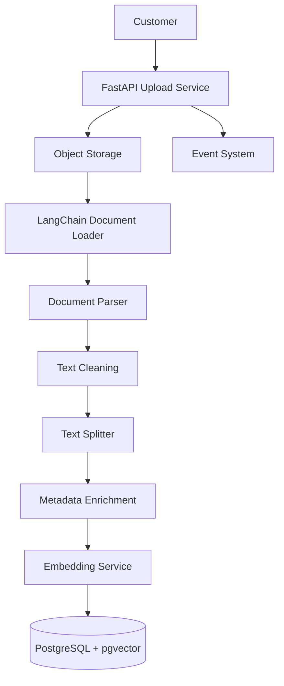
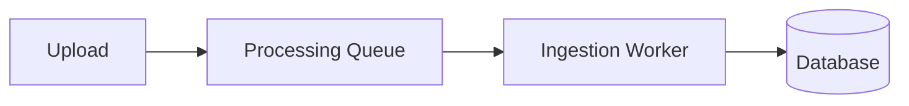

# LangChain Document Ingestion Pipeline

**Document Version:** 1.0
**Project:** AI Voice Agent SaaS Platform
**Phase:** 03 - RAG Knowledge Platform
**Status:** Draft
**Last Updated:** 2026-07-23

---

# 1. Overview

This document defines the LangChain-based document ingestion pipeline for the RAG Knowledge Platform.

The ingestion pipeline transforms raw customer knowledge sources into searchable AI knowledge assets.

The pipeline handles:

* Document upload
* Content extraction
* Cleaning
* Chunking
* Metadata enrichment
* Embedding generation
* Vector indexing

---

# 2. Ingestion Pipeline Objectives

The ingestion system must provide:

* Reliable document processing
* High-quality chunks
* Accurate metadata
* Fast indexing
* Tenant isolation
* Reproducible processing

---

# 3. Ingestion Architecture



---

# 4. Supported Document Sources

The ingestion pipeline supports:

```text id="r6m2vx"
Sources

├── PDF Files

├── DOCX Files

├── TXT Files

├── Markdown Files

├── CSV Files

├── Web Pages

├── APIs

└── Database Records
```

---

# 5. Upload Workflow

Customer upload flow:

```text id="q8m5pk"
Customer Upload

↓

Authentication

↓

Tenant Validation

↓

File Validation

↓

Store Document

↓

Create Processing Job
```

---

# 6. Document Storage Strategy

Original documents are stored separately from vectors.

Architecture:

```text id="b5x7mn"
Object Storage

├── Original Files

├── Processed Files

├── Metadata

└── Versions
```

Examples:

* AWS S3
* Google Cloud Storage
* Azure Blob Storage
* MinIO

---

# 7. LangChain Document Loaders

LangChain loaders convert files into documents.

Example:

```text id="p4v8mz"
PDF

↓

PDF Loader

↓

LangChain Document Object
```

Document object contains:

```text id="w7n2kc"
Document

├── Page Content

└── Metadata
```

---

# 8. Document Processing Pipeline

Processing stages:

```text id="n5q9rx"
Raw Document

↓

Extraction

↓

Normalization

↓

Cleaning

↓

Chunking

↓

Embedding

↓

Indexing
```

---

# 9. Text Cleaning

Cleaning operations:

* Remove unnecessary whitespace
* Normalize encoding
* Remove duplicate content
* Fix formatting issues
* Extract meaningful text

---

# 10. Text Chunking Strategy

Chunking is critical for retrieval quality.

Example:

```text id="z3m8pv"
Large Document

↓

Smaller Chunks

↓

Embeddings

↓

Searchable Knowledge
```

---

# 11. Chunking Parameters

Important parameters:

| Parameter     | Purpose                   |
| ------------- | ------------------------- |
| Chunk Size    | Amount of text per vector |
| Chunk Overlap | Preserve context          |
| Separators    | Maintain meaning          |

---

# 12. Metadata Enrichment

Each chunk receives metadata:

```text id="m6q4yz"
Chunk Metadata

├── Tenant ID

├── Document ID

├── File Name

├── Category

├── Version

├── Created Date

└── Permissions
```

---

# 13. Embedding Generation Flow

```text id="h9v2kp"
Chunk Text

↓

Embedding Model

↓

Vector

↓

Storage
```

---

# 14. Processing Queue Architecture

Large documents should use asynchronous processing.



---

# 15. Background Worker Responsibilities

Workers handle:

* Document processing
* Chunk creation
* Embedding generation
* Index updates
* Error handling

---

# 16. Error Handling Strategy

Handle:

```text id="s2m7vx"
Processing Error

↓

Capture Error

↓

Retry

↓

Log Failure

↓

Notify User
```

---

# 17. Document Versioning

Every document should maintain versions.

Example:

```text id="c8p5mq"
Document

Version 1

↓

Version 2

↓

Version 3
```

---

# 18. Multi-Tenant Processing

Each ingestion job includes:

```text id="x4m9pk"
Processing Context

├── Tenant ID

├── User ID

├── Permissions

└── Knowledge Base ID
```

---

# 19. Security Controls

Required:

* File validation
* Malware scanning
* Permission checks
* Access tracking
* Encryption

---

# 20. Ingestion Database Entities

Recommended tables:

```text id="v7m3qx"
documents

document_versions

processing_jobs

document_chunks

ingestion_errors

chunk_metadata
```

---

# 21. Ingestion Monitoring

Monitor:

```text id="a9k6mw"
Metrics

├── Documents Processed

├── Processing Time

├── Failed Jobs

├── Chunk Count

└── Embedding Cost
```

---

# 22. Performance Optimization

Optimize:

* Batch processing
* Parallel workers
* Embedding batching
* Cache usage
* Incremental updates

---

# 23. Production Deployment Model

Recommended:

```text id="q5m8zn"
FastAPI

↓

Task Queue

↓

LangChain Workers

↓

Embedding Service

↓

Vector Database
```

---

# 24. Future Enhancements

Potential improvements:

* Automatic document classification
* AI-powered summarization
* Intelligent chunking
* Multi-modal ingestion
* Real-time synchronization

---

# 25. Related Documents

| Document                             | Purpose              |
| ------------------------------------ | -------------------- |
| 01_RAG_System_Architecture.md        | Overall architecture |
| 03_Document_Processing_Pipeline.md   | Processing details   |
| 04_Embedding_Service_Architecture.md | Embedding system     |
| 12_Multi_Tenant_RAG_Architecture.md  | Tenant isolation     |

---

# 26. Conclusion

The LangChain Document Ingestion Pipeline creates the foundation for converting business knowledge into AI-searchable information.

It enables:

* Reliable knowledge ingestion
* High-quality retrieval
* Scalable processing
* Enterprise-ready AI agents

---

**End of Document**
