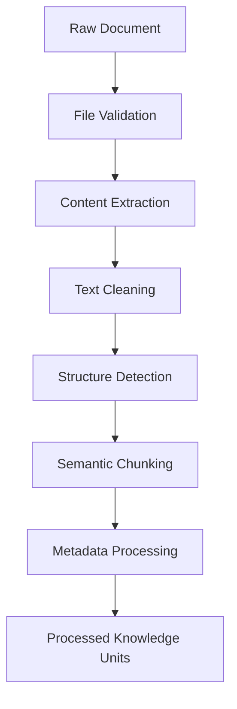

# Document Processing Pipeline

**Document Version:** 1.0
**Project:** AI Voice Agent SaaS Platform
**Phase:** 03 - RAG Knowledge Platform
**Status:** Draft
**Last Updated:** 2026-07-23

---

# 1. Overview

This document defines the document processing pipeline used by the RAG Knowledge Platform.

The document processing pipeline transforms raw customer documents into clean, structured, AI-ready knowledge units.

The pipeline prepares data for:

* Embedding generation
* Vector storage
* Semantic search
* AI agent retrieval

---

# 2. Processing Objectives

The document processor must provide:

* Accurate text extraction
* High-quality chunk creation
* Metadata preservation
* Content normalization
* Processing reliability

---

# 3. Document Processing Architecture



---

# 4. Processing Lifecycle

```text id="c7n4mx"
Document Received

↓

Validation

↓

Extraction

↓

Cleaning

↓

Analysis

↓

Chunking

↓

Metadata Generation

↓

Ready for Embedding
```

---

# 5. Supported File Processing

Supported formats:

```text id="k5q8mv"
File Types

├── PDF

├── DOCX

├── TXT

├── Markdown

├── CSV

├── HTML

└── JSON
```

---

# 6. File Validation

Before processing:

Validate:

```text id="m3x7qp"
[ ] File type

[ ] File size

[ ] File integrity

[ ] Security scan

[ ] Tenant permission
```

---

# 7. Content Extraction

Extraction converts files into machine-readable content.

Examples:

```text id="z4p8nk"
PDF

↓

Text Extraction


DOCX

↓

Paragraph Extraction


CSV

↓

Structured Records
```

---

# 8. PDF Processing

PDF pipeline:

```text id="r6m2vx"
PDF File

↓

Page Detection

↓

Text Extraction

↓

Layout Analysis

↓

Content Cleaning
```

Considerations:

* Tables
* Headers
* Footers
* Images
* Multiple columns

---

# 9. DOCX Processing

DOCX extraction includes:

* Paragraphs
* Headings
* Tables
* Lists
* Metadata

---

# 10. Structured Data Processing

CSV and JSON require structured handling.

Example:

```text id="n8q3mw"
Customer Records

↓

Field Mapping

↓

Knowledge Representation

↓

Indexing
```

---

# 11. Text Cleaning Pipeline

Cleaning removes:

* Duplicate text
* Formatting noise
* Invalid characters
* Unnecessary whitespace

---

# 12. Structure Detection

The system identifies:

```text id="p7m5vx"
Document Structure

├── Titles

├── Headings

├── Sections

├── Tables

├── Lists

└── References
```

---

# 13. Semantic Chunking

Chunking divides content into meaningful pieces.

Goal:

Maintain enough context while keeping retrieval efficient.

---

# 14. Chunking Strategies

Supported strategies:

## Fixed Size Chunking

```text id="s9m4kp"
Characters Based

↓

Fixed Chunks
```

---

## Recursive Chunking

```text id="x6q8mv"
Paragraph

↓

Sentence

↓

Character
```

---

## Semantic Chunking

```text id="b4n7qc"
Meaning

↓

Related Content Groups
```

---

# 15. Chunk Metadata Generation

Each chunk receives:

```text id="w3m8px"
Metadata

├── Document ID

├── Tenant ID

├── Section

├── Page Number

├── Chunk Position

├── Version

└── Permissions
```

---

# 16. Knowledge Classification

Documents may be classified by:

* Business type
* Department
* Product
* Region
* Access level

---

# 17. Duplicate Detection

Prevent duplicate knowledge:

Process:

```text id="f5m9vx"
New Document

↓

Hash Generation

↓

Compare Existing

↓

Accept or Reject
```

---

# 18. Processing Pipeline States

Document lifecycle:

```text id="q2x7mp"
UPLOADED

↓

PROCESSING

↓

EXTRACTED

↓

CHUNKED

↓

INDEXED

↓

ACTIVE

↓

ARCHIVED
```

---

# 19. Asynchronous Processing

Large documents use background workers.

Architecture:

```text id="h8m3qv"
API

↓

Queue

↓

Processing Worker

↓

Storage
```

---

# 20. Processing Failure Handling

Failure workflow:

```text id="t6p9mx"
Error

↓

Retry

↓

Failure Record

↓

User Notification

↓

Manual Review
```

---

# 21. Multi-Tenant Processing Isolation

Every processing task includes:

```text id="u7q5mc"
Processing Context

├── Tenant ID

├── Knowledge Base ID

├── User ID

└── Permissions
```

---

# 22. Processing Database Model

Recommended tables:

```text id="a4m8qx"
document_processing_jobs

processing_steps

document_structures

document_chunks

processing_errors
```

---

# 23. Performance Optimization

Optimize:

* Parallel extraction
* Batch processing
* Incremental updates
* Cached processing results

---

# 24. Monitoring Metrics

Track:

```text id="z9m2kv"
Processing Metrics

├── Documents Processed

├── Processing Duration

├── Failure Rate

├── Chunk Quality

└── Resource Usage
```

---

# 25. Security Considerations

Protect:

* Uploaded documents
* Extracted content
* Metadata
* Permissions

---

# 26. Future Enhancements

Future improvements:

* AI document understanding
* Automatic summaries
* Image understanding
* Table extraction intelligence
* Real-time synchronization

---

# 27. Related Documents

| Document                              | Purpose            |
| ------------------------------------- | ------------------ |
| 02_LangChain_Ingestion_Pipeline.md    | Ingestion workflow |
| 04_Embedding_Service_Architecture.md  | Embeddings         |
| 05_Vector_Database_pgvector_Design.md | Storage            |
| 14_Document_Versioning_Strategy.md    | Version control    |

---

# 28. Conclusion

The Document Processing Pipeline converts raw business information into structured AI knowledge.

It provides the foundation for accurate retrieval, efficient embeddings, and reliable AI agent responses.

---

**End of Document**
