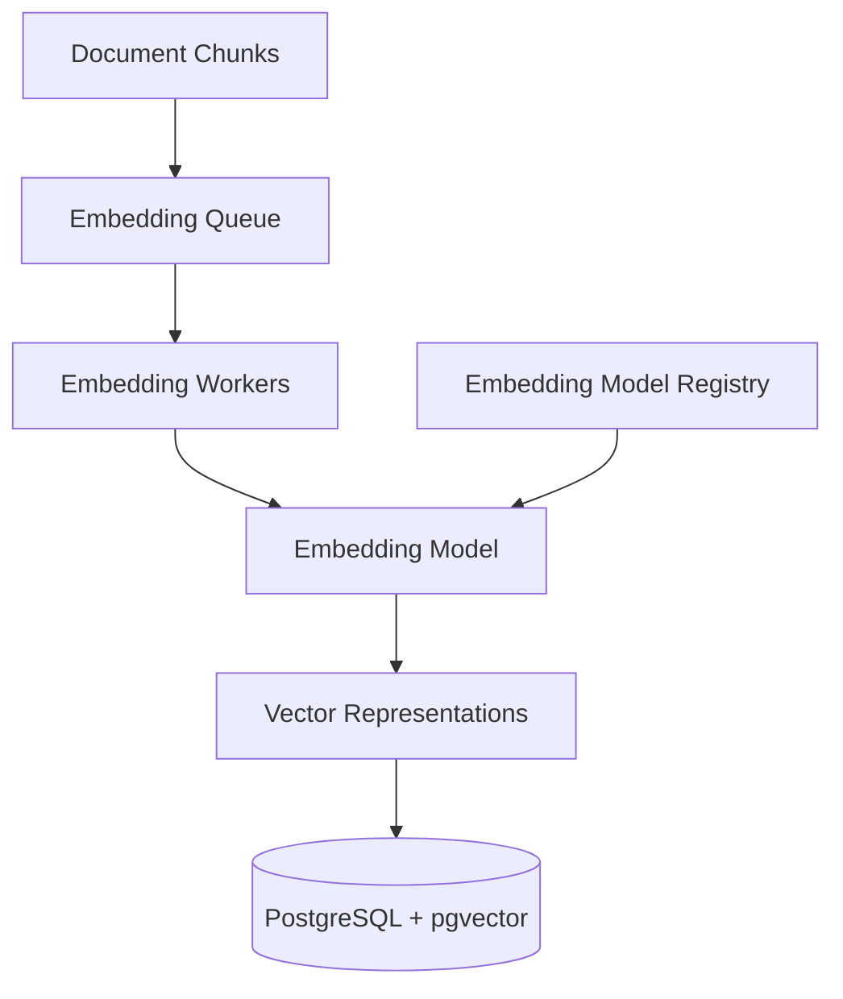

# Embedding Service Architecture

**Document Version:** 1.0
**Project:** AI Voice Agent SaaS Platform
**Phase:** 03 - RAG Knowledge Platform
**Status:** Draft
**Last Updated:** 2026-07-23

---

# 1. Overview

This document defines the embedding service architecture used by the RAG Knowledge Platform.

The embedding service converts processed knowledge content into numerical vector representations that enable semantic search.

The embedding layer is responsible for:

* Text vectorization
* Model management
* Batch processing
* Embedding storage
* Version control
* Performance optimization

---

# 2. Embedding Service Objectives

The embedding system must provide:

* High-quality semantic representations
* Consistent vector generation
* Scalable processing
* Model flexibility
* Cost optimization

---

# 3. Embedding Architecture



---

# 4. Embedding Pipeline Flow

```text id="m5q8vx"
Text Chunk

↓

Preprocessing

↓

Embedding Model

↓

Vector Generation

↓

Validation

↓

Storage
```

---

# 5. Embedding Model Role

Embedding models transform text:

Example:

```text id="p7m3qc"
Customer Question

↓

Vector

↓

Similarity Search
```

The vector captures:

* Meaning
* Context
* Relationships
* Concepts

---

# 6. Embedding Model Selection

Selection criteria:

| Factor           | Description             |
| ---------------- | ----------------------- |
| Accuracy         | Retrieval quality       |
| Dimensions       | Vector size             |
| Cost             | Processing expense      |
| Speed            | Generation latency      |
| Language Support | Multilingual capability |

---

# 7. Embedding Providers

Supported options:

```text id="v9m2kx"
Embedding Providers

├── OpenAI Embeddings

├── Open Source Models

├── Local Models

└── Custom Models
```

---

# 8. Embedding Model Versioning

Every embedding has a model version.

Example:

```text id="c5n8mw"
Document Chunk

+

Embedding Model Version

=

Vector Record
```

---

# 9. Vector Dimension Management

Important properties:

```text id="x4q7pv"
Vector

├── Dimension Size

├── Model Version

├── Distance Metric

└── Created Time
```

Changing dimensions requires re-indexing.

---

# 10. Batch Processing Architecture

Large workloads use batching:

```text id="z6m3qx"
Chunks

↓

Batch Processor

↓

Embedding API

↓

Vectors

↓

Database
```

Benefits:

* Faster processing
* Lower cost
* Better throughput

---

# 11. Real-Time Embedding Processing

For small updates:

```text id="n7p4mv"
New Document

↓

Immediate Processing

↓

Embedding

↓

Index Update
```

---

# 12. Embedding Storage Design

Vectors are stored with:

```text id="r8m5qc"
Embedding Record

├── ID

├── Chunk ID

├── Tenant ID

├── Vector

├── Model Version

├── Metadata

└── Timestamp
```

---

# 13. PostgreSQL + pgvector Integration

Storage architecture:

```text id="h3k9vx"
PostgreSQL

├── Documents

├── Chunks

├── Metadata

└── Vector Embeddings
```

---

# 14. Similarity Search

The embedding system supports:

* Cosine similarity
* Euclidean distance
* Inner product

Example:

```text id="s5m8qk"
User Query Vector

↓

Compare

↓

Nearest Knowledge Vectors
```

---

# 15. Embedding Cache Strategy

Cache frequently generated embeddings.

Examples:

* Common queries
* Repeated documents
* System prompts

---

# 16. Multi-Tenant Embedding Isolation

Every vector must contain:

```text id="q4m7vx"
Isolation Metadata

├── Tenant ID

├── Knowledge Base ID

├── Access Policy

└── Owner
```

---

# 17. Embedding Security

Protect:

* Source text
* Vector data
* Metadata
* Access permissions

---

# 18. Embedding Quality Evaluation

Evaluate:

* Retrieval accuracy
* Similarity quality
* Search relevance
* Context usefulness

---

# 19. Embedding Monitoring

Track:

```text id="y8m2kp"
Embedding Metrics

├── Processing Time

├── Cost

├── Failure Rate

├── Queue Size

└── Model Performance
```

---

# 20. Failure Handling

Process:

```text id="b6q9mv"
Embedding Failure

↓

Retry

↓

Fallback Model

↓

Error Logging
```

---

# 21. Database Entities

Recommended tables:

```text id="d4m8qx"
embedding_models

embeddings

embedding_jobs

embedding_versions

embedding_metrics
```

---

# 22. Deployment Architecture

Production deployment:

```text id="w5p3nz"
FastAPI

↓

Task Queue

↓

Embedding Workers

↓

Embedding Provider

↓

pgvector
```

---

# 23. Performance Optimization

Optimize:

* Batch size
* Worker count
* Model selection
* Database indexing
* Cache usage

---

# 24. Future Enhancements

Future improvements:

* Adaptive embedding selection
* Multimodal embeddings
* Domain-specific models
* Automatic re-indexing
* AI optimization engine

---

# 25. Related Documents

| Document                              | Purpose              |
| ------------------------------------- | -------------------- |
| 03_Document_Processing_Pipeline.md    | Document preparation |
| 05_Vector_Database_pgvector_Design.md | Vector storage       |
| 07_Retrieval_Pipeline_Design.md       | Retrieval            |
| 15_RAG_Evaluation_Framework.md        | Evaluation           |

---

# 26. Conclusion

The Embedding Service Architecture provides the vector intelligence layer of the RAG Knowledge Platform.

It enables:

* Semantic understanding
* Accurate retrieval
* Scalable knowledge processing
* Production-grade AI search

---

**End of Document**
