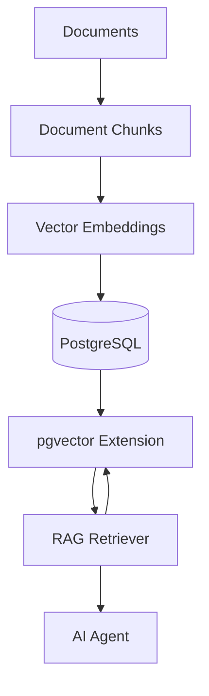
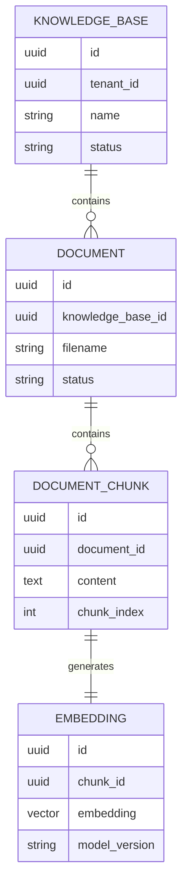

# Vector Database pgvector Design

**Document Version:** 1.0
**Project:** AI Voice Agent SaaS Platform
**Phase:** 03 - RAG Knowledge Platform
**Status:** Draft
**Last Updated:** 2026-07-23

---

# 1. Overview

This document defines the vector database architecture using PostgreSQL with the pgvector extension for the RAG Knowledge Platform.

The vector database provides the storage and retrieval layer for AI knowledge embeddings.

It enables:

* Semantic search
* Similarity matching
* Tenant-isolated knowledge retrieval
* High-performance AI context retrieval

---

# 2. Vector Database Objectives

The vector database must provide:

* Reliable vector storage
* Fast similarity search
* Metadata filtering
* Multi-tenant isolation
* Scalable indexing

---

# 3. Database Architecture



---

# 4. Why PostgreSQL + pgvector

PostgreSQL + pgvector provides:

* Relational data support
* Vector similarity search
* Transaction consistency
* Existing application integration
* Strong ecosystem support

---

# 5. Database Layers

Architecture:

```text
PostgreSQL

├── Application Data

├── Knowledge Metadata

├── Document Data

├── Vector Data

└── Analytics Data
```

---

# 6. Core Vector Data Model

Main entities:

```text
Knowledge Base

↓

Document

↓

Document Chunk

↓

Embedding Vector

↓

Retrieval Event
```

---

# 7. Database Schema Overview



---

# 8. Vector Storage Model

Each embedding record stores:

```text
Embedding

├── Vector Data

├── Chunk Reference

├── Tenant Reference

├── Model Version

├── Metadata

└── Timestamp
```

---

# 9. pgvector Data Types

Supported vector types:

* vector
* halfvec
* bit
* sparsevec

Recommended:

```text
vector(n)
```

where:

* n = embedding dimensions

---

# 10. Similarity Search

The system supports:

## Cosine Distance

Best for semantic similarity.

## Euclidean Distance

Measures vector distance.

## Inner Product

Useful for normalized embeddings.

---

# 11. Retrieval Query Flow

```text
User Question

↓

Generate Query Embedding

↓

Vector Search

↓

Similarity Ranking

↓

Metadata Filtering

↓

Return Context
```

---

# 12. Index Strategy

Indexes improve search speed.

Recommended:

```text
Vector Index

+

Metadata Index

+

Tenant Index
```

---

# 13. pgvector Index Types

Supported:

## IVFFlat

Good for:

* Large datasets
* Faster approximate search

---

## HNSW

Good for:

* High accuracy
* Production retrieval

Recommended default:

```text
HNSW Index
```

---

# 14. Metadata Filtering

Vector search should combine:

```text
Semantic Search

+

Metadata Filtering
```

Example filters:

* Tenant ID
* Knowledge Base ID
* Document category
* Permissions

---

# 15. Multi-Tenant Isolation

Every vector record must include:

```text
Tenant Context

├── Tenant ID

├── Organization ID

├── Knowledge Base ID

└── Access Rules
```

---

# 16. Database Security

Security controls:

* Row Level Security
* Encryption
* Access policies
* Audit logging

---

# 17. Partitioning Strategy

For large deployments:

Partition by:

```text
Tenant

or

Knowledge Domain

or

Region
```

---

# 18. Scaling Strategy

Growth path:

```text
Small Scale

↓

Single PostgreSQL Cluster

↓

Read Replicas

↓

Partitioned Vector Storage

↓

Distributed Search Layer
```

---

# 19. Backup Strategy

Backup:

* Documents
* Metadata
* Embeddings
* Index configuration

---

# 20. Migration Strategy

Database changes require:

* Schema migrations
* Vector compatibility checks
* Re-indexing procedures

---

# 21. Vector Re-indexing Process

Required when:

* Embedding model changes
* Dimension changes
* Search strategy changes

Flow:

```text
Old Embeddings

↓

Generate New Embeddings

↓

Validate

↓

Replace Index
```

---

# 22. Performance Monitoring

Track:

```text
Vector Metrics

├── Query Latency

├── Index Size

├── Search Accuracy

├── Storage Usage

└── CPU Usage
```

---

# 23. Database Tables

Recommended tables:

```text
knowledge_bases

documents

document_chunks

embeddings

embedding_models

retrieval_logs

vector_indexes
```

---

# 24. Integration Architecture

```text
LangChain

↓

Vector Store Adapter

↓

pgvector

↓

PostgreSQL
```

---

# 25. Future Enhancements

Future improvements:

* Distributed vector search
* Hybrid retrieval engine
* Knowledge graph integration
* AI-managed indexing
* Automatic optimization

---

# 26. Related Documents

| Document                             | Purpose    |
| ------------------------------------ | ---------- |
| 04_Embedding_Service_Architecture.md | Embeddings |
| 06_Hybrid_Search_Strategy.md         | Search     |
| 07_Retrieval_Pipeline_Design.md      | Retrieval  |
| 12_Multi_Tenant_RAG_Architecture.md  | Isolation  |

---

# 27. Conclusion

The PostgreSQL + pgvector architecture provides a reliable and scalable vector storage foundation for the RAG Knowledge Platform.

It enables:

* Fast semantic retrieval
* Enterprise data isolation
* Production-scale AI search
* Integration with LangChain and LangGraph agents

---

**End of Document**
