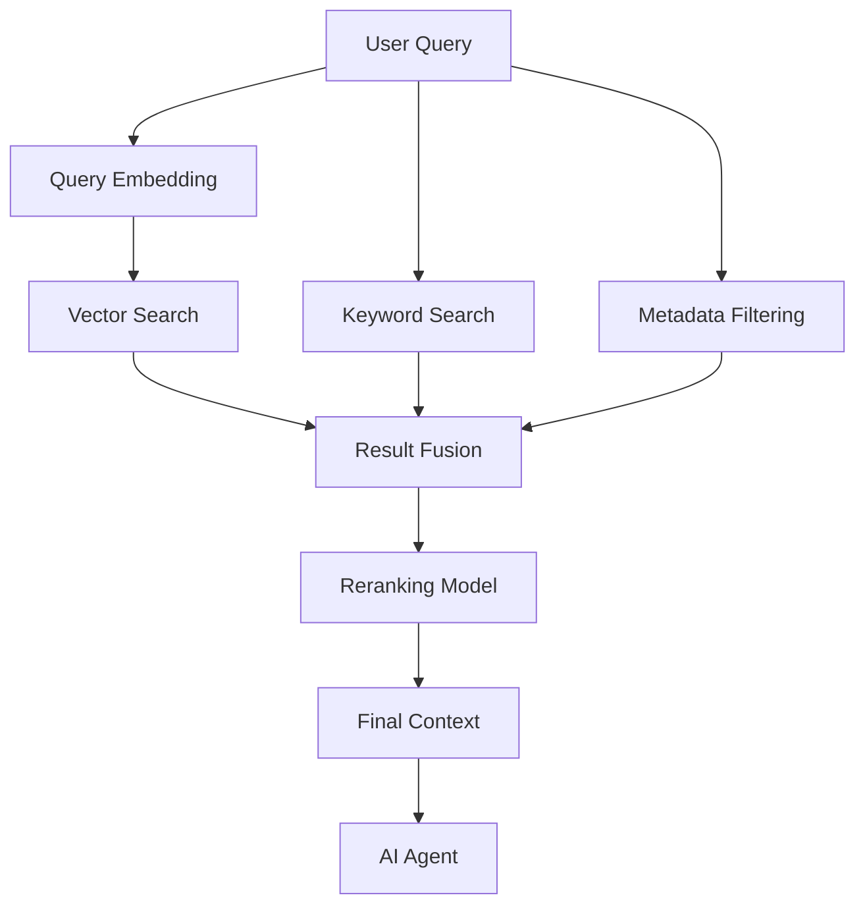

# Hybrid Search Strategy

**Document Version:** 1.0
**Project:** AI Voice Agent SaaS Platform
**Phase:** 03 - RAG Knowledge Platform
**Status:** Draft
**Last Updated:** 2026-07-23

---

# 1. Overview

This document defines the hybrid search strategy for the RAG Knowledge Platform.

Hybrid search combines multiple retrieval techniques to improve AI agent accuracy.

The strategy combines:

* Semantic vector search
* Keyword-based search
* Metadata filtering
* Ranking algorithms

The goal is to provide the most relevant context to AI agents.

---

# 2. Hybrid Search Objectives

The search system must provide:

* Higher retrieval accuracy
* Better handling of exact terms
* Improved business knowledge discovery
* Reduced hallucinations
* Faster response times

---

# 3. Why Hybrid Search Is Required

Vector search is excellent for:

* Meaning
* Concepts
* Similar questions

Keyword search is better for:

* Exact names
* Product codes
* IDs
* Technical terms

Combining both improves retrieval quality.

---

# 4. Hybrid Search Architecture



---

# 5. Search Pipeline

```text
User Question

↓

Query Understanding

↓

Parallel Retrieval

↓

Result Combination

↓

Ranking

↓

Context Selection

↓

LLM Response
```

---

# 6. Retrieval Components

```text
Hybrid Retrieval

├── Vector Retriever

├── Keyword Retriever

├── Metadata Filter

├── Fusion Engine

└── Reranker
```

---

# 7. Vector Search Layer

Vector search uses embeddings.

Process:

```text
Query

↓

Embedding Generation

↓

Similarity Search

↓

Semantic Results
```

Advantages:

* Understands meaning
* Handles natural language
* Finds related concepts

---

# 8. Keyword Search Layer

Keyword search handles exact matching.

Examples:

* SKU numbers
* Names
* Phone numbers
* Error codes
* Policy numbers

---

# 9. Metadata Filtering

Before ranking:

Filter by:

```text
Metadata

├── Tenant ID

├── Knowledge Base

├── Department

├── Document Type

├── Permission Level

└── Region
```

---

# 10. Result Fusion Strategy

Multiple search results are combined.

Example:

```text
Vector Results

+

Keyword Results

+

Metadata Results

=

Combined Candidate Set
```

---

# 11. Ranking Strategy

Ranking determines final relevance.

Factors:

| Factor              | Purpose            |
| ------------------- | ------------------ |
| Semantic Similarity | Meaning match      |
| Keyword Match       | Exact match        |
| Freshness           | Recent information |
| Authority           | Trusted sources    |
| User Context        | Personalization    |

---

# 12. Reranking Architecture

Advanced pipeline:

```text
Candidate Documents

↓

Reranker Model

↓

Top Relevant Documents

↓

LLM Context
```

---

# 13. Retrieval Parameters

Important parameters:

```text
Top K

↓

Number of Results Returned


Similarity Threshold

↓

Minimum Relevance Score
```

---

# 14. Context Selection Strategy

Avoid sending unnecessary information.

Process:

```text
Retrieved Chunks

↓

Remove Duplicates

↓

Rank

↓

Select Best Context
```

---

# 15. Multi-Tenant Search Isolation

Every search request includes:

```text
Search Context

├── Tenant ID

├── User ID

├── Permissions

└── Knowledge Scope
```

---

# 16. LangChain Integration

LangChain provides:

* Retriever interfaces
* Vector store connectors
* Retrieval chains
* Context management

Architecture:

```text
LangChain Retriever

↓

Hybrid Search Engine

↓

Vector Database
```

---

# 17. LangGraph Agent Integration

Agent workflow:

```text
User Question

↓

Agent Decision

↓

Search Tool

↓

Hybrid Retrieval

↓

Reasoning

↓

Answer
```

---

# 18. Query Optimization

Improve retrieval through:

* Query rewriting
* Query expansion
* Intent detection
* Conversation history

---

# 19. Conversational Search

The system should understand:

Previous messages:

```text
User:
"What is the price?"

Previous:
"Talking about Premium Plan"
```

The retriever uses conversation context.

---

# 20. Search Cache Strategy

Cache:

* Frequent queries
* Popular documents
* Common answers

---

# 21. Evaluation Metrics

Measure:

```text
Search Quality

├── Precision

├── Recall

├── MRR

├── NDCG

└── Answer Accuracy
```

---

# 22. Performance Requirements

Target:

* Low retrieval latency
* High relevance
* Stable ranking
* Predictable cost

---

# 23. Monitoring

Track:

```text
Search Metrics

├── Query Volume

├── Retrieval Time

├── Failed Searches

├── Result Quality

└── User Feedback
```

---

# 24. Database Support

Recommended components:

```text
PostgreSQL

+

pgvector

+

Full Text Search

+

Redis Cache
```

---

# 25. Future Enhancements

Future improvements:

* AI query planning
* Knowledge graphs
* Personalized retrieval
* Multimodal search
* Autonomous search optimization

---

# 26. Related Documents

| Document                              | Purpose            |
| ------------------------------------- | ------------------ |
| 05_Vector_Database_pgvector_Design.md | Vector storage     |
| 07_Retrieval_Pipeline_Design.md       | Retrieval workflow |
| 08_Reranking_Strategy.md              | Ranking            |
| 15_RAG_Evaluation_Framework.md        | Evaluation         |

---

# 27. Conclusion

The Hybrid Search Strategy provides a production-grade retrieval approach for AI agents.

By combining semantic understanding with exact matching, the platform achieves:

* Better accuracy
* Better business knowledge retrieval
* More reliable AI responses

---

**End of Document**
