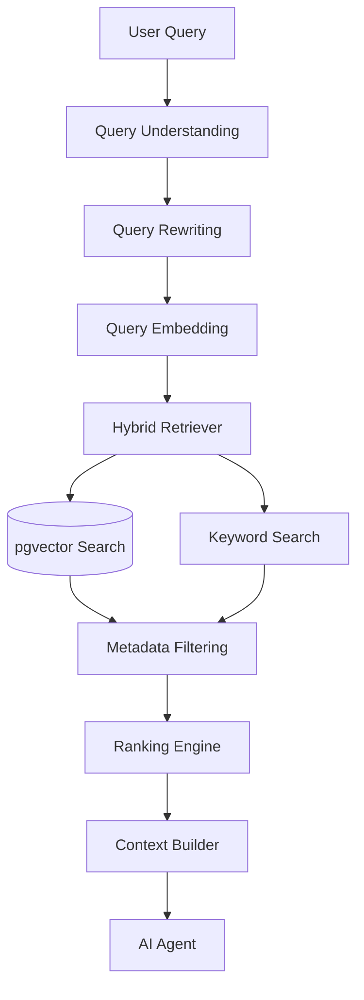
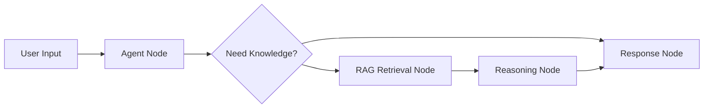

# Retrieval Pipeline Design

**Document Version:** 1.0
**Project:** AI Voice Agent SaaS Platform
**Phase:** 03 - RAG Knowledge Platform
**Status:** Draft
**Last Updated:** 2026-07-23

---

# 1. Overview

This document defines the retrieval pipeline architecture for the RAG Knowledge Platform.

The retrieval pipeline is responsible for finding the most relevant knowledge from customer data and providing accurate context to AI agents.

The retrieval system converts:

```text
User Intent

↓

Relevant Knowledge

↓

AI Generated Response
```

---

# 2. Retrieval Objectives

The retrieval pipeline must provide:

* High relevance results
* Low latency
* Tenant isolation
* Context optimization
* Reliable AI grounding

---

# 3. Retrieval Architecture



---

# 4. Retrieval Pipeline Stages

```text
Query Received

↓

Query Analysis

↓

Retrieval Planning

↓

Search Execution

↓

Result Filtering

↓

Ranking

↓

Context Construction

↓

Agent Response
```

---

# 5. Query Understanding Layer

The first stage analyzes:

* User intent
* Conversation context
* Required information
* Search scope

Example:

```text
User:
"What time do you close?"

Intent:
Business Hours Lookup
```

---

# 6. Query Rewriting

The system improves queries before retrieval.

Example:

Original:

```text
"What about tomorrow?"
```

Rewritten:

```text
"What are business opening hours tomorrow?"
```

Benefits:

* Better search accuracy
* Better conversational understanding

---

# 7. Retrieval Planning

The system decides:

* Which knowledge base to search
* Which tools to use
* How many results to retrieve

Architecture:

```text
Query

↓

Retrieval Planner

↓

Search Strategy
```

---

# 8. Retriever Components

The retrieval engine contains:

```text
Retriever

├── Vector Retriever

├── Keyword Retriever

├── Metadata Filter

├── Reranker

└── Context Builder
```

---

# 9. Vector Retrieval

Vector retrieval:

```text
Query

↓

Embedding

↓

Similarity Search

↓

Relevant Chunks
```

Uses:

* pgvector
* Embedding models
* Similarity scoring

---

# 10. Keyword Retrieval

Keyword search handles:

* Exact terms
* Product names
* Codes
* Technical references

Example:

```text
"Model X500 warranty"
```

---

# 11. Metadata Filtering

Before returning results:

Apply:

```text
Filters

├── Tenant

├── Knowledge Base

├── User Permissions

├── Category

└── Version
```

---

# 12. Retrieval Ranking

Ranking combines:

* Semantic similarity
* Keyword score
* Document importance
* Freshness

Example:

```text
Final Score =
Vector Score
+
Keyword Score
+
Business Priority
```

---

# 13. Context Building

The context builder prepares information for the LLM.

Process:

```text
Retrieved Chunks

↓

Remove Duplicates

↓

Order Information

↓

Limit Tokens

↓

Generate Context
```

---

# 14. Context Window Management

Important considerations:

* Token limits
* Response latency
* Information quality

Strategy:

```text
More Relevant

↓

Less Relevant

↓

Discard
```

---

# 15. Conversation-Aware Retrieval

The retrieval system uses previous messages.

Example:

```text
Conversation:

User:
"I need a booking"

Agent:
"For which service?"

User:
"AC repair"

Retriever understands:
AC repair booking
```

---

# 16. LangChain Retrieval Integration

LangChain provides:

* Retriever abstraction
* Vector store connectors
* Retrieval chains
* Context handling

Architecture:

```text
LangChain

↓

Retriever Interface

↓

Hybrid Search Engine

↓

Knowledge Store
```

---

# 17. LangGraph Retrieval Workflow

Example:



---

# 18. Retrieval Caching

Cache:

* Frequent questions
* Query embeddings
* Retrieval results

Technology:

```text
Redis
```

---

# 19. Retrieval Security

Every retrieval request validates:

```text
Security Context

├── Tenant ID

├── User Identity

├── Permissions

└── Data Scope
```

---

# 20. Retrieval Failure Handling

Failure scenarios:

* No results found
* Low confidence
* Database unavailable
* Embedding failure

Handling:

```text
Failure

↓

Fallback

↓

Human Escalation

↓

Logging
```

---

# 21. Retrieval Monitoring

Track:

```text
Retrieval Metrics

├── Query Latency

├── Result Count

├── Relevance Score

├── No Result Rate

├── Token Usage

└── User Feedback
```

---

# 22. Retrieval Database Entities

Recommended tables:

```text
retrieval_requests

retrieval_results

retrieval_scores

query_history

search_feedback
```

---

# 23. Performance Optimization

Optimize:

* Indexes
* Query rewriting
* Cache usage
* Result filtering
* Batch operations

---

# 24. Production Architecture

```text
AI Agent

↓

LangGraph

↓

LangChain Retriever

↓

Hybrid Search Engine

↓

PostgreSQL + pgvector

↓

Knowledge Context
```

---

# 25. Future Enhancements

Future capabilities:

* Agent-driven search planning
* Knowledge graph retrieval
* Personalized retrieval
* Autonomous research agents

---

# 26. Related Documents

| Document                            | Purpose         |
| ----------------------------------- | --------------- |
| 06_Hybrid_Search_Strategy.md        | Search strategy |
| 08_Reranking_Strategy.md            | Ranking         |
| 11_LangGraph_RAG_Workflow_Design.md | Agent workflow  |
| 15_RAG_Evaluation_Framework.md      | Evaluation      |

---

# 27. Conclusion

The Retrieval Pipeline Design defines how AI agents access trusted knowledge.

It provides the intelligence layer required for:

* Accurate answers
* Grounded responses
* Enterprise knowledge access
* Reliable AI automation

---

**End of Document**
