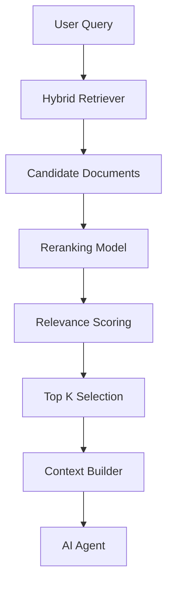
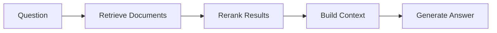

# Reranking Strategy

**Document Version:** 1.0
**Project:** AI Voice Agent SaaS Platform
**Phase:** 03 - RAG Knowledge Platform
**Status:** Draft
**Last Updated:** 2026-07-23

---

# 1. Overview

This document defines the reranking strategy for the RAG Knowledge Platform.

Reranking is the optimization layer that improves retrieval quality by evaluating and ordering candidate documents after initial retrieval.

The purpose is to ensure AI agents receive the most relevant and useful context.

---

# 2. Reranking Objectives

The reranking system provides:

* Improved search relevance
* Better context selection
* Reduced irrelevant information
* Higher answer accuracy
* Lower hallucination rates

---

# 3. Retrieval vs Reranking

Initial retrieval finds possible candidates.

Reranking selects the best candidates.

```text id="b8m4px"
User Query

↓

Retriever

↓

100 Candidate Chunks

↓

Reranker

↓

5 Best Chunks

↓

LLM Context
```

---

# 4. Reranking Architecture



---

# 5. Reranking Pipeline

```text id="n4q8mz"
Search Query

↓

Retrieve Candidates

↓

Calculate Relevance

↓

Apply Ranking Model

↓

Filter Results

↓

Build Context
```

---

# 6. Why Reranking Is Required

Vector similarity alone may return:

* Related but not useful documents
* Duplicate information
* Outdated content
* Broad matches

Reranking improves precision.

---

# 7. Reranking Methods

Supported approaches:

```text id="v5p9qx"
Reranking Methods

├── Cross Encoder Models

├── LLM-Based Ranking

├── Rule-Based Ranking

└── Hybrid Ranking
```

---

# 8. Cross Encoder Reranking

Cross encoders evaluate:

```
Query + Document
```

together.

Example:

```text id="k7m2vx"
Question

+

Candidate Chunk

↓

Relevance Score
```

Advantages:

* High accuracy
* Better semantic understanding

Tradeoff:

* More computation

---

# 9. LLM-Based Reranking

An LLM can evaluate:

* Relevance
* Completeness
* Authority
* Freshness

Example:

```text id="m9q4pk"
Query

↓

Documents

↓

LLM Ranking Decision

↓

Best Context
```

---

# 10. Rule-Based Ranking

Business rules can influence ranking.

Examples:

```text id="z8n5mv"
Priority Rules

├── Official Documents First

├── Latest Version First

├── Customer Approved Sources

└── Internal Knowledge Priority
```

---

# 11. Hybrid Ranking Model

Recommended production approach:

```text id="p6m8qx"
Final Ranking Score

=

Semantic Score

+

Keyword Score

+

Business Priority

+

Freshness Score

+
 
Reranker Score
```

---

# 12. Ranking Features

Features used:

| Feature             | Purpose            |
| ------------------- | ------------------ |
| Semantic Similarity | Meaning match      |
| Keyword Match       | Exact terms        |
| Recency             | Latest information |
| Authority           | Trusted sources    |
| User Context        | Personalization    |

---

# 13. Top-K Selection Strategy

The system balances:

* Accuracy
* Cost
* Latency

Example:

```text id="q5m7vx"
Retrieve Top 50

↓

Rerank

↓

Return Top 5
```

---

# 14. Context Optimization

The reranker helps reduce:

* Token usage
* LLM cost
* Response latency

---

# 15. Multi-Tenant Ranking

Ranking must respect:

```text id="w3m9kp"
Tenant Context

├── Customer Data

├── Permissions

├── Knowledge Priority

└── Business Rules
```

---

# 16. LangChain Integration

LangChain provides:

* Document compressor interfaces
* Retriever wrappers
* Context filtering

Architecture:

```text id="c4n7mx"
LangChain Retriever

↓

Reranker

↓

Compressed Context

↓

LLM
```

---

# 17. LangGraph Integration

Example workflow:



---

# 18. Reranking Evaluation

Measure:

```text id="s6m4vx"
Metrics

├── Precision

├── Recall

├── MRR

├── NDCG

└── Answer Quality
```

---

# 19. Performance Considerations

Optimize:

* Model selection
* Candidate count
* Batch ranking
* Cache usage

---

# 20. Caching Strategy

Cache:

* Query rankings
* Frequent searches
* Common contexts

Technology:

```text id="u7m5qx"
Redis
```

---

# 21. Failure Handling

Fallback:

```text id="r9m3pv"
Reranker Failure

↓

Use Retriever Ranking

↓

Continue Response

↓

Log Issue
```

---

# 22. Monitoring

Track:

```text id="d5q8mx"
Reranking Metrics

├── Ranking Latency

├── Score Distribution

├── Improvement Rate

├── Cost

└── User Feedback
```

---

# 23. Database Entities

Recommended tables:

```text id="e8m4vz"
reranking_models

ranking_requests

ranking_results

ranking_feedback

```

---

# 24. Production Architecture

```text id="f7n2kc"
User Query

↓

Hybrid Retrieval

↓

Reranker

↓

Context Builder

↓

LangGraph Agent

↓

LLM Response
```

---

# 25. Future Enhancements

Future improvements:

* Adaptive reranking
* Agent-controlled ranking
* Domain-specific rankers
* Self-improving retrieval models

---

# 26. Related Documents

| Document                        | Purpose    |
| ------------------------------- | ---------- |
| 06_Hybrid_Search_Strategy.md    | Search     |
| 07_Retrieval_Pipeline_Design.md | Retrieval  |
| 09_Context_Building_Strategy.md | Context    |
| 15_RAG_Evaluation_Framework.md  | Evaluation |

---

# 27. Conclusion

The Reranking Strategy improves the intelligence of the RAG platform by selecting the most relevant knowledge before AI generation.

It enables:

* Higher accuracy
* Better context quality
* Lower AI costs
* More reliable voice agents

---

**End of Document**
