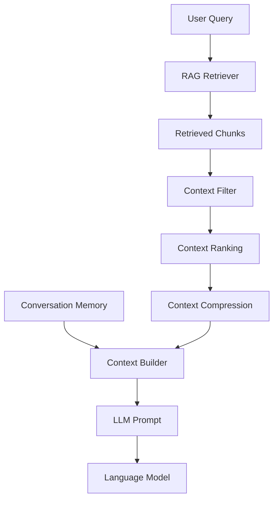
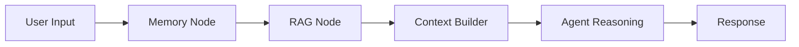

# Context Building Strategy

**Document Version:** 1.0
**Project:** AI Voice Agent SaaS Platform
**Phase:** 03 - RAG Knowledge Platform
**Status:** Draft
**Last Updated:** 2026-07-23

---

# 1. Overview

This document defines the context building strategy for the RAG Knowledge Platform.

Context building is the process of transforming retrieved knowledge into an optimized information package that can be provided to the Large Language Model (LLM).

The objective is to provide:

* Relevant information
* Correct context
* Minimal noise
* Efficient token usage
* Reliable AI responses

---

# 2. Context Building Objectives

The context layer must:

* Select the best retrieved information
* Remove irrelevant content
* Maintain conversation awareness
* Control token usage
* Preserve knowledge relationships

---

# 3. Context Building Architecture



---

# 4. Context Pipeline

```text
User Question

↓

Retrieve Knowledge

↓

Filter Results

↓

Rank Information

↓

Combine Memory

↓

Build Prompt Context

↓

Send To LLM
```

---

# 5. Context Components

```text
Context Package

├── User Query

├── Conversation History

├── Retrieved Knowledge

├── Agent Instructions

├── Tool Results

└── Business Rules
```

---

# 6. Context Selection Strategy

Not all retrieved documents should be included.

Selection criteria:

```text
Relevance

+

Authority

+

Freshness

+

User Intent

+

Token Availability
```

---

# 7. Context Filtering

Remove:

* Duplicate chunks
* Low relevance information
* Conflicting content
* Outdated knowledge

---

# 8. Context Ranking

Ranking priority:

```text
1. Direct Answer Information

2. Official Business Knowledge

3. Recent Updates

4. Supporting Information
```

---

# 9. Context Compression

Large contexts create problems:

* Higher cost
* Slower responses
* Reduced model focus

Compression strategies:

```text
Large Context

↓

Summarization

↓

Important Facts

↓

LLM Input
```

---

# 10. Token Budget Management

The context builder manages:

* System prompt tokens
* Conversation history tokens
* Retrieved knowledge tokens
* Response tokens

Example:

```text
Token Budget

├── System Instructions

├── Memory

├── RAG Context

└── Output
```

---

# 11. Conversation Memory Integration

Context combines:

```text
Current Question

+

Previous Conversation

+

Retrieved Knowledge
```

Example:

```text
User:
"Book it tomorrow"

Memory:
"Customer wants AC repair"

Context:
"Schedule AC repair tomorrow"
```

---

# 12. Agent Instructions Layer

Every agent receives:

* Role definition
* Personality
* Business rules
* Restrictions
* Response format

---

# 13. Tool Result Integration

Agents may use tools:

Examples:

* Calendar
* CRM
* Booking system
* Payment system

Tool responses become part of context.

---

# 14. Context Priority Model

Recommended priority:

```text
Highest Priority

↓

System Instructions

↓

Business Rules

↓

Retrieved Knowledge

↓

Conversation Memory

↓

General Knowledge

↓

Lowest Priority
```

---

# 15. Context Conflict Resolution

When information conflicts:

Priority:

```text
Latest Approved Knowledge

↓

Business Rules

↓

Customer Configuration

↓

Older Documents
```

---

# 16. Multi-Tenant Context Isolation

Every context package includes:

```text
Tenant Context

├── Organization ID

├── Agent ID

├── Knowledge Base

├── Permissions

└── User Session
```

---

# 17. Voice Agent Context Optimization

Voice agents require:

* Shorter responses
* Lower latency
* Immediate answers

Optimization:

```text
Retrieve

↓

Compress

↓

Generate

↓

Speak
```

---

# 18. LangChain Integration

LangChain manages:

* Prompt templates
* Document formatting
* Retrieval chains
* Context assembly

Architecture:

```text
Retriever

↓

Document Compressor

↓

Prompt Template

↓

LLM
```

---

# 19. LangGraph Integration

Example workflow:



---

# 20. Context Caching

Cache:

* Frequently used knowledge
* Common prompts
* Agent configurations

Technology:

```text
Redis
```

---

# 21. Context Quality Evaluation

Measure:

```text
Metrics

├── Relevance

├── Completeness

├── Accuracy

├── Token Efficiency

└── Response Quality
```

---

# 22. Monitoring

Track:

```text
Context Metrics

├── Context Size

├── Token Usage

├── Retrieval Quality

├── Compression Ratio

└── Latency
```

---

# 23. Database Entities

Recommended tables:

```text
context_sessions

context_builds

context_documents

context_metrics

prompt_versions
```

---

# 24. Production Architecture

```text
User

↓

Voice Agent

↓

LangGraph

↓

Context Builder

↓

LangChain RAG

↓

LLM

↓

Voice Response
```

---

# 25. Future Enhancements

Future capabilities:

* AI-controlled context selection
* Dynamic memory prioritization
* Knowledge graph context
* Autonomous reasoning chains

---

# 26. Related Documents

| Document                         | Purpose     |
| -------------------------------- | ----------- |
| 07_Retrieval_Pipeline_Design.md  | Retrieval   |
| 08_Reranking_Strategy.md         | Ranking     |
| 10_RAG_Agent_Tool_Integration.md | Agent tools |
| 15_RAG_Evaluation_Framework.md   | Evaluation  |

---

# 27. Conclusion

The Context Building Strategy ensures AI agents receive the right information at the right time.

It provides the foundation for:

* Accurate answers
* Efficient token usage
* Low latency voice conversations
* Reliable enterprise AI agents

---

**End of Document**
