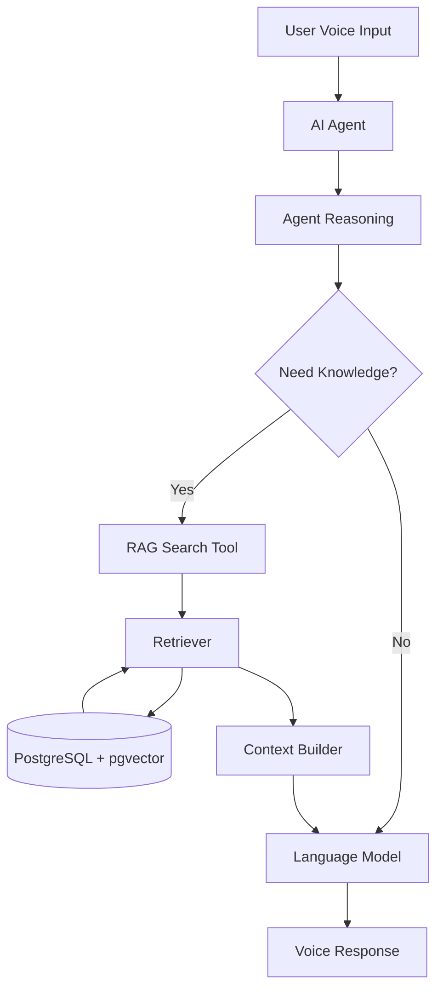
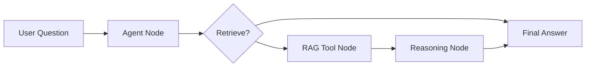

# RAG Agent Tool Integration

**Document Version:** 1.0
**Project:** AI Voice Agent SaaS Platform
**Phase:** 03 - RAG Knowledge Platform
**Status:** Draft
**Last Updated:** 2026-07-23

---

# 1. Overview

This document defines how the RAG Knowledge Platform integrates with AI agents through tools.

The purpose is to allow agents to dynamically access business knowledge during conversations.

Instead of loading all knowledge into prompts, agents use retrieval tools when required.

---

# 2. Integration Objectives

The integration layer provides:

* Agent-controlled knowledge retrieval
* Dynamic context loading
* Reduced prompt size
* Better response accuracy
* Secure knowledge access

---

# 3. Agent + RAG Architecture



---

# 4. RAG as an Agent Tool

The agent exposes knowledge retrieval as a callable tool.

Example:

```text
Tool Name:

search_knowledge_base

Purpose:

Retrieve business information
```

---

# 5. Tool Definition

A RAG tool contains:

```text
RAG Tool

├── Tool Name

├── Description

├── Input Schema

├── Permissions

├── Retrieval Logic

└── Response Format
```

---

# 6. Example Tool Schema

```json
{
  "name": "search_knowledge_base",
  "description": "Search customer knowledge",
  "parameters": {
    "query": "string",
    "category": "optional",
    "limit": "optional"
  }
}
```

---

# 7. Agent Decision Flow

The agent decides:

```text
User Question

↓

Can I answer directly?

↓

Yes → Respond

↓

No → Call RAG Tool

↓

Use Retrieved Knowledge

↓

Respond
```

---

# 8. Tool Selection Logic

The agent considers:

* Question complexity
* Available knowledge
* Confidence level
* Business rules

---

# 9. RAG Tool Response Format

Recommended response:

```json
{
  "results": [
    {
      "content": "Relevant information",
      "source": "document.pdf",
      "confidence": 0.94
    }
  ]
}
```

---

# 10. LangChain Tool Integration

LangChain provides:

* Tool abstraction
* Agent tools
* Retriever integration
* Prompt management

Architecture:

```text
LangChain Agent

↓

Tool Calling

↓

RAG Retriever

↓

Vector Store
```

---

# 11. LangGraph Integration

LangGraph manages:

* Tool decisions
* Retrieval workflows
* State management
* Multi-step reasoning

Example:



---

# 12. Voice Agent Integration

Voice workflow:

```text
Caller

↓

Speech Recognition

↓

AI Agent

↓

RAG Tool

↓

Knowledge Retrieval

↓

LLM Response

↓

Text To Speech

↓

Caller
```

---

# 13. Business Knowledge Examples

RAG tools can retrieve:

## Customer Support

* FAQs
* Troubleshooting
* Policies

## Sales

* Product details
* Pricing
* Features

## Booking

* Services
* Availability rules
* Procedures

## Healthcare

* General information
* Instructions
* Documentation

---

# 14. Permission-Aware Retrieval

Every tool call validates:

```text
Security Context

├── Tenant ID

├── Agent ID

├── User Identity

├── Knowledge Scope

└── Permissions
```

---

# 15. Multi-Agent RAG Access

Different agents may access different knowledge.

Example:

```text
Sales Agent

↓

Sales Knowledge Base


Support Agent

↓

Support Knowledge Base
```

---

# 16. Tool Error Handling

Failures:

* No knowledge found
* Retrieval timeout
* Permission denied
* Database unavailable

Handling:

```text
Error

↓

Fallback Response

↓

Human Escalation

↓

Logging
```

---

# 17. Tool Performance Optimization

Optimize:

* Retrieval speed
* Result size
* Cache usage
* Tool invocation frequency

---

# 18. RAG Tool Monitoring

Track:

```text
Metrics

├── Tool Calls

├── Retrieval Success Rate

├── Latency

├── Confidence Score

└── User Satisfaction
```

---

# 19. Security Requirements

Protect:

* Customer documents
* Retrieved content
* Tool permissions
* Agent access

---

# 20. Database Entities

Recommended tables:

```text
agent_rag_tools

tool_calls

tool_permissions

retrieval_sessions

agent_knowledge_access
```

---

# 21. Production Architecture

```text
Voice Platform

↓

Agent Runtime

↓

LangGraph

↓

LangChain Tools

↓

RAG Platform

↓

Knowledge Database
```

---

# 22. Future Enhancements

Future capabilities:

* Autonomous knowledge discovery
* Multi-agent knowledge sharing
* AI-generated tools
* Self-improving retrieval

---

# 23. Related Documents

| Document                            | Purpose          |
| ----------------------------------- | ---------------- |
| 09_Context_Building_Strategy.md     | Context creation |
| 11_LangGraph_RAG_Workflow_Design.md | Workflow         |
| 12_Multi_Tenant_RAG_Architecture.md | Isolation        |
| 15_RAG_Evaluation_Framework.md      | Evaluation       |

---

# 24. Conclusion

RAG Agent Tool Integration connects the knowledge platform with intelligent agents.

It enables:

* Dynamic knowledge access
* Secure retrieval
* Better AI reasoning
* Production-grade voice automation

---

**End of Document**
