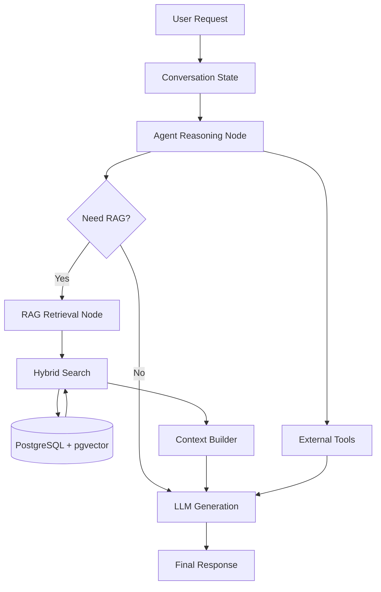
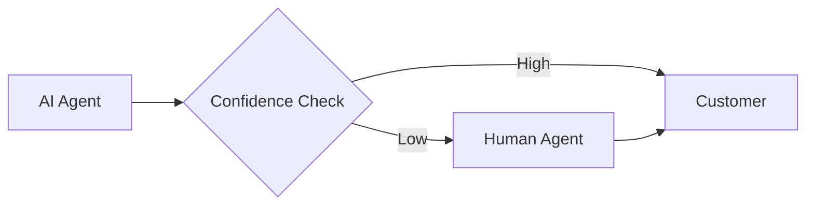

# LangGraph RAG Workflow Design

**Document Version:** 1.0
**Project:** AI Voice Agent SaaS Platform
**Phase:** 03 - RAG Knowledge Platform
**Status:** Draft
**Last Updated:** 2026-07-23

---

# 1. Overview

This document defines the LangGraph-based workflow architecture for RAG-powered AI agents.

LangGraph manages complex AI workflows by providing:

* Stateful execution
* Agent decision making
* Tool orchestration
* Multi-step reasoning
* Human escalation paths

The RAG workflow combines:

* LangGraph agent orchestration
* LangChain retrieval components
* Vector search
* Memory systems
* LLM reasoning

---

# 2. Workflow Objectives

The workflow engine provides:

* Intelligent retrieval decisions
* Controlled agent behavior
* Reliable knowledge grounding
* Multi-step task execution
* Production observability

---

# 3. LangGraph RAG Architecture



---

# 4. LangGraph State Model

LangGraph maintains workflow state.

Example:

```text
Conversation State

├── User Message

├── Conversation History

├── Agent Configuration

├── Retrieved Documents

├── Tool Results

├── User Intent

└── Response State
```

---

# 5. RAG Agent State Flow

```text
User Input

↓

Update State

↓

Analyze Intent

↓

Decide Action

↓

Retrieve Knowledge

↓

Build Context

↓

Generate Response

↓

Update Memory
```

---

# 6. Core Workflow Nodes

```text
RAG Workflow

├── Input Node

├── Memory Node

├── Intent Node

├── Retrieval Node

├── Validation Node

├── Reasoning Node

├── Tool Node

└── Response Node
```

---

# 7. Input Node

Responsibilities:

* Receive user message
* Normalize input
* Add request metadata

Example:

```text
Voice Transcript

↓

Agent Input
```

---

# 8. Memory Node

Retrieves:

* Conversation history
* User preferences
* Previous context

Sources:

* Redis
* PostgreSQL
* Long-term memory store

---

# 9. Intent Detection Node

Determines:

* User goal
* Required action
* Knowledge requirements

Example:

```text
Question:

"What is your warranty?"

Intent:

Product Information
```

---

# 10. Retrieval Decision Node

Determines:

```text
Should RAG be used?

YES

↓

Retrieve Knowledge


NO

↓

Continue Reasoning
```

---

# 11. Retrieval Node

Responsibilities:

* Generate query
* Search knowledge
* Apply filters
* Return documents

Flow:

```text
Query

↓

Retriever

↓

Relevant Chunks
```

---

# 12. Validation Node

Checks:

* Retrieved relevance
* Confidence score
* Missing information

Example:

```text
Confidence < Threshold

↓

Ask Clarification
```

---

# 13. Reasoning Node

Combines:

* Instructions
* Memory
* Knowledge
* Tool results

Produces:

* Next action
* Final response

---

# 14. Tool Execution Node

Handles:

* API calls
* CRM actions
* Booking systems
* Business workflows

Example:

```text
Agent

↓

Booking Tool

↓

Calendar System

↓

Confirmation
```

---

# 15. Response Node

Responsibilities:

* Format answer
* Apply agent personality
* Prepare voice output

---

# 16. Human Escalation Workflow



---

# 17. Multi-Agent RAG Workflow

Future architecture:

```text
Supervisor Agent

↓

Decision

├── Sales Agent

├── Support Agent

├── Booking Agent

└── Knowledge Agent
```

---

# 18. LangChain Integration

LangChain provides:

* Retrieval chains
* Tools
* Prompt templates
* Vector database connectors

Architecture:

```text
LangGraph

↓

LangChain Components

↓

RAG Infrastructure
```

---

# 19. Voice Agent Workflow

Complete flow:

```text
Caller

↓

Speech To Text

↓

LangGraph Agent

↓

RAG Decision

↓

Knowledge Retrieval

↓

LLM

↓

Text To Speech

↓

Caller
```

---

# 20. Error Handling

Workflow failures:

```text
Error

↓

Capture State

↓

Retry

↓

Fallback

↓

Escalate

↓

Log
```

---

# 21. Observability

Track:

```text
Workflow Metrics

├── Node Execution Time

├── Retrieval Decisions

├── Tool Calls

├── Errors

├── Token Usage

└── Completion Rate
```

---

# 22. Database Entities

Recommended tables:

```text
workflow_runs

workflow_states

agent_nodes

node_executions

rag_decisions

```

---

# 23. Performance Optimization

Optimize:

* State size
* Retrieval calls
* Parallel execution
* Cache usage
* Streaming responses

---

# 24. Security

Protect:

* Agent state
* Retrieved documents
* Tool permissions
* Customer data

---

# 25. Production Deployment

Recommended:

```text
FastAPI Backend

↓

Agent Runtime Service

↓

LangGraph Workflow Engine

↓

LangChain RAG

↓

PostgreSQL + Redis
```

---

# 26. Future Enhancements

Future capabilities:

* Self-correcting agents
* Autonomous planning
* Multi-agent collaboration
* Workflow learning

---

# 27. Related Documents

| Document                            | Purpose          |
| ----------------------------------- | ---------------- |
| 10_RAG_Agent_Tool_Integration.md    | Tool integration |
| 12_Multi_Tenant_RAG_Architecture.md | Tenant isolation |
| 15_RAG_Evaluation_Framework.md      | Quality          |
| 18_RAG_Production_Deployment.md     | Deployment       |

---

# 28. Conclusion

The LangGraph RAG Workflow Design defines the intelligence orchestration layer of the RAG platform.

It enables:

* Stateful AI reasoning
* Reliable knowledge retrieval
* Tool execution
* Enterprise-grade AI automation

---

**End of Document**
