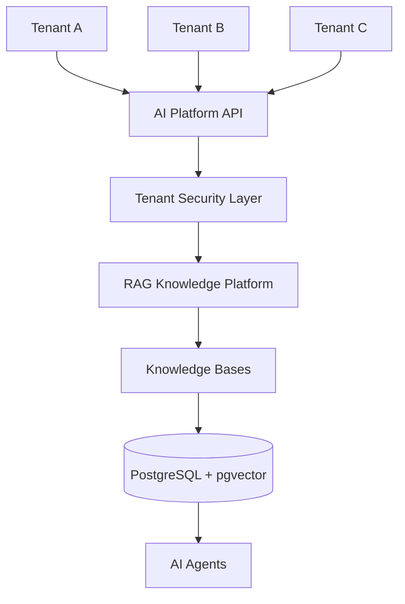

# Multi-Tenant RAG Architecture

**Document Version:** 1.0
**Project:** AI Voice Agent SaaS Platform
**Phase:** 03 - RAG Knowledge Platform
**Status:** Draft
**Last Updated:** 2026-07-23

---

# 1. Overview

This document defines the multi-tenant architecture for the RAG Knowledge Platform.

The AI Voice Agent SaaS platform serves multiple businesses, therefore every customer's knowledge data must remain isolated and secure.

The architecture ensures:

* Tenant data separation
* Secure retrieval
* Independent knowledge bases
* Permission-aware AI responses
* Enterprise scalability

---

# 2. Multi-Tenant Objectives

The platform must support:

* Thousands of organizations
* Multiple AI agents per organization
* Separate knowledge bases
* Different access permissions
* Independent configurations

---

# 3. Multi-Tenant RAG Architecture



---

# 4. Tenant Isolation Model

Recommended model:

```text
Tenant

↓

Knowledge Base

↓

Documents

↓

Chunks

↓

Embeddings
```

Every layer contains tenant ownership.

---

# 5. Tenant Data Model

Example:

```text
Tenant

├── Organization

├── Users

├── AI Agents

├── Knowledge Bases

├── Documents

└── Embeddings
```

---

# 6. Database Isolation Strategy

Recommended approach:

## Shared Database + Row Level Security

Architecture:

```text
PostgreSQL

├── Tenant ID Columns

├── RLS Policies

└── Permission Rules
```

Benefits:

* Cost effective
* Easier operations
* Scalable SaaS model

---

# 7. Tenant ID Propagation

Every request carries:

```text
Request Context

├── Tenant ID

├── User ID

├── Agent ID

├── Session ID

└── Permissions
```

---

# 8. Retrieval Security Flow

```text
User Question

↓

Authentication

↓

Tenant Validation

↓

Knowledge Scope Check

↓

RAG Retrieval

↓

Filtered Results

↓

AI Response
```

---

# 9. Vector Isolation

Every embedding record requires:

```text
Embedding

├── Vector

├── Chunk ID

├── Document ID

├── Tenant ID

├── Knowledge Base ID

└── Access Rules
```

---

# 10. PostgreSQL Row Level Security

Example policy concept:

```sql
Tenant A users

↓

Can only access

↓

Tenant A records
```

---

# 11. Knowledge Base Isolation

Each tenant can have:

```text
Company A

├── Sales Knowledge

├── Support Knowledge

└── Product Knowledge


Company B

├── HR Knowledge

├── Technical Knowledge
```

---

# 12. Agent-Level Knowledge Access

Different agents can have different access.

Example:

```text
Sales Agent

↓

Sales Knowledge Base


Support Agent

↓

Support Knowledge Base
```

---

# 13. Permission Model

Access levels:

```text
Permissions

├── Read

├── Write

├── Update

├── Delete

└── Admin
```

---

# 14. Document Security

Every document tracks:

```text
Document

├── Owner

├── Tenant

├── Access Policy

├── Version

└── Status
```

---

# 15. Retrieval Filtering

Search query automatically applies:

```text
WHERE

tenant_id = current_tenant

AND

knowledge_base_id IN allowed_scope
```

---

# 16. Multi-Tenant Agent Runtime

Agent context includes:

```text
Agent Runtime

├── Tenant Configuration

├── Agent Personality

├── Allowed Tools

├── Knowledge Access

└── Business Rules
```

---

# 17. Tenant Configuration Management

Each tenant can customize:

* AI agent behavior
* Knowledge sources
* Retrieval settings
* Voice settings
* Business workflows

---

# 18. Tenant Resource Limits

Control:

```text
Limits

├── Documents

├── Storage

├── Embeddings

├── API Calls

└── AI Usage
```

---

# 19. Billing Integration

Track usage:

```text
Usage Metrics

├── Documents Processed

├── Vector Searches

├── Tokens Used

├── Voice Minutes

└── Agent Executions
```

---

# 20. Tenant Backup Strategy

Backup:

* Documents
* Metadata
* Embeddings
* Configurations

---

# 21. Tenant Deletion Workflow

Secure deletion:

```text
Delete Request

↓

Verify Ownership

↓

Archive

↓

Delete Data

↓

Confirm Removal
```

---

# 22. Monitoring

Track:

```text
Tenant Metrics

├── Retrieval Volume

├── Storage Usage

├── Errors

├── Latency

└── Costs
```

---

# 23. Production Architecture

```text
Customer

↓

SaaS Dashboard

↓

FastAPI Backend

↓

Tenant Security Layer

↓

LangGraph Agent Runtime

↓

LangChain RAG

↓

PostgreSQL + pgvector
```

---

# 24. Security Requirements

Must implement:

* Authentication
* Authorization
* RLS policies
* Audit logging
* Encryption
* Data isolation testing

---

# 25. Future Enhancements

Future capabilities:

* Dedicated databases per enterprise tenant
* Regional data isolation
* Customer-managed encryption keys
* Advanced compliance controls

---

# 26. Related Documents

| Document                              | Purpose        |
| ------------------------------------- | -------------- |
| 05_Vector_Database_pgvector_Design.md | Vector storage |
| 10_RAG_Agent_Tool_Integration.md      | Agent access   |
| 11_LangGraph_RAG_Workflow_Design.md   | Workflow       |
| 15_RAG_Evaluation_Framework.md        | Quality        |

---

# 27. Conclusion

The Multi-Tenant RAG Architecture provides the foundation for a secure enterprise AI knowledge platform.

It enables:

* Customer data isolation
* Secure AI retrieval
* SaaS scalability
* Enterprise-ready deployments

---

**End of Document**
