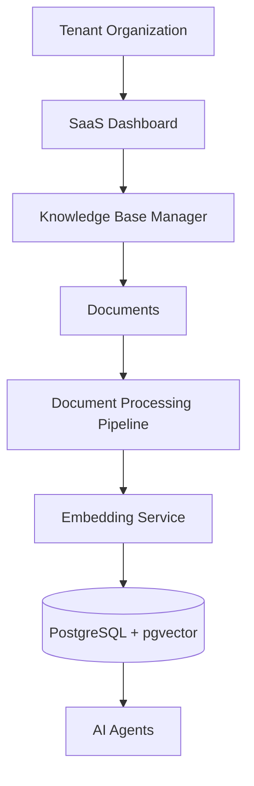

# Knowledge Base Management

**Document Version:** 1.0
**Project:** AI Voice Agent SaaS Platform
**Phase:** 03 - RAG Knowledge Platform
**Status:** Draft
**Last Updated:** 2026-07-23

---

# 1. Overview

This document defines the Knowledge Base Management architecture for the RAG Knowledge Platform.

The Knowledge Base is the central repository where each tenant manages the information used by AI agents.

It provides:

* Knowledge organization
* Document lifecycle management
* Access control
* Version management
* Agent assignment

---

# 2. Knowledge Base Objectives

The system must support:

* Multiple knowledge bases per tenant
* Multiple document sources
* Agent-specific knowledge access
* Document lifecycle control
* Secure information management

---

# 3. Knowledge Base Architecture



---

# 4. Knowledge Base Hierarchy

Structure:

```text
Tenant

└── Knowledge Bases

    ├── Documents

    │
    ├── Document Versions

    │
    ├── Chunks

    │
    └── Embeddings
```

---

# 5. Knowledge Base Types

Examples:

## Business Knowledge

Contains:

* Company information
* Policies
* Procedures

## Product Knowledge

Contains:

* Products
* Features
* Pricing

## Support Knowledge

Contains:

* FAQs
* Troubleshooting
* Guides

## Operational Knowledge

Contains:

* Workflows
* Internal instructions

---

# 6. Knowledge Base Lifecycle

```text
Created

↓

Configured

↓

Documents Added

↓

Processed

↓

Indexed

↓

Assigned To Agents

↓

Active
```

---

# 7. Knowledge Base Entity Model

```text
Knowledge Base

├── ID

├── Tenant ID

├── Name

├── Description

├── Type

├── Status

├── Settings

└── Created Date
```

---

# 8. Document Management

Supported operations:

* Upload
* Replace
* Archive
* Delete
* Restore
* Reprocess

---

# 9. Document Organization

Documents can be organized by:

```text
Category

↓

Folder

↓

Document

↓

Version

↓

Chunks
```

---

# 10. Document Metadata

Each document stores:

```text
Metadata

├── Name

├── Type

├── Category

├── Owner

├── Version

├── Status

├── Created Date

└── Permissions
```

---

# 11. Knowledge Base Configuration

Settings include:

```text
Configuration

├── Embedding Model

├── Chunk Size

├── Retrieval Strategy

├── Access Rules

├── Agent Availability

└── Search Settings
```

---

# 12. Agent Knowledge Assignment

Agents receive selected knowledge.

Example:

```text
Sales Agent

↓

Product Knowledge


Support Agent

↓

Troubleshooting Knowledge


Booking Agent

↓

Service Knowledge
```

---

# 13. Knowledge Permissions

Permission levels:

```text
Access

├── View

├── Search

├── Modify

├── Delete

└── Admin
```

---

# 14. Knowledge Import Sources

Supported sources:

```text
Sources

├── File Upload

├── Website Crawling

├── API Integration

├── CRM Systems

├── Cloud Storage

└── Database
```

---

# 15. Knowledge Synchronization

External sources require sync:

```text
External Source

↓

Sync Service

↓

Change Detection

↓

Update Knowledge Base

↓

Re-index
```

---

# 16. Document Version Control

Every change creates a version:

```text
Document

Version 1

↓

Version 2

↓

Version 3
```

---

# 17. Knowledge Quality Management

Quality checks:

* Duplicate detection
* Missing metadata
* Outdated content
* Low retrieval performance

---

# 18. Knowledge Analytics

Track:

```text
Analytics

├── Most Used Documents

├── Search Frequency

├── Failed Searches

├── Agent Usage

└── User Feedback
```

---

# 19. Knowledge Base API Operations

Required APIs:

```text
Knowledge Base

POST   /knowledge-bases

GET    /knowledge-bases

PATCH  /knowledge-bases/{id}

DELETE /knowledge-bases/{id}
```

---

# 20. Document API Operations

```text
Documents

POST   /documents/upload

GET    /documents

POST   /documents/process

POST   /documents/reindex

DELETE /documents/{id}
```

---

# 21. Database Entities

Recommended tables:

```text
knowledge_bases

knowledge_base_settings

knowledge_documents

document_versions

document_permissions

knowledge_agent_assignments
```

---

# 22. Security Controls

Implement:

* Tenant isolation
* Permission checks
* Audit logging
* Encryption
* Access monitoring

---

# 23. Production Architecture

```text
Admin Dashboard

↓

Knowledge Base Service

↓

Document Processing

↓

Embedding Pipeline

↓

Vector Database

↓

AI Agents
```

---

# 24. Future Enhancements

Future capabilities:

* AI-generated knowledge organization
* Automatic document cleanup
* Knowledge recommendations
* Self-updating knowledge bases

---

# 25. Related Documents

| Document                            | Purpose    |
| ----------------------------------- | ---------- |
| 02_LangChain_Ingestion_Pipeline.md  | Ingestion  |
| 03_Document_Processing_Pipeline.md  | Processing |
| 12_Multi_Tenant_RAG_Architecture.md | Isolation  |
| 14_Document_Versioning_Strategy.md  | Versions   |

---

# 26. Conclusion

Knowledge Base Management provides the operational layer for maintaining AI agent knowledge.

It enables:

* Organized business knowledge
* Secure access
* Agent-specific information
* Continuous knowledge improvement

---

**End of Document**

