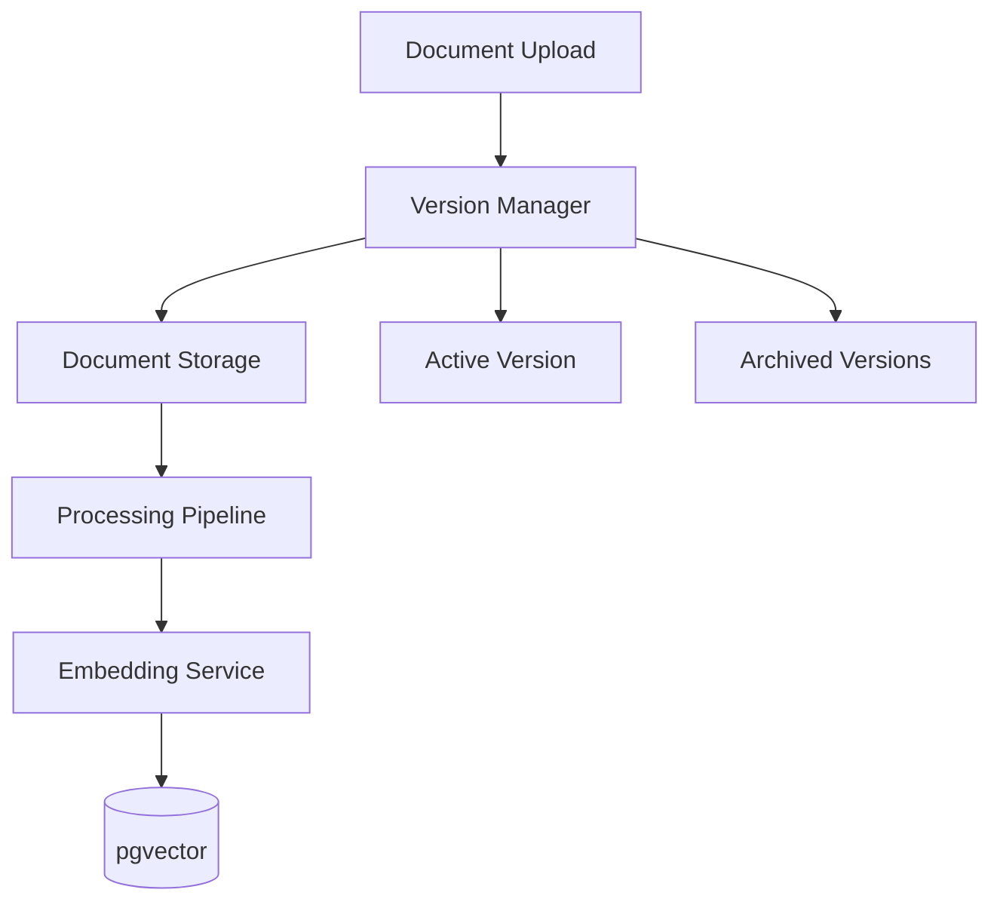

# Document Versioning Strategy

**Document Version:** 1.0
**Project:** AI Voice Agent SaaS Platform
**Phase:** 03 - RAG Knowledge Platform
**Status:** Draft
**Last Updated:** 2026-07-23

---

# 1. Overview

This document defines the document versioning strategy for the RAG Knowledge Platform.

Document versioning ensures that AI agents always use the correct and approved knowledge while maintaining historical records of changes.

The versioning system provides:

* Change tracking
* Knowledge rollback
* Audit history
* Controlled re-indexing
* Compliance support

---

# 2. Versioning Objectives

The system must support:

* Multiple document versions
* Version comparison
* Version activation
* Historical retrieval
* Safe updates

---

# 3. Versioning Architecture



---

# 4. Version Lifecycle

```text id="q9m5vx"
New Document

↓

Version Created

↓

Processing

↓

Validation

↓

Approved

↓

Active

↓

Archived
```

---

# 5. Document Version Model

Each version contains:

```text id="p6n8mx"
Document Version

├── Version ID

├── Document ID

├── Version Number

├── Content Hash

├── Status

├── Created By

├── Created Date

└── Processing Status
```

---

# 6. Version States

```text id="r4k7qp"
DRAFT

↓

PROCESSING

↓

REVIEW

↓

APPROVED

↓

ACTIVE

↓

ARCHIVED
```

---

# 7. Active Version Management

Only one version should normally be active.

Example:

```text id="c8m2vz"
Product Manual

Version 1

Archived


Version 2

Active


Version 3

Draft
```

---

# 8. Document Update Workflow

When a document changes:

```text id="n7q3mx"
Updated Document

↓

Create New Version

↓

Process Content

↓

Generate Embeddings

↓

Validate

↓

Activate Version

↓

Archive Previous
```

---

# 9. Embedding Version Relationship

Embeddings must reference document versions.

Structure:

```text id="s5m9pk"
Document

↓

Version

↓

Chunks

↓

Embeddings
```

---

# 10. Re-indexing Strategy

Re-index required when:

* Content changes
* Embedding model changes
* Chunking strategy changes

Process:

```text id="z8m4qx"
New Version

↓

Generate Chunks

↓

Create Embeddings

↓

Update Vector Index

↓

Activate
```

---

# 11. Rollback Strategy

Rollback allows restoring previous knowledge.

Example:

```text id="v3n8mp"
Version 3

Problem Detected

↓

Rollback

↓

Version 2 Activated
```

---

# 12. Version Comparison

Compare:

* Text changes
* Metadata changes
* Permissions
* Processing results

---

# 13. Change Detection

Detect changes using:

```text id="a6q9mv"
Content Hash

+

Metadata Comparison

+

File Timestamp
```

---

# 14. Duplicate Version Prevention

Before creating a version:

```text id="m4p8vx"
New Content

↓

Generate Hash

↓

Compare Existing

↓

Create Only If Changed
```

---

# 15. Knowledge Consistency

Versioning prevents:

* Mixed document versions
* Outdated answers
* Conflicting information

---

# 16. Tenant Isolation

Every version belongs to:

```text id="b7m5qx"
Tenant

↓

Knowledge Base

↓

Document

↓

Version
```

---

# 17. Permissions

Version operations require:

```text id="u8q4mp"
Permissions

├── Create Version

├── Review

├── Approve

├── Activate

└── Delete
```

---

# 18. Audit Trail

Track:

```text id="h6m9vk"
Audit Event

├── User

├── Action

├── Document

├── Version

├── Timestamp

└── Change Details
```

---

# 19. Database Design

Recommended tables:

```text id="d5n8qx"
documents

document_versions

document_version_changes

document_chunks

document_embeddings

version_audit_logs
```

---

# 20. API Design

Required operations:

```text id="y4m7kp"
POST

/documents/{id}/versions


GET

/documents/{id}/versions


POST

/versions/{id}/activate


POST

/versions/{id}/rollback
```

---

# 21. Processing History

Maintain:

* Processing logs
* Embedding model version
* Chunking configuration
* Retrieval performance

---

# 22. Version Analytics

Measure:

```text id="t8q5mv"
Version Metrics

├── Usage

├── Retrieval Success

├── Search Quality

├── Rollbacks

└── Errors
```

---

# 23. Production Workflow

```text id="k3p9vx"
Admin Upload

↓

Version Creation

↓

Processing Queue

↓

Embedding Generation

↓

Quality Check

↓

Activation

↓

Agent Usage
```

---

# 24. Security Requirements

Protect:

* Historical documents
* Version metadata
* Approval records
* Audit information

---

# 25. Future Enhancements

Future capabilities:

* AI change summaries
* Automatic approval workflows
* Smart version recommendations
* Knowledge freshness scoring

---

# 26. Related Documents

| Document                              | Purpose              |
| ------------------------------------- | -------------------- |
| 13_Knowledge_Base_Management.md       | Knowledge management |
| 05_Vector_Database_pgvector_Design.md | Vector storage       |
| 15_RAG_Evaluation_Framework.md        | Quality              |
| 18_RAG_Production_Deployment.md       | Deployment           |

---

# 27. Conclusion

The Document Versioning Strategy ensures reliable and controlled knowledge evolution.

It enables:

* Accurate AI responses
* Safe document updates
* Historical tracking
* Enterprise knowledge governance

---

**End of Document**
