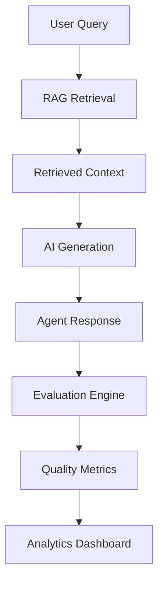
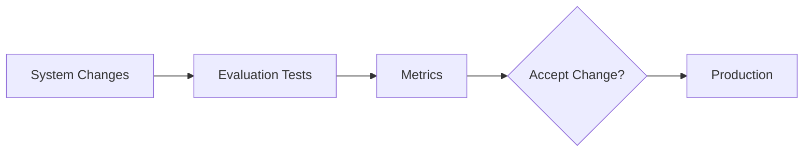

# RAG Evaluation Framework

**Document Version:** 1.0
**Project:** AI Voice Agent SaaS Platform
**Phase:** 03 - RAG Knowledge Platform
**Status:** Draft
**Last Updated:** 2026-07-23

---

# 1. Overview

This document defines the evaluation framework for measuring the quality, accuracy, and performance of the RAG Knowledge Platform.

A production RAG system requires continuous evaluation to ensure AI agents provide reliable and grounded responses.

The evaluation framework measures:

* Retrieval quality
* Context quality
* Answer accuracy
* Latency
* Cost efficiency
* User satisfaction

---

# 2. Evaluation Objectives

The evaluation system must:

* Detect retrieval failures
* Measure answer quality
* Reduce hallucinations
* Improve knowledge coverage
* Optimize AI costs

---

# 3. RAG Evaluation Architecture



---

# 4. Evaluation Pipeline

```text
Test Query

↓

Retrieve Knowledge

↓

Generate Answer

↓

Evaluate Retrieval

↓

Evaluate Response

↓

Store Metrics

↓

Improve System
```

---

# 5. Evaluation Categories

The platform evaluates:

```text
RAG Quality

├── Retrieval Quality

├── Context Quality

├── Generation Quality

├── Performance

└── Cost
```

---

# 6. Retrieval Evaluation

Measures whether the correct information was found.

Metrics:

* Precision
* Recall
* Mean Reciprocal Rank (MRR)
* Normalized Discounted Cumulative Gain (NDCG)

---

# 7. Precision

Precision measures:

"How many retrieved documents were actually relevant?"

Formula:

```text
Relevant Retrieved Documents

÷

Total Retrieved Documents
```

High precision means fewer irrelevant results.

---

# 8. Recall

Recall measures:

"Did the system find all relevant information?"

Formula:

```text
Relevant Retrieved Documents Found

÷

Total Relevant Documents
```

---

# 9. Context Quality Evaluation

Evaluate retrieved context:

Criteria:

```text
Context Quality

├── Relevance

├── Completeness

├── Accuracy

├── Freshness

└── Source Authority
```

---

# 10. Answer Quality Evaluation

Measure:

* Correctness
* Completeness
* Helpfulness
* Grounding

---

# 11. Hallucination Detection

Detect when the model generates unsupported information.

Process:

```text
AI Response

↓

Compare With Context

↓

Identify Unsupported Claims

↓

Calculate Hallucination Score
```

---

# 12. Grounded Response Score

Measures:

"Is the answer supported by retrieved knowledge?"

Example:

```text
High Score

=

Answer Fully Supported By Context
```

---

# 13. Human Evaluation

Human reviewers evaluate:

* Accuracy
* Tone
* Usefulness
* Customer experience

---

# 14. Automated Evaluation

Automated methods:

```text
Evaluation Tools

├── LLM-as-Judge

├── Rule-Based Checks

├── Similarity Metrics

└── Feedback Analysis
```

---

# 15. Test Dataset Management

Maintain:

```text
Evaluation Dataset

├── Questions

├── Expected Answers

├── Expected Documents

├── Categories

└── Difficulty Level
```

---

# 16. RAG Benchmark Categories

Test scenarios:

## Simple Questions

Example:

"Business hours?"

## Complex Questions

Example:

"Compare two service plans."

## Multi-step Questions

Example:

"Schedule a repair based on policy rules."

---

# 17. Voice Agent Evaluation

Additional metrics:

```text
Voice Metrics

├── Response Time

├── Conversation Success

├── Transfer Rate

├── User Satisfaction

└── Call Completion
```

---

# 18. Performance Metrics

Monitor:

```text
Performance

├── Retrieval Latency

├── LLM Latency

├── Total Response Time

├── Token Usage

└── Cost
```

---

# 19. Continuous Evaluation Pipeline



---

# 20. Regression Testing

Prevent quality degradation.

Test after:

* Prompt changes
* Model changes
* Embedding changes
* Retrieval changes

---

# 21. Feedback Loop

User feedback improves the system.

Flow:

```text
User Feedback

↓

Analysis

↓

Knowledge Update

↓

Retrieval Improvement

↓

Better Responses
```

---

# 22. Monitoring Dashboard

Track:

```text
Dashboard

├── Accuracy

├── Retrieval Score

├── Failed Queries

├── Latency

├── Cost

└── User Rating
```

---

# 23. Database Entities

Recommended tables:

```text
evaluation_datasets

evaluation_cases

evaluation_runs

evaluation_results

user_feedback

quality_metrics
```

---

# 24. Production Integration

Architecture:

```text
Agent Runtime

↓

RAG Platform

↓

Evaluation Service

↓

Analytics

↓

Improvement Cycle
```

---

# 25. Security Requirements

Protect:

* Customer conversations
* Evaluation datasets
* Business knowledge
* Analytics data

---

# 26. Future Enhancements

Future capabilities:

* Automatic RAG optimization
* AI-generated test cases
* Self-evaluating agents
* Continuous learning systems

---

# 27. Related Documents

| Document                            | Purpose    |
| ----------------------------------- | ---------- |
| 07_Retrieval_Pipeline_Design.md     | Retrieval  |
| 08_Reranking_Strategy.md            | Ranking    |
| 11_LangGraph_RAG_Workflow_Design.md | Workflow   |
| 18_RAG_Production_Deployment.md     | Deployment |

---

# 28. Conclusion

The RAG Evaluation Framework provides continuous measurement and improvement of the knowledge platform.

It ensures AI agents deliver:

* Accurate responses
* Grounded answers
* Reliable customer interactions
* Production-quality AI automation

---

**End of Document**
