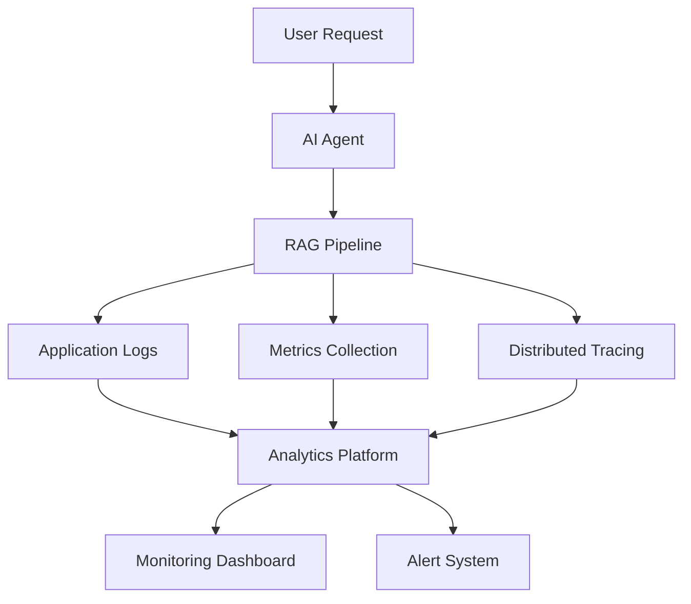

# RAG Observability and Monitoring

**Document Version:** 1.0
**Project:** AI Voice Agent SaaS Platform
**Phase:** 03 - RAG Knowledge Platform
**Status:** Draft
**Last Updated:** 2026-07-23

---

# 1. Overview

This document defines the observability and monitoring architecture for the RAG Knowledge Platform.

A production RAG system requires visibility across the complete AI knowledge lifecycle:

* Document ingestion
* Processing
* Embedding generation
* Retrieval
* Context construction
* Agent responses
* User feedback

The observability system ensures reliability, performance, and continuous improvement.

---

# 2. Observability Objectives

The platform must provide:

* End-to-end request tracing
* Retrieval visibility
* Performance monitoring
* Error detection
* Cost tracking
* Quality analysis

---

# 3. Observability Architecture



---

# 4. Observability Layers

```text
Observability

├── Logs

├── Metrics

├── Traces

├── Quality Signals

└── Cost Analytics
```

---

# 5. Request Tracing

Every RAG request should have:

```text
Request Context

├── Request ID

├── Tenant ID

├── Agent ID

├── Session ID

├── Conversation ID

└── Trace ID
```

---

# 6. RAG Pipeline Tracing

Track every stage:

```text
User Question

↓

Query Processing

↓

Embedding Generation

↓

Vector Search

↓

Reranking

↓

Context Building

↓

LLM Generation

↓

Response
```

---

# 7. Logging Strategy

Required logs:

## Application Logs

* API requests
* Agent actions
* Errors

## Retrieval Logs

* Queries
* Results
* Scores

## Processing Logs

* Document processing
* Embedding jobs

---

# 8. Retrieval Monitoring

Monitor:

```text
Retrieval Metrics

├── Search Latency

├── Result Count

├── Similarity Scores

├── Empty Results

└── Retrieval Failures
```

---

# 9. Embedding Monitoring

Track:

```text
Embedding Metrics

├── Processing Time

├── Model Version

├── Vector Count

├── Failed Jobs

└── Cost
```

---

# 10. Document Processing Monitoring

Monitor:

```text
Processing Metrics

├── Documents Uploaded

├── Processing Duration

├── Failed Documents

├── Chunk Count

└── Processing Queue
```

---

# 11. Agent Response Monitoring

Track:

* Response accuracy
* Response latency
* Tool usage
* Knowledge usage
* Escalations

---

# 12. Quality Monitoring

Measure:

```text
Quality Signals

├── User Feedback

├── Confidence Scores

├── Hallucination Rate

├── Retrieval Success

└── Answer Rating
```

---

# 13. Cost Monitoring

Track:

```text
AI Costs

├── Embedding Cost

├── LLM Tokens

├── Retrieval Operations

├── Voice Minutes

└── Storage
```

---

# 14. Alerting Strategy

Alerts for:

## Critical

* Database unavailable
* Retrieval failure
* Agent outage

## Warning

* High latency
* Increased errors
* Cost spikes

---

# 15. Performance Targets

Example targets:

| Component        | Target           |
| ---------------- | ---------------- |
| Retrieval        | Low latency      |
| Embedding        | High throughput  |
| Context Building | Optimized tokens |
| Agent Response   | Real-time        |

---

# 16. Distributed Tracing

Recommended trace flow:

```text
Voice Call

↓

Agent Runtime

↓

RAG Service

↓

Database

↓

LLM Provider
```

---

# 17. Multi-Tenant Monitoring

Metrics must include:

```text
Tenant Metrics

├── Usage

├── Cost

├── Errors

├── Latency

└── Quality
```

---

# 18. Dashboard Design

Recommended dashboards:

## System Health

Shows:

* Services
* Errors
* Latency

## RAG Quality

Shows:

* Retrieval quality
* Answer quality

## Tenant Usage

Shows:

* Usage
* Cost

---

# 19. Feedback Collection

Collect:

* User ratings
* Failed questions
* Agent transfers
* Corrections

---

# 20. Observability Database Entities

Recommended tables:

```text
observability_events

rag_requests

retrieval_logs

embedding_metrics

agent_quality_scores

cost_records
```

---

# 21. Integration With Agent Runtime

Architecture:

```text
Agent Runtime

↓

Telemetry Layer

↓

RAG Observability

↓

Monitoring Platform
```

---

# 22. Recommended Technologies

Possible stack:

```text
Metrics:

Prometheus


Dashboards:

Grafana


Tracing:

OpenTelemetry


Logs:

Loki / ELK


Analytics:

PostgreSQL
```

---

# 23. Security Requirements

Protect:

* Conversation data
* Customer documents
* Analytics information
* Tenant metrics

---

# 24. Production Architecture

```text
AI Agent

↓

LangGraph

↓

LangChain RAG

↓

Telemetry Middleware

↓

Observability Platform

↓

Dashboards + Alerts
```

---

# 25. Future Enhancements

Future capabilities:

* AI-powered anomaly detection
* Automatic retrieval optimization
* Predictive cost management
* Self-healing pipelines

---

# 26. Related Documents

| Document                        | Purpose             |
| ------------------------------- | ------------------- |
| 15_RAG_Evaluation_Framework.md  | Quality evaluation  |
| 17_RAG_Security_Model.md        | Security            |
| 18_RAG_Production_Deployment.md | Deployment          |
| 37_Observability/               | Platform monitoring |

---

# 27. Conclusion

RAG Observability and Monitoring provides operational visibility into the AI knowledge platform.

It enables:

* Reliable production operation
* Faster troubleshooting
* Quality improvement
* Enterprise-grade AI monitoring

---

**End of Document**
