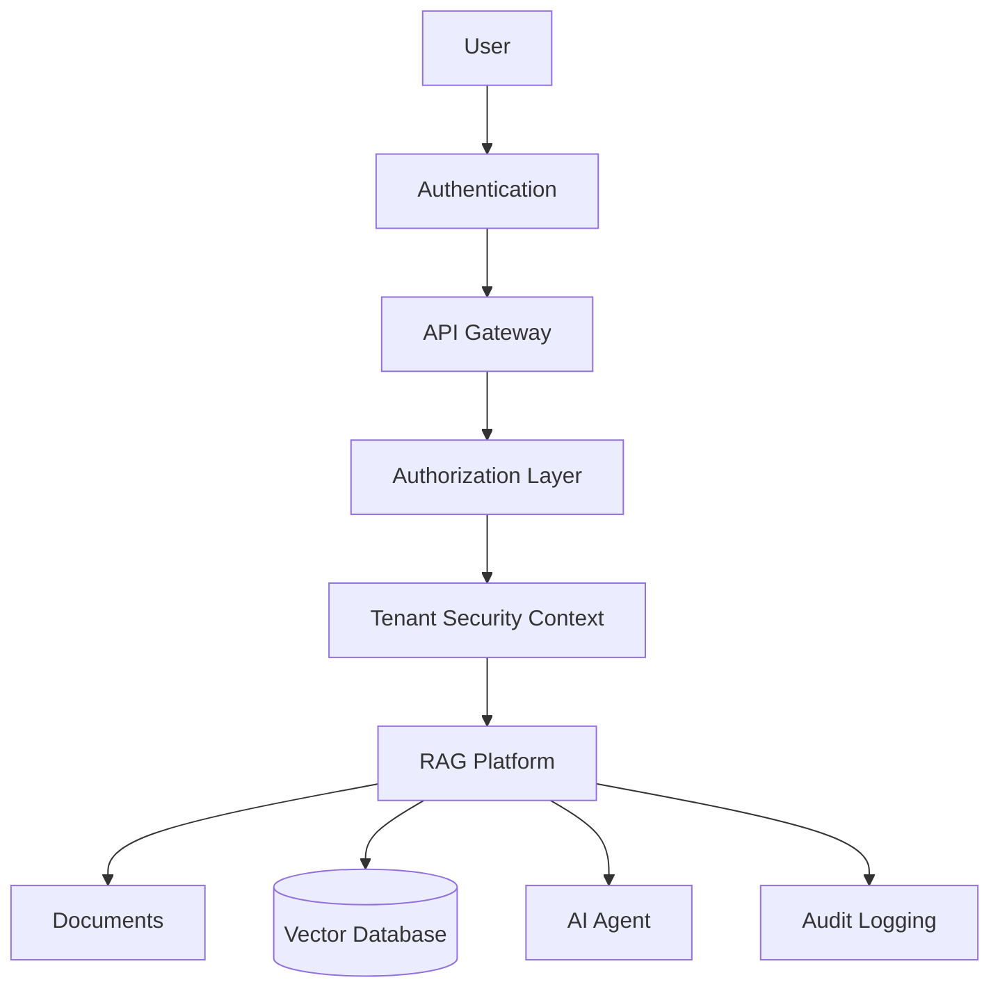

# RAG Security Model

**Document Version:** 1.0
**Project:** AI Voice Agent SaaS Platform
**Phase:** 03 - RAG Knowledge Platform
**Status:** Draft
**Last Updated:** 2026-07-23

---

# 1. Overview

This document defines the security architecture for the RAG Knowledge Platform.

The RAG system handles sensitive business knowledge, customer documents, AI conversations, and tenant-specific information.

The security model ensures:

* Data isolation
* Secure retrieval
* Access control
* Privacy protection
* Auditability

---

# 2. Security Objectives

The platform must provide:

* Tenant data separation
* Authentication and authorization
* Secure document handling
* Protected embeddings
* Controlled AI access
* Complete audit trails

---

# 3. RAG Security Architecture



---

# 4. Security Layers

```text id="g5n7kp"
Security Model

├── Identity Security

├── Access Control

├── Data Security

├── Retrieval Security

├── AI Safety

└── Monitoring
```

---

# 5. Identity Authentication

Supported methods:

* Email/password
* OAuth
* API keys
* Service accounts
* JWT tokens

---

# 6. Authorization Model

Authorization controls:

```text id="m4q8vz"
Permission Check

User

↓

Role

↓

Tenant

↓

Resource

↓

Action
```

---

# 7. Role-Based Access Control (RBAC)

Roles:

```text id="u9m3qx"
Roles

├── Tenant Admin

├── Knowledge Manager

├── Agent Manager

├── User

└── Read Only
```

---

# 8. Tenant Isolation Security

Every operation validates:

```text id="p7m5vx"
Security Context

├── Tenant ID

├── User ID

├── Agent ID

├── Knowledge Scope

└── Permissions
```

---

# 9. Document Security

Documents require:

* Ownership validation
* Access permissions
* Encryption
* Audit tracking

---

# 10. Vector Database Security

Vector records include:

```text id="q8m4kp"
Embedding Record

├── Vector Data

├── Tenant ID

├── Document ID

├── Access Rules

└── Metadata
```

---

# 11. Retrieval Security

Before retrieval:

```text id="r5n8mx"
User Request

↓

Authentication

↓

Permission Validation

↓

Tenant Filter

↓

Vector Search

↓

Allowed Results Only
```

---

# 12. Prompt Injection Protection

RAG systems must defend against:

* Malicious documents
* User instructions inside documents
* Prompt manipulation

Controls:

```text id="v6m9qx"
Protection

├── Input Validation

├── Document Sanitization

├── Instruction Separation

└── Output Validation
```

---

# 13. Data Classification

Knowledge can be classified:

```text id="s4m8vp"
Data Levels

├── Public

├── Internal

├── Confidential

└── Restricted
```

---

# 14. Encryption Strategy

Protect:

## Data At Rest

* Database encryption
* Storage encryption

## Data In Transit

* TLS
* Secure APIs

---

# 15. Secret Management

Protect:

* API keys
* Database credentials
* AI provider keys
* Service tokens

Recommended:

```text id="e7m3qx"
Secret Manager

↓

Application Runtime

↓

Secure Access
```

---

# 16. Audit Logging

Record:

```text id="a8n5mv"
Audit Events

├── User Actions

├── Document Changes

├── Retrieval Requests

├── Agent Access

└── Security Events
```

---

# 17. AI Response Security

Validate:

* Generated content
* Sensitive information exposure
* Policy compliance

---

# 18. Data Leakage Prevention

Prevent:

* Cross-tenant retrieval
* Unauthorized document access
* Sensitive data exposure

---

# 19. API Security

Implement:

* Rate limiting
* Request validation
* Authentication middleware
* API monitoring

---

# 20. Multi-Agent Security

Agents must have:

```text id="h5m9qv"
Agent Permissions

├── Allowed Tools

├── Knowledge Access

├── Actions

└── Data Scope
```

---

# 21. Security Monitoring

Monitor:

```text id="c6m8px"
Security Events

├── Failed Access

├── Unusual Queries

├── Data Export

├── Permission Changes

└── Injection Attempts
```

---

# 22. Compliance Considerations

Prepare for:

* Data privacy requirements
* Customer security reviews
* Enterprise compliance needs

---

# 23. Security Testing

Perform:

* Access control testing
* Retrieval isolation testing
* Prompt injection testing
* Penetration testing

---

# 24. Database Security Entities

Recommended tables:

```text id="f9m3vk"
roles

permissions

user_roles

resource_permissions

audit_logs

security_events
```

---

# 25. Production Security Architecture

```text id="z5m8qx"
User

↓

Authentication

↓

API Gateway

↓

Authorization

↓

Agent Runtime

↓

RAG Platform

↓

Secure Knowledge Storage
```

---

# 26. Future Enhancements

Future capabilities:

* AI security agents
* Automated threat detection
* Zero-trust architecture
* Advanced compliance automation

---

# 27. Related Documents

| Document                               | Purpose           |
| -------------------------------------- | ----------------- |
| 12_Multi_Tenant_RAG_Architecture.md    | Tenant isolation  |
| 16_RAG_Observability_and_Monitoring.md | Monitoring        |
| 18_RAG_Production_Deployment.md        | Deployment        |
| 40_Security_Threat_Model/              | Security strategy |

---

# 28. Conclusion

The RAG Security Model provides the protection layer required for enterprise AI knowledge systems.

It enables:

* Secure AI retrieval
* Customer data protection
* Controlled agent behavior
* Enterprise trust

---

**End of Document**
