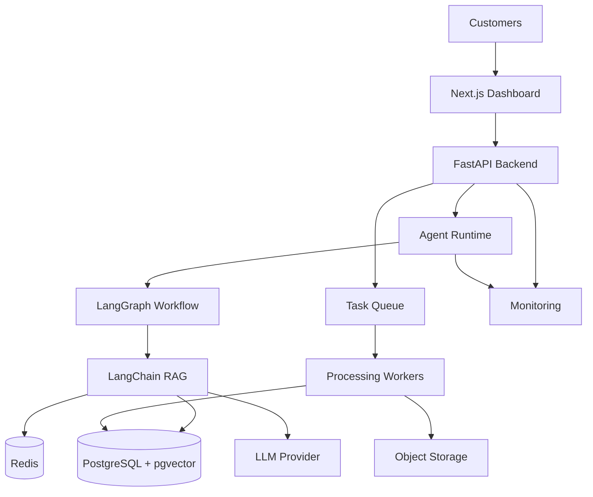
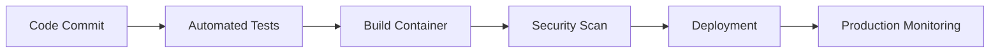

# RAG Production Deployment

**Document Version:** 1.0
**Project:** AI Voice Agent SaaS Platform
**Phase:** 03 - RAG Knowledge Platform
**Status:** Draft
**Last Updated:** 2026-07-23

---

# 1. Overview

This document defines the production deployment architecture for the RAG Knowledge Platform.

The deployment architecture is designed for a multi-tenant AI Voice Agent SaaS platform requiring:

* High availability
* Horizontal scalability
* Secure data isolation
* Low latency retrieval
* Operational reliability

---

# 2. Deployment Objectives

The production system must provide:

* Scalable RAG services
* Reliable document processing
* Fault tolerance
* Monitoring and alerting
* Secure infrastructure

---

# 3. Production RAG Architecture



---

# 4. Deployment Components

```text
Production Platform

├── Web Application

├── API Services

├── Agent Runtime

├── RAG Services

├── Background Workers

├── Database Layer

├── Cache Layer

├── Storage Layer

└── Monitoring Stack
```

---

# 5. Service Architecture

Recommended services:

```text
services/

├── api-service

├── agent-runtime

├── rag-service

├── ingestion-worker

├── embedding-worker

├── evaluation-service

└── monitoring-service
```

---

# 6. FastAPI Backend Deployment

Responsibilities:

* API endpoints
* Authentication
* Tenant management
* Agent configuration
* RAG orchestration

Deployment:

```text
FastAPI

↓

Container

↓

Kubernetes Deployment
```

---

# 7. Agent Runtime Deployment

The agent runtime handles:

* LangGraph workflows
* Conversation state
* Tool execution
* Agent reasoning

Architecture:

```text
Voice Event

↓

Agent Runtime

↓

Workflow Execution

↓

Response
```

---

# 8. RAG Service Deployment

Responsibilities:

* Retrieval
* Ranking
* Context generation
* Knowledge access

---

# 9. Document Processing Workers

Workers handle:

* File parsing
* Chunk creation
* Metadata extraction
* Embedding generation

Workflow:

```text
Upload

↓

Queue

↓

Worker

↓

Embedding

↓

Vector Storage
```

---

# 10. Database Deployment

Primary database:

```text
PostgreSQL

+

pgvector Extension
```

Stores:

* Tenants
* Documents
* Chunks
* Embeddings
* Metadata
* Agent data

---

# 11. Redis Deployment

Redis provides:

* Session cache
* Conversation memory
* Retrieval cache
* Task coordination

---

# 12. Storage Layer

Object storage contains:

* Original documents
* Audio recordings
* Processed files
* Export files

Examples:

```text
S3 Compatible Storage
```

---

# 13. Container Strategy

All services run as containers:

```text
Docker Images

↓

Container Registry

↓

Deployment Platform
```

---

# 14. Kubernetes Architecture

Production cluster:

```text
Kubernetes Cluster

├── API Pods

├── Agent Pods

├── Worker Pods

├── RAG Pods

├── Database

└── Monitoring
```

---

# 15. Scaling Strategy

Scale independently:

## API Layer

Based on:

* Requests per second

## Agent Runtime

Based on:

* Active conversations

## Workers

Based on:

* Processing queue length

## Retrieval

Based on:

* Search volume

---

# 16. Deployment Environments

Recommended:

```text
Environment

├── Development

├── Testing

├── Staging

└── Production
```

---

# 17. CI/CD Pipeline



---

# 18. Configuration Management

Configuration includes:

* Database URLs
* API keys
* Model settings
* Tenant limits
* Feature flags

Stored securely using:

```text
Secrets Manager
```

---

# 19. Backup Strategy

Backup:

* PostgreSQL database
* Documents
* Vector data
* Configuration
* Audit logs

---

# 20. Disaster Recovery

Recovery plan:

```text
Failure

↓

Detect

↓

Restore

↓

Validate

↓

Resume Service
```

---

# 21. Performance Targets

Monitor:

```text
Performance

├── Retrieval Latency

├── Agent Response Time

├── Processing Speed

├── Database Performance

└── Resource Usage
```

---

# 22. Security Deployment Controls

Implement:

* Network isolation
* Secrets management
* Encryption
* Access policies
* Container security

---

# 23. Production Monitoring

Monitor:

* Service health
* Errors
* Latency
* Costs
* Retrieval quality

---

# 24. Deployment Database Entities

Recommended:

```text
deployment_configs

service_instances

deployment_versions

health_checks

release_history
```

---

# 25. Recommended Infrastructure Stack

Example:

```text
Frontend:

Next.js


Backend:

FastAPI


Agent:

LangGraph


RAG:

LangChain + pgvector


Cache:

Redis


Containers:

Docker


Orchestration:

Kubernetes


Monitoring:

OpenTelemetry + Grafana
```

---

# 26. Future Enhancements

Future capabilities:

* Multi-region deployment
* Automated scaling
* Serverless workers
* Edge AI processing

---

# 27. Related Documents

| Document                               | Purpose                  |
| -------------------------------------- | ------------------------ |
| 16_RAG_Observability_and_Monitoring.md | Monitoring               |
| 17_RAG_Security_Model.md               | Security                 |
| 32_Deployment_Configs/                 | Deployment configuration |
| 33_Kubernetes_Manifests/               | Kubernetes resources     |

---

# 28. Conclusion

The RAG Production Deployment architecture defines how the knowledge platform moves from development into a scalable enterprise environment.

It enables:

* Reliable AI agents
* Secure tenant operations
* High-performance retrieval
* Production SaaS readiness

---

**End of Document**
