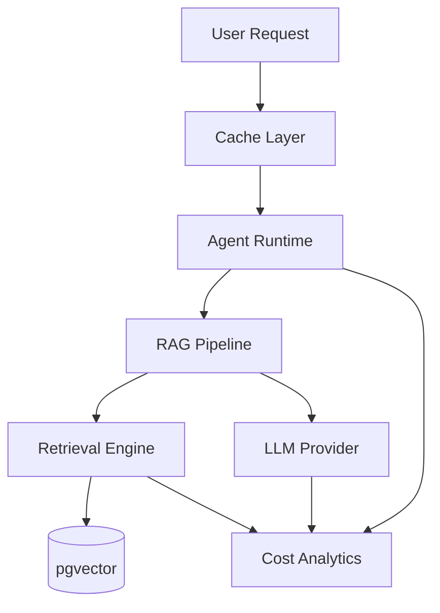

# RAG Cost Optimization Strategy

**Document Version:** 1.0
**Project:** AI Voice Agent SaaS Platform
**Phase:** 03 - RAG Knowledge Platform
**Status:** Draft
**Last Updated:** 2026-07-23

---

# 1. Overview

This document defines the cost optimization strategy for the RAG Knowledge Platform.

A production AI platform must balance:

* Response quality
* Retrieval accuracy
* Latency
* Infrastructure cost
* AI model usage cost

The objective is to deliver enterprise-grade AI agents while maintaining predictable operating costs.

---

# 2. Cost Optimization Objectives

The platform should:

* Reduce unnecessary LLM calls
* Minimize token consumption
* Optimize vector operations
* Control storage growth
* Improve infrastructure efficiency

---

# 3. Cost Architecture



---

# 4. Cost Categories

```text
Cost Model

├── LLM Costs

├── Embedding Costs

├── Database Costs

├── Storage Costs

├── Compute Costs

└── Voice Infrastructure Costs
```

---

# 5. LLM Cost Optimization

Strategies:

* Use smaller models where possible
* Reduce unnecessary generations
* Cache repeated answers
* Optimize prompts
* Limit context size

---

# 6. Model Routing Strategy

Use different models for different tasks:

```text
Simple Task

↓

Small Model


Complex Task

↓

Large Model
```

Example:

```text
Classification

GPT Small Model


Complex Reasoning

Advanced Model
```

---

# 7. Token Optimization

Reduce token usage by:

* Better chunking
* Context compression
* Removing duplicate information
* Summarizing history

---

# 8. Context Budget Management

Example:

```text
Total Token Budget

├── System Instructions

├── Conversation Memory

├── RAG Context

└── Response Output
```

---

# 9. Retrieval Cost Optimization

Improve retrieval efficiency:

* Metadata filtering
* Smaller search scope
* Optimized indexes
* Query caching

---

# 10. Embedding Optimization

Reduce embedding costs:

* Avoid duplicate processing
* Detect document changes
* Batch embedding jobs
* Use appropriate embedding models

---

# 11. Document Processing Optimization

Processing pipeline:

```text
Upload

↓

Check Hash

↓

Changed?

↓

Process Only If Required
```

---

# 12. Vector Database Optimization

Optimize:

* Index configuration
* Storage cleanup
* Vector dimensions
* Query performance

---

# 13. Chunking Optimization

Poor chunking increases cost.

Recommended:

```text
Good Chunk

=

Enough Context

+

Low Token Waste

+

High Retrieval Accuracy
```

---

# 14. Retrieval Cache Strategy

Cache:

* Query embeddings
* Frequent searches
* Retrieval results
* Agent configurations

Technology:

```text
Redis
```

---

# 15. Response Cache Strategy

For repeated questions:

```text
Question

↓

Cache Lookup

↓

Return Existing Answer

OR

Generate New Answer
```

---

# 16. Multi-Tenant Cost Controls

Track usage per tenant:

```text
Tenant Usage

├── AI Tokens

├── Voice Minutes

├── Storage

├── Searches

└── Documents
```

---

# 17. Usage Limits

Implement:

* API quotas
* Token limits
* Storage limits
* Request throttling

---

# 18. Cost Attribution

Every operation should record:

```text
Cost Event

├── Tenant ID

├── Agent ID

├── Operation

├── Model

├── Tokens

└── Cost
```

---

# 19. Background Processing Optimization

Optimize workers:

* Queue batching
* Parallel processing
* Priority queues
* Resource limits

---

# 20. Infrastructure Optimization

Reduce infrastructure cost through:

* Autoscaling
* Container optimization
* Resource monitoring
* Efficient database usage

---

# 21. Cost Monitoring Dashboard

Track:

```text
Cost Dashboard

├── Daily Spend

├── Cost Per Conversation

├── Cost Per Tenant

├── Model Usage

└── Storage Growth
```

---

# 22. AI Quality vs Cost Balance

Optimization should not reduce:

* Accuracy
* Safety
* Customer experience

Decision model:

```text
Lower Cost

+

Acceptable Quality

=

Optimal System
```

---

# 23. Database Entities

Recommended tables:

```text
usage_records

token_usage

cost_events

tenant_billing_usage

model_usage_logs
```

---

# 24. Production Cost Flow

```text
User Call

↓

Agent Runtime

↓

RAG Retrieval

↓

LLM Processing

↓

Usage Tracking

↓

Cost Analytics

↓

Billing System
```

---

# 25. Billing Integration

Future integration:

* Subscription plans
* Usage billing
* Cost limits
* Invoice generation

---

# 26. Cost Optimization Monitoring

Monitor:

* Cost trends
* Model performance
* Token efficiency
* Tenant usage patterns

---

# 27. Future Enhancements

Future capabilities:

* AI cost optimizer agent
* Automatic model selection
* Predictive cost forecasting
* Tenant optimization recommendations

---

# 28. Related Documents

| Document                               | Purpose    |
| -------------------------------------- | ---------- |
| 15_RAG_Evaluation_Framework.md         | Quality    |
| 16_RAG_Observability_and_Monitoring.md | Monitoring |
| 18_RAG_Production_Deployment.md        | Deployment |
| 29_Database_Schema/                    | Data model |

---

# 29. Conclusion

The RAG Cost Optimization Strategy ensures the AI platform remains economically scalable.

It enables:

* Predictable operating costs
* Efficient AI usage
* Better margins
* Enterprise SaaS scalability

---

**End of Document**
