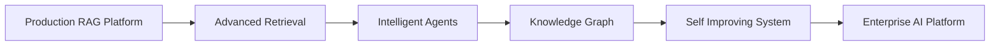

# RAG Future Roadmap

**Document Version:** 1.0
**Project:** AI Voice Agent SaaS Platform
**Phase:** 03 - RAG Knowledge Platform
**Status:** Draft
**Last Updated:** 2026-07-23

---

# 1. Overview

This document defines the future evolution roadmap for the RAG Knowledge Platform.

The current architecture provides a production-ready foundation for:

* Enterprise knowledge management
* AI agent retrieval
* Multi-tenant security
* Voice automation
* Intelligent responses

Future development will focus on making the platform more autonomous, intelligent, and adaptive.

---

# 2. Roadmap Objectives

Future improvements will target:

* Higher retrieval accuracy
* Autonomous knowledge management
* Advanced reasoning
* Better personalization
* Enterprise intelligence

---

# 3. Evolution Roadmap



---

# 4. Phase 1 - Production Foundation

Completed capabilities:

```text id="x3m9qp"
✓ Document ingestion

✓ Vector search

✓ Hybrid retrieval

✓ Reranking

✓ Context building

✓ LangGraph workflows

✓ Multi-tenant security

✓ Monitoring
```

---

# 5. Phase 2 - Advanced Retrieval

Future improvements:

## Semantic Search Enhancement

Implement:

* Better embeddings
* Domain-specific models
* Query understanding

---

## Adaptive Retrieval

System automatically decides:

```text id="m8q4vx"
Simple Question

↓

Direct Answer


Complex Question

↓

Deep Retrieval
```

---

# 6. Phase 3 - Knowledge Graph Integration

Future architecture:

```text id="r7k2mz"
Documents

↓

Entities

↓

Relationships

↓

Knowledge Graph

↓

Reasoning Engine
```

Benefits:

* Better relationship understanding
* Multi-hop reasoning
* Complex question answering

---

# 7. Phase 4 - Autonomous Knowledge Management

AI manages knowledge lifecycle:

Capabilities:

* Detect outdated documents
* Recommend updates
* Identify missing information
* Generate summaries

---

# 8. Phase 5 - Self Improving RAG

Future system:

```text id="b4n8qx"
User Interaction

↓

Feedback

↓

Evaluation

↓

Optimization

↓

Improved Retrieval
```

---

# 9. Agentic RAG

Future agents will:

* Plan retrieval strategies
* Select knowledge sources
* Validate answers
* Correct mistakes

Architecture:

```text id="c6m9vx"
Supervisor Agent

↓

Research Agent

↓

Knowledge Agent

↓

Response Agent
```

---

# 10. Multi-Agent Knowledge Collaboration

Future:

```text id="p5n8mq"
Sales Agent

        ↕

Knowledge Agent

        ↕

Support Agent

        ↕

Operations Agent
```

---

# 11. Personalized Knowledge Retrieval

Future personalization:

* User preferences
* Previous interactions
* Customer history
* Business context

---

# 12. Real-Time Knowledge Updates

Future capability:

```text id="z6m4qp"
Business Change

↓

Knowledge Detection

↓

Automatic Processing

↓

Immediate Agent Update
```

---

# 13. Advanced Voice RAG

Voice-specific improvements:

* Real-time retrieval during calls
* Streaming context updates
* Call-aware knowledge selection
* Customer emotion awareness

---

# 14. AI Governance Layer

Future governance:

```text id="f8m2vx"
Governance

├── AI Policies

├── Knowledge Approval

├── Response Validation

├── Compliance

└── Audit
```

---

# 15. Enterprise Features Roadmap

Future enterprise capabilities:

* Dedicated tenant infrastructure
* Private AI deployments
* Customer-managed models
* Compliance certifications

---

# 16. Research Areas

Explore:

* Agentic retrieval
* Long-term memory
* Neural search
* Multimodal RAG
* AI reasoning systems

---

# 17. Platform Integration Roadmap

Future integrations:

```text id="k7m5qx"
CRM Systems

↓

ERP Systems

↓

Ticketing Systems

↓

Knowledge Platforms

↓

Business Applications
```

---

# 18. Performance Improvements

Future optimization:

* Faster retrieval
* Lower latency
* Better caching
* Distributed vector search

---

# 19. Cost Optimization Roadmap

Future:

* Automatic model routing
* AI cost prediction
* Intelligent caching
* Resource optimization

---

# 20. Security Evolution

Future security:

* Zero trust architecture
* AI threat detection
* Advanced data governance
* Automated compliance

---

# 21. Innovation Timeline

```text id="n9m3vx"

Now

↓

Production RAG Platform


Next

↓

Advanced Retrieval


Future

↓

Autonomous Knowledge Intelligence


Long Term

↓

Enterprise AI Operating System
```

---

# 22. Success Metrics

Measure:

```text id="w6m8qp"
Success

├── Retrieval Accuracy

├── Customer Satisfaction

├── Agent Resolution Rate

├── Response Speed

├── AI Cost Efficiency

└── Knowledge Coverage
```

---

# 23. Final Architecture Vision

```text id="e5m9vx"
Customer

↓

Voice AI Agent

↓

LangGraph Intelligence Layer

↓

Agentic RAG Platform

↓

Knowledge Graph

↓

Enterprise Data Systems

↓

Autonomous AI Operations
```

---

# 24. Related Documents

| Document                        | Purpose            |
| ------------------------------- | ------------------ |
| 15_RAG_Evaluation_Framework.md  | Quality            |
| 17_RAG_Security_Model.md        | Security           |
| 18_RAG_Production_Deployment.md | Deployment         |
| 04_Agent_Runtime_Platform/      | Agent architecture |

---

# 25. Conclusion

The RAG Future Roadmap defines the long-term evolution of the AI Knowledge Platform.

The goal is to move from:

```text
Knowledge Retrieval
```

towards:

```text
Autonomous Knowledge Intelligence
```

This roadmap enables the AI Voice Agent SaaS platform to become a scalable enterprise AI operating system.

---

**End of Document**
