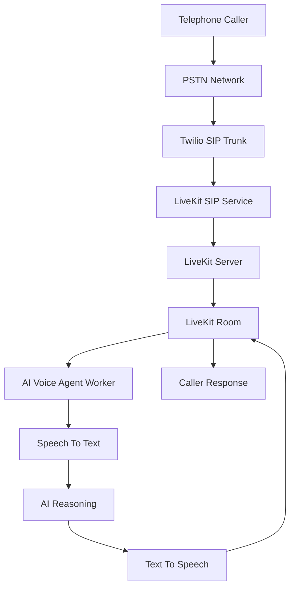
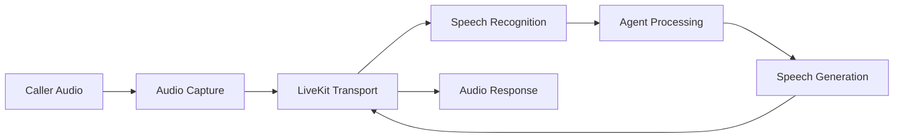

# LiveKit Voice Platform Architecture Overview

**Document Version:** 1.0
**Project:** AI Voice Agent SaaS Platform
**Phase:** 04 - LiveKit Voice Platform
**Status:** Draft
**Last Updated:** 2026-07-23

---

# 1. Overview

This document defines the architecture of the LiveKit Voice Platform layer.

LiveKit provides the real-time communication infrastructure that connects:

* Telephone networks
* Voice channels
* AI agents
* Speech services
* Human operators

Within the AI Voice Agent SaaS platform, LiveKit acts as the real-time media orchestration layer.

---

# 2. Platform Role

The complete AI voice stack is divided into layers:

```text
Caller Communication

↓

LiveKit Voice Platform

↓

Agent Runtime Platform

↓

RAG Knowledge Platform

↓

Business Systems
```

---

# 3. LiveKit Responsibilities

LiveKit manages:

* Real-time audio transport
* Voice sessions
* Rooms
* Participants
* Audio tracks
* SIP connectivity
* Agent connections
* Media routing

---

# 4. High-Level Architecture



---

# 5. System Position

LiveKit sits between communication infrastructure and AI intelligence.

```text
                Communication Layer

                    Twilio SIP

                        |

                        |

                 LiveKit Platform

                        |

                        |

                Agent Runtime Layer

                        |

                        |

                AI Intelligence Layer
```

---

# 6. Core Components

## LiveKit Server

Responsible for:

* Room management
* Participant signaling
* Media routing
* Real-time communication

---

## LiveKit SIP Service

Responsible for:

* PSTN integration
* SIP trunk handling
* Telephone connectivity

---

## LiveKit Rooms

A room represents a live conversation session.

Example:

```text
Room

├── Caller Participant

├── AI Agent Participant

├── Human Agent Participant

└── Audio Tracks
```

---

## Agent Workers

AI workers join LiveKit rooms as participants.

Responsibilities:

* Receive audio
* Send audio
* Execute AI workflows
* Manage conversation

---

# 7. Voice Call Architecture

Inbound call:

```text
Caller

↓

Telephone Network

↓

Twilio SIP

↓

LiveKit SIP Gateway

↓

LiveKit Room

↓

AI Agent Worker

↓

Conversation
```

---

# 8. Outbound Call Architecture

```text
Campaign System

↓

Agent Runtime

↓

LiveKit API

↓

SIP Participant

↓

Twilio

↓

Customer Phone
```

---

# 9. Real-Time Audio Pipeline



---

# 10. Multi-Tenant Architecture

Each customer receives isolated resources:

```text
Tenant

├── Agents

├── SIP Configuration

├── Voice Settings

├── Call Routing Rules

├── Knowledge Access

└── Usage Metrics
```

---

# 11. LiveKit Session Model

A call session contains:

```text
Call Session

├── Call ID

├── Tenant ID

├── Agent ID

├── Room ID

├── Participant IDs

├── Audio Streams

├── Transcript

└── Recording
```

---

# 12. Integration Points

LiveKit connects with:

| System        | Purpose            |
| ------------- | ------------------ |
| Twilio        | PSTN connectivity  |
| FastAPI       | Backend control    |
| Agent Runtime | AI execution       |
| OpenAI        | Intelligence       |
| STT Provider  | Speech recognition |
| TTS Provider  | Voice generation   |
| PostgreSQL    | Metadata           |
| Redis         | Session state      |

---

# 13. Security Model

Security requirements:

* API authentication
* Room access tokens
* Tenant isolation
* Encrypted media
* Secure SIP credentials

---

# 14. Production Deployment Model

```text
Users

↓

Cloud Load Balancer

↓

LiveKit Cluster

↓

Agent Workers

↓

AI Services

↓

Database Layer
```

---

# 15. Scalability Considerations

The platform must support:

* Multiple concurrent calls
* Multiple tenants
* Geographic scaling
* Dynamic agent workers
* High availability

---

# 16. Observability

Monitor:

* Active rooms
* Call duration
* Audio quality
* Latency
* Agent failures
* SIP errors

---

# 17. Future Capabilities

Future improvements:

* Multi-region LiveKit deployment
* Advanced call routing
* Real-time sentiment analysis
* Voice analytics
* AI supervisor monitoring

---

# 18. Related Documents

| Document                           | Purpose            |
| ---------------------------------- | ------------------ |
| 02_LiveKit_Server_Deployment.md    | Server deployment  |
| 03_LiveKit_Room_Architecture.md    | Room model         |
| 04_SIP_Integration_Architecture.md | SIP design         |
| 05_Twilio_SIP_Trunk_Integration.md | Twilio integration |

---

# 19. Conclusion

The LiveKit Voice Platform provides the real-time communication foundation for the AI Voice Agent SaaS platform.

It separates:

* Voice transport
* Media handling
* AI reasoning
* Knowledge retrieval

This architecture enables scalable enterprise voice automation.

---

**End of Document**
