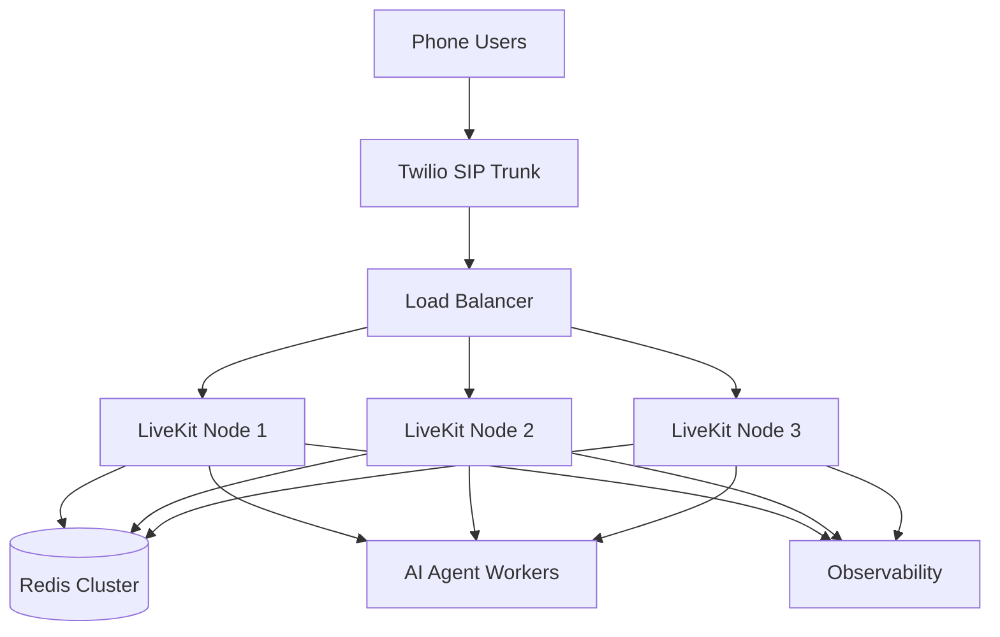

# LiveKit Server Deployment Architecture

**Document Version:** 1.0
**Project:** AI Voice Agent SaaS Platform
**Phase:** 04 - LiveKit Voice Platform
**Status:** Draft
**Last Updated:** 2026-07-23

---

# 1. Overview

This document defines the deployment architecture for the LiveKit Server infrastructure.

LiveKit Server provides the real-time communication engine responsible for:

* Room management
* Participant signaling
* Audio routing
* Media transport
* SIP communication

The deployment must support production-grade AI voice workloads with low latency and high availability.

---

# 2. Deployment Objectives

The LiveKit infrastructure must provide:

* Reliable voice sessions
* Horizontal scalability
* Low media latency
* Secure communication
* High availability
* Multi-tenant support

---

# 3. LiveKit Deployment Architecture



---

# 4. Deployment Modes

LiveKit can run in:

```text
Development

↓

Single Server


Production

↓

Distributed Cluster
```

---

# 5. Development Deployment

Local development:

```text id="w8q4nv"
Developer Machine

↓

Docker Container

↓

LiveKit Server

↓

Agent Worker
```

Typical usage:

* Testing agents
* Developing workflows
* Debugging calls

---

# 6. Production Deployment

Recommended:

```text id="j4m8px"
Internet

↓

Load Balancer

↓

LiveKit Cluster

↓

Agent Workers

↓

AI Services
```

---

# 7. Container Deployment

LiveKit should run as a containerized service.

Example:

```text id="x7m2qp"
Docker Image

↓

Container Runtime

↓

Production Host

↓

LiveKit Service
```

---

# 8. Kubernetes Deployment

Recommended production architecture:

```text id="n5q8mv"
Kubernetes Cluster

├── LiveKit Pods

├── SIP Service Pods

├── Agent Worker Pods

├── Redis

└── Monitoring Stack
```

---

# 9. LiveKit Configuration

Main configuration includes:

```yaml
server:

  port: 7880

rtc:

  tcp_port: 7881

  port_range_start: 50000

  port_range_end: 60000
```

---

# 10. Network Requirements

Required ports:

| Port        | Purpose                  |
| ----------- | ------------------------ |
| 7880        | HTTP/WebSocket signaling |
| 7881        | RTC TCP                  |
| 50000-60000 | WebRTC UDP media         |

---

# 11. External Dependencies

LiveKit requires:

```text id="9c4mpv"
LiveKit Server

↓

Redis

↓

Database

↓

Monitoring

↓

Agent Runtime
```

---

# 12. Redis Integration

Redis provides:

* Cluster coordination
* Room state
* Distributed communication

Architecture:

```text id="x9q5mz"
LiveKit Node

↓

Redis

↓

Other LiveKit Nodes
```

---

# 13. TLS Configuration

Production requires:

* HTTPS
* Secure WebSocket
* Valid certificates
* Encrypted media signaling

---

# 14. Authentication

Clients connect using:

```text id="p8m4vx"
Access Token

Contains:

├── Identity

├── Room Permission

├── Participant Permission

└── Expiration
```

---

# 15. SIP Deployment

SIP connectivity:

```text id="h6m9qp"
Phone Network

↓

Twilio

↓

LiveKit SIP Service

↓

LiveKit Server
```

---

# 16. Scaling Strategy

Scale based on:

* Active rooms
* Concurrent participants
* Audio streams
* CPU usage
* Network bandwidth

---

# 17. High Availability Design

Production setup:

```text id="v7m3qx"
Multiple LiveKit Nodes

+

Shared Redis

+

Load Balancer

+

Health Checks
```

---

# 18. Failure Handling

Example:

```text id="d5m8kp"
Node Failure

↓

Health Check Detects

↓

Traffic Redirected

↓

New Session Created
```

---

# 19. Monitoring Requirements

Monitor:

```text id="c8q4mv"
LiveKit Metrics

├── Active Rooms

├── Participants

├── Packet Loss

├── Latency

├── CPU Usage

└── Memory Usage
```

---

# 20. Logging

Collect:

* Connection events
* Room lifecycle
* SIP events
* Media errors
* Authentication failures

---

# 21. Security Controls

Implement:

* Firewall rules
* Token authentication
* TLS encryption
* SIP credential protection
* Network isolation

---

# 22. Backup and Recovery

Backup:

* Configuration
* Secrets
* Deployment manifests
* Infrastructure state

---

# 23. Production Infrastructure Example

```text id="k7m9qx"
Cloud Provider

↓

Load Balancer

↓

Kubernetes Cluster

↓

LiveKit Pods

↓

Agent Workers

↓

AI Platform
```

---

# 24. Recommended Technology Stack

```text id="v2m8qp"
Runtime:

Docker


Orchestration:

Kubernetes


Networking:

Load Balancer


State:

Redis


Monitoring:

OpenTelemetry + Grafana
```

---

# 25. Future Enhancements

Future improvements:

* Multi-region LiveKit clusters
* Automatic scaling
* Geographic routing
* Edge media servers

---

# 26. Related Documents

| Document                            | Purpose            |
| ----------------------------------- | ------------------ |
| 01_LiveKit_Architecture_Overview.md | Platform overview  |
| 03_LiveKit_Room_Architecture.md     | Room design        |
| 19_LiveKit_Kubernetes_Deployment.md | Kubernetes details |
| 20_LiveKit_Future_Roadmap.md        | Future plans       |

---

# 27. Conclusion

The LiveKit Server Deployment Architecture defines the infrastructure foundation required for production voice AI operations.

It enables:

* Real-time communication
* Scalable call handling
* Secure media transport
* Enterprise deployment readiness

---

**End of Document**
