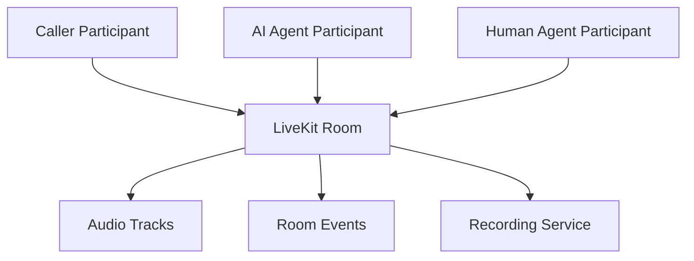

# LiveKit Room Architecture

**Document Version:** 1.0
**Project:** AI Voice Agent SaaS Platform
**Phase:** 04 - LiveKit Voice Platform
**Status:** Draft
**Last Updated:** 2026-07-23

---

# 1. Overview

This document defines the LiveKit Room architecture used by the AI Voice Agent SaaS platform.

In LiveKit, a **Room** represents an isolated real-time communication session where participants exchange audio, video, and data streams.

For the voice AI platform, every phone call maps to a dedicated LiveKit Room.

---

# 2. Room Architecture Objectives

The room design must support:

* One call = one isolated session
* Multiple participants
* AI agent participation
* Human transfer
* Audio streaming
* Recording
* Event tracking
* Tenant isolation

---

# 3. Room Concept

A LiveKit Room contains:

```text
Room

├── Participants

├── Audio Tracks

├── Data Messages

├── Metadata

├── Events

└── Recording State
```

---

# 4. Voice Call Room Model



---

# 5. Room Lifecycle

A voice session follows:

```text
CREATED

↓

CONNECTING

↓

ACTIVE

↓

AI_PROCESSING

↓

TRANSFER

↓

ENDING

↓

CLOSED
```

---

# 6. Room Creation Flow

Inbound call:

```text
Caller

↓

Twilio SIP

↓

LiveKit SIP Service

↓

Create Room

↓

Join AI Agent

↓

Start Conversation
```

---

# 7. Room Naming Strategy

Room names should be unique.

Recommended format:

```text
tenant_{tenant_id}_call_{call_id}
```

Example:

```text
tenant_123_call_987654
```

Benefits:

* Easy debugging
* Tenant tracking
* Log correlation

---

# 8. Room Metadata

Each room stores:

```json
{
  "tenant_id": "tenant_123",
  "call_id": "call_987654",
  "agent_id": "support_agent",
  "direction": "inbound",
  "language": "en"
}
```

---

# 9. Participant Architecture

A typical AI call contains:

```text
LiveKit Room

├── SIP Caller

├── AI Voice Agent

└── Optional Human Agent
```

---

# 10. Participant Identity Model

Each participant has:

```text
Participant

├── Identity

├── Role

├── Permissions

├── Metadata

└── Connection State
```

---

# 11. AI Agent Participant

The AI agent joins as a participant.

Responsibilities:

* Subscribe to caller audio
* Process speech
* Publish response audio
* Execute tools
* Maintain conversation state

---

# 12. Caller Participant

Caller properties:

```text
Caller

├── Phone Number

├── SIP Identity

├── Call Direction

├── Connection Status

└── Session ID
```

---

# 13. Human Transfer Participant

During escalation:

```text
AI Agent

↓

Transfer Request

↓

Human Agent Joins Room

↓

AI Agent Leaves
```

---

# 14. Audio Track Architecture

Tracks:

```text
Caller Audio Track

↓

LiveKit Audio Stream

↓

AI Agent Subscription

↓

STT Processing
```

Response:

```text
AI Response

↓

TTS Audio Track

↓

LiveKit

↓

Caller
```

---

# 15. Data Channel Usage

Data messages can carry:

* Agent events
* Tool results
* UI updates
* Call controls

Example:

```json
{
 "event": "transfer_requested",
 "reason": "customer_requested_human"
}
```

---

# 16. Room Event Architecture

Important events:

```text
Room Events

├── Room Created

├── Participant Joined

├── Participant Left

├── Track Published

├── Track Subscribed

├── Recording Started

└── Room Closed
```

---

# 17. Room State Management

Store important state externally:

```text
LiveKit Room

        |

        |

Redis / PostgreSQL

        |

        |

Conversation State
```

---

# 18. Database Relationship

Recommended model:

```text
Tenant

↓

Call Session

↓

LiveKit Room

↓

Participants

↓

Audio Events
```

---

# 19. Multi-Tenant Isolation

Every room must include:

```text
Security Context

├── Tenant ID

├── Agent ID

├── Permissions

└── Access Token
```

---

# 20. Room Access Security

Access controlled through:

* JWT tokens
* Room permissions
* Participant permissions
* Token expiration

---

# 21. Call Recording Integration

Recording flow:

```text
Room Active

↓

Recording Enabled

↓

Audio Captured

↓

Storage

↓

Call Archive
```

---

# 22. Room Cleanup

After call completion:

```text
Call End

↓

Finalize Recording

↓

Save Transcript

↓

Update Database

↓

Close Room
```

---

# 23. Monitoring Metrics

Track:

```text
Room Metrics

├── Active Rooms

├── Duration

├── Participants

├── Audio Quality

├── Failures

└── Latency
```

---

# 24. Production Scaling

Scaling depends on:

* Number of active rooms
* Concurrent calls
* Audio bandwidth
* Agent workers

---

# 25. Failure Handling

Example:

```text
Agent Worker Failure

↓

Detect Disconnect

↓

Restart Worker

↓

Reconnect Session

OR

Transfer To Human
```

---

# 26. Future Enhancements

Future capabilities:

* AI supervisor participant
* Multiple AI agents in one room
* Real-time sentiment tracking
* Advanced call analytics

---

# 27. Related Documents

| Document                            | Purpose          |
| ----------------------------------- | ---------------- |
| 01_LiveKit_Architecture_Overview.md | Overall design   |
| 04_SIP_Integration_Architecture.md  | SIP connectivity |
| 08_Voice_Agent_Session_Model.md     | Session model    |
| 12_Call_Recording_Architecture.md   | Recording        |

---

# 28. Conclusion

The LiveKit Room Architecture provides the foundation for managing real-time AI voice conversations.

It enables:

* Isolated calls
* Scalable sessions
* AI-human collaboration
* Reliable voice communication

---

**End of Document**
