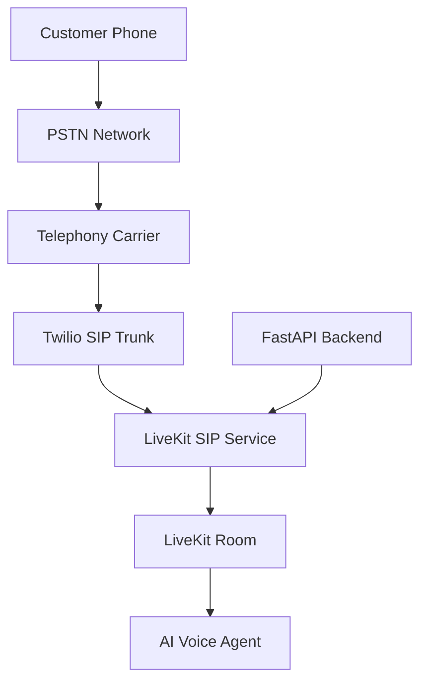

# SIP Integration Architecture

**Document Version:** 1.0
**Project:** AI Voice Agent SaaS Platform
**Phase:** 04 - LiveKit Voice Platform
**Status:** Draft
**Last Updated:** 2026-07-23

---

# 1. Overview

This document defines the Session Initiation Protocol (SIP) integration architecture for the AI Voice Agent SaaS platform.

SIP provides the communication bridge between traditional telephone networks and the real-time AI voice platform.

The SIP architecture enables:

* Incoming phone calls
* Outgoing phone calls
* Call routing
* Number management
* Voice agent connectivity

---

# 2. SIP Architecture Objectives

The system must support:

* PSTN connectivity
* SIP trunk integration
* Tenant-specific routing
* Scalable call handling
* Secure signaling
* Reliable media transport

---

# 3. High-Level SIP Architecture



---

# 4. SIP Components

```text id="v9k4mp"
SIP Architecture

├── PSTN Network

├── SIP Carrier

├── SIP Trunk

├── SIP Gateway

├── LiveKit SIP Service

└── AI Agent
```

---

# 5. Call Flow - Incoming Call

```text id="q3m8vx"
Customer Calls Number

↓

Telephony Provider Receives Call

↓

SIP INVITE Generated

↓

LiveKit SIP Service Receives Request

↓

Create LiveKit Room

↓

AI Agent Joins

↓

Conversation Begins
```

---

# 6. Call Flow - Outbound Call

```text id="m5q8kp"
Campaign System

↓

Agent Runtime

↓

LiveKit SIP Participant

↓

SIP INVITE

↓

Telephony Provider

↓

Customer Phone Rings
```

---

# 7. SIP Signaling Flow

Basic SIP messages:

```text id="p6n3vx"
INVITE

↓

100 Trying

↓

180 Ringing

↓

200 OK

↓

ACK

↓

RTP Media Session

↓

BYE
```

---

# 8. Media Flow

SIP handles signaling while RTP carries audio.

```text id="x8m4qp"
Caller Audio

↓

RTP Stream

↓

LiveKit SIP Gateway

↓

LiveKit Audio Track

↓

AI Agent
```

---

# 9. Tenant-Based Routing

The platform routes calls based on:

```text id="b4m8qx"
Incoming Number

↓

Tenant Lookup

↓

Agent Assignment

↓

Voice Configuration

↓

LiveKit Room Creation
```

---

# 10. Phone Number Management

Each tenant can have:

```text id="n7q5mx"
Tenant

├── Phone Numbers

├── SIP Configuration

├── Business Hours

├── Routing Rules

└── Assigned Agents
```

---

# 11. SIP Trunk Configuration

Required settings:

```text id="c8m2vx"
SIP Trunk

├── Provider

├── Domain

├── Authentication

├── Allowed Numbers

├── Routing Rules

└── Media Settings
```

---

# 12. Twilio Integration

Twilio provides:

* Phone numbers
* SIP trunking
* PSTN termination
* Call routing

Architecture:

```text id="r5m9vx"
Twilio

↓

SIP Trunk

↓

LiveKit SIP

↓

AI Agent
```

---

# 13. SIP Authentication

Security methods:

* IP authentication
* Credential authentication
* SIP tokens
* TLS signaling

---

# 14. SIP Security

Protect against:

* Unauthorized calls
* SIP abuse
* Fraud attempts
* Credential leakage

Controls:

```text id="d8m4qx"
Security

├── TLS

├── Secure Credentials

├── Rate Limits

├── Validation

└── Monitoring
```

---

# 15. Call Routing Engine

Routing decisions:

```text id="h7q3mp"
Incoming Call

↓

Identify Tenant

↓

Check Rules

↓

Select Agent

↓

Create Session
```

---

# 16. SIP Metadata

Store:

```json id="s6m8qx"
{
  "caller_number": "+15551234567",
  "destination_number": "+15557654321",
  "tenant_id": "tenant_001",
  "call_direction": "inbound"
}
```

---

# 17. Integration With Backend

FastAPI manages:

* Number provisioning
* Routing rules
* Agent assignment
* Call configuration

---

# 18. Database Entities

Recommended tables:

```text id="e5m9vx"
phone_numbers

sip_trunks

sip_configurations

call_routes

routing_rules

call_sessions
```

---

# 19. SIP Failure Handling

Handle:

* No answer
* Busy
* Invalid destination
* Network failure
* Provider failure

---

# 20. Monitoring

Track:

```text id="u6q8mp"
SIP Metrics

├── Call Attempts

├── Successful Calls

├── Failed Calls

├── Call Duration

├── SIP Errors

└── Media Quality
```

---

# 21. Production Architecture

```text id="k9m5vx"
Customer

↓

PSTN

↓

Twilio SIP

↓

LiveKit SIP Gateway

↓

LiveKit Room

↓

AI Voice Agent

↓

Business Logic
```

---

# 22. Future Enhancements

Future capabilities:

* Multiple SIP providers
* Automatic carrier failover
* Global phone number routing
* Advanced fraud detection

---

# 23. Related Documents

| Document                           | Purpose        |
| ---------------------------------- | -------------- |
| 05_Twilio_SIP_Trunk_Integration.md | Twilio details |
| 06_Inbound_Call_Flow.md            | Incoming calls |
| 07_Outbound_Call_Flow.md           | Outgoing calls |
| 11_Call_State_Management.md        | Call lifecycle |

---

# 24. Conclusion

The SIP Integration Architecture connects traditional telephone infrastructure with the AI voice platform.

It provides the communication foundation required for:

* Inbound AI receptionists
* Outbound AI campaigns
* Enterprise phone automation

---

**End of Document**
