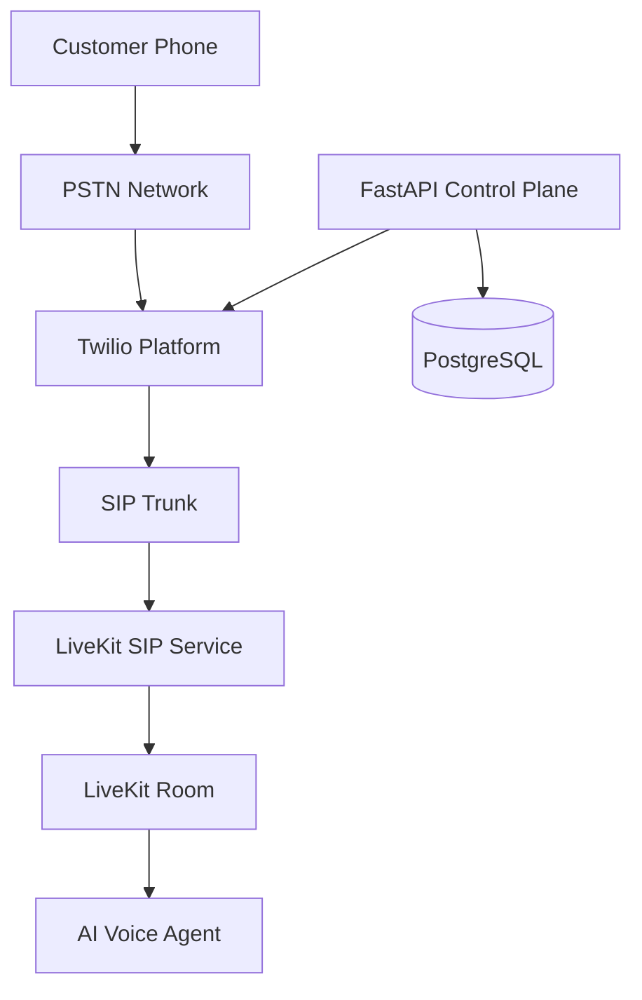
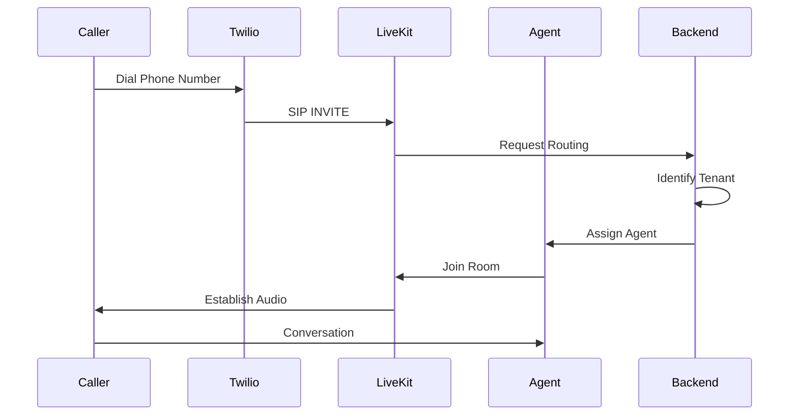
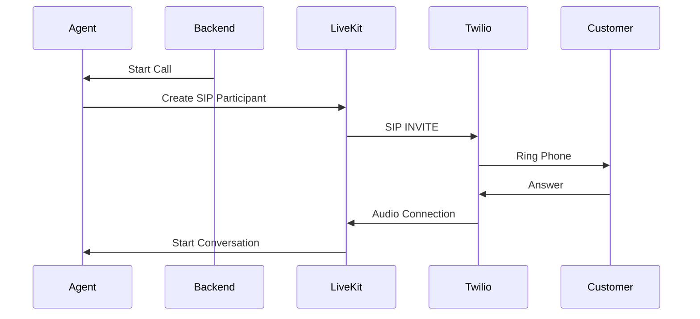

# Twilio SIP Trunk Integration Architecture

**Document Version:** 1.0
**Project:** AI Voice Agent SaaS Platform
**Phase:** 04 - LiveKit Voice Platform
**Status:** Draft
**Last Updated:** 2026-07-23

---

# 1. Overview

This document defines the integration architecture between Twilio SIP Trunking and the LiveKit Voice Platform.

Twilio provides the connection between the Public Switched Telephone Network (PSTN) and the AI voice infrastructure.

The integration enables:

* Inbound customer calls
* Outbound AI calls
* Phone number management
* SIP routing
* Enterprise telephony connectivity

---

# 2. Integration Objectives

The Twilio SIP integration must provide:

* Reliable PSTN connectivity
* Low-latency audio transport
* Secure SIP communication
* Tenant-aware call routing
* Scalable call handling

---

# 3. Integration Architecture



---

# 4. Twilio Role

Twilio handles:

* Phone number provisioning
* PSTN termination
* SIP trunking
* Call routing
* Carrier connectivity

---

# 5. LiveKit Role

LiveKit handles:

* SIP session termination
* Real-time media
* Voice rooms
* AI participant connection
* Audio routing

---

# 6. Complete Call Path

```text id="y8m5qp"
Customer Phone

↓

PSTN

↓

Twilio Phone Number

↓

Twilio SIP Trunk

↓

LiveKit SIP Gateway

↓

LiveKit Room

↓

AI Agent Worker

↓

Conversation
```

---

# 7. Inbound Call Flow



---

# 8. Outbound Call Flow



---

# 9. SIP Trunk Configuration Model

A tenant SIP configuration contains:

```text id="j8m4vx"
SIP Configuration

├── Provider

├── Trunk ID

├── Authentication

├── Origination URI

├── Termination URI

├── Phone Numbers

└── Routing Rules
```

---

# 10. Twilio Number Management

Each tenant may have:

```text id="c9m5qx"
Tenant

├── Phone Number

├── Country

├── Region

├── Voice Agent

├── Business Hours

└── Routing Policy
```

---

# 11. Backend Integration

FastAPI manages:

* Provisioning numbers
* Assigning agents
* Configuring SIP trunks
* Tracking calls

Example:

```text id="r4m8vx"
API Request

↓

Create Phone Configuration

↓

Assign Tenant

↓

Assign Agent

↓

Activate Routing
```

---

# 12. SIP Authentication

Supported approaches:

## IP Authentication

```text id="q7m5vx"
Twilio IP

↓

Allowed SIP Endpoint
```

## Credential Authentication

```text id="h8m3qx"
Username + Password

↓

SIP Registration
```

---

# 13. Security Requirements

Protect:

* SIP credentials
* Phone numbers
* Call metadata
* Customer data

Controls:

```text id="d5m8qx"
Security

├── TLS

├── Authentication

├── Access Tokens

├── Rate Limits

└── Monitoring
```

---

# 14. Call Metadata

Capture:

```json id="v6m2qx"
{
 "tenant_id": "tenant_001",
 "phone_number": "+15550000000",
 "provider": "twilio",
 "direction": "inbound",
 "sip_status": "connected"
}
```

---

# 15. Database Design

Recommended tables:

```text id="e8m4qx"
telephony_providers

sip_trunks

phone_numbers

call_routes

call_sessions

sip_events
```

---

# 16. Error Handling

Handle:

* SIP connection failure
* Invalid numbers
* Carrier outage
* Authentication failure
* Media negotiation errors

---

# 17. Monitoring Metrics

Track:

```text id="u7m5vx"
Twilio Metrics

├── Incoming Calls

├── Outgoing Calls

├── Answer Rate

├── Failed Calls

├── Duration

└── Cost
```

---

# 18. Multi-Tenant Architecture

Example:

```text id="s9m4vx"
Tenant A

↓

Twilio Number A

↓

Agent A


Tenant B

↓

Twilio Number B

↓

Agent B
```

---

# 19. Production Deployment

```text id="k3m7qx"
Twilio Cloud

↓

Internet

↓

LiveKit SIP Gateway

↓

LiveKit Cluster

↓

Agent Workers
```

---

# 20. Cost Tracking

Track:

* Minutes used
* Call direction
* Tenant usage
* Carrier charges

---

# 21. Future Enhancements

Future improvements:

* Multiple carrier support
* Automatic failover
* Global phone routing
* Enterprise SIP providers

---

# 22. Related Documents

| Document                           | Purpose        |
| ---------------------------------- | -------------- |
| 04_SIP_Integration_Architecture.md | SIP foundation |
| 06_Inbound_Call_Flow.md            | Incoming calls |
| 07_Outbound_Call_Flow.md           | Outbound calls |
| 18_LiveKit_Scaling_Strategy.md     | Scaling        |

---

# 23. Conclusion

The Twilio SIP Trunk Integration provides the telephony bridge between customers and the AI Voice Agent platform.

It enables:

* Enterprise phone connectivity
* Scalable voice automation
* Multi-tenant AI calling
* Production-ready communication

---

**End of Document**
