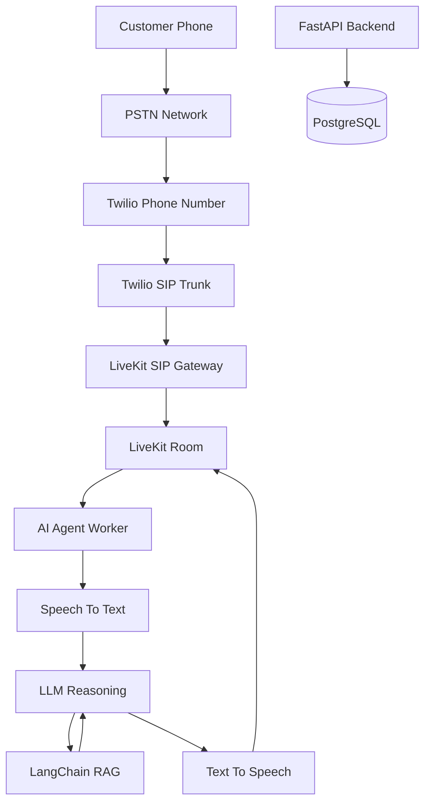

# Inbound Call Flow Architecture

**Document Version:** 1.0
**Project:** AI Voice Agent SaaS Platform
**Phase:** 04 - LiveKit Voice Platform
**Status:** Draft
**Last Updated:** 2026-07-23

---

# 1. Overview

This document defines the complete inbound call processing architecture for the AI Voice Agent SaaS platform.

An inbound call starts from a customer's phone network and travels through the telephony layer, LiveKit real-time infrastructure, Agent Runtime, and AI services.

The flow supports:

* AI receptionist scenarios
* Sales agents
* Support agents
* Booking agents
* Medical assistants
* Customer service automation

---

# 2. Inbound Call Architecture



---

# 3. Call Lifecycle

The inbound call lifecycle:

```text
 id="x8k4mv"
CALL_RECEIVED

↓

AUTHENTICATING

↓

TENANT_IDENTIFICATION

↓

AGENT_SELECTION

↓

ROOM_CREATION

↓

AGENT_CONNECTED

↓

CONVERSATION_ACTIVE

↓

CALL_COMPLETED

↓

ARCHIVED
```

---

# 4. Step-by-Step Call Flow

## Step 1 - Customer Dialing

Customer calls a business phone number.

Example:

```text
Customer

↓

+1 Business Number
```

---

## Step 2 - PSTN Routing

The telephone carrier routes the call to the configured provider.

```text
Caller

↓

PSTN Network

↓

Twilio
```

---

## Step 3 - Twilio Receives Call

Twilio identifies:

* Destination number
* Caller number
* Call direction
* SIP configuration

---

## Step 4 - SIP INVITE Generation

Twilio creates a SIP request:

```text
INVITE sip:tenant-agent@livekit
```

---

## Step 5 - LiveKit SIP Gateway

LiveKit receives the SIP connection.

Responsibilities:

* Validate SIP request
* Establish media session
* Create room

---

# 5. Tenant Identification

The platform determines:

```text
Incoming Number

↓

Phone Number Lookup

↓

Tenant ID

↓

Agent Configuration
```

Example:

```json
{
 "phone_number":"+15551234567",
 "tenant_id":"company_001",
 "agent_id":"receptionist_agent"
}
```

---

# 6. Agent Selection

The routing engine selects:

* AI agent
* Voice configuration
* Language
* Knowledge base
* Workflow

Example:

```text
Tenant

↓

Business Rules

↓

Assigned Agent
```

---

# 7. LiveKit Room Creation

A dedicated room is created:

```text
Room

tenant_001_call_12345
```

Room metadata:

```json
{
 "tenant_id":"tenant_001",
 "call_id":"12345",
 "agent":"sales_agent"
}
```

---

# 8. AI Agent Connection

The Agent Worker joins:

```text
LiveKit Room

├── Caller

└── AI Agent
```

The agent receives:

* Audio stream
* Call metadata
* Tenant context

---

# 9. Speech Processing Flow

Caller speech:

```text
Caller Voice

↓

LiveKit Audio Track

↓

STT Engine

↓

Text Transcript

↓

Agent Runtime
```

---

# 10. AI Reasoning Flow

The agent processes:

```text
User Intent

↓

LangGraph Workflow

↓

Memory Lookup

↓

RAG Retrieval

↓

LLM Response
```

---

# 11. Knowledge Retrieval

For business questions:

```text
Question

↓

LangChain

↓

Vector Search

↓

pgvector

↓

Relevant Knowledge

↓

LLM
```

---

# 12. Voice Response Flow

AI response:

```text
LLM Response

↓

TTS Engine

↓

Audio Stream

↓

LiveKit Room

↓

Caller
```

---

# 13. Conversation State

Maintain:

```text
Conversation State

├── Call ID

├── Customer Intent

├── Previous Messages

├── Retrieved Knowledge

├── Agent Actions

└── Final Outcome
```

---

# 14. Backend Events

FastAPI receives:

* Call started
* Agent joined
* Transcript updates
* Call completed
* Recording completed

---

# 15. Database Records

Created records:

```text
call_sessions

conversation_sessions

livekit_rooms

participants

transcripts

call_events
```

---

# 16. Human Transfer Flow

If escalation occurs:

```text
AI Agent

↓

Transfer Decision

↓

Find Human Agent

↓

Human Joins Room

↓

AI Leaves
```

---

# 17. Failure Handling

Possible failures:

## Agent unavailable

Action:

* Retry worker
* Fallback agent

## RAG unavailable

Action:

* Use cached knowledge
* Continue conversation

## SIP failure

Action:

* Retry connection
* Log failure

---

# 18. Security Controls

Validate:

* Caller identity
* Tenant access
* Agent permissions
* Room tokens

---

# 19. Monitoring Metrics

Track:

```text
Inbound Metrics

├── Calls Received

├── Answer Rate

├── Connection Time

├── Conversation Duration

├── AI Resolution Rate

└── Transfer Rate
```

---

# 20. Production Flow Summary

```text
Customer

↓

Twilio

↓

LiveKit SIP

↓

LiveKit Room

↓

AI Agent Worker

↓

LangGraph

↓

LangChain RAG

↓

LLM

↓

TTS

↓

Customer
```

---

# 21. Related Documents

| Document                           | Purpose               |
| ---------------------------------- | --------------------- |
| 05_Twilio_SIP_Trunk_Integration.md | Telephony integration |
| 07_Outbound_Call_Flow.md           | Outbound calls        |
| 08_Voice_Agent_Session_Model.md    | Session management    |
| 11_Call_State_Management.md        | Call lifecycle        |

---

# 22. Conclusion

The Inbound Call Flow architecture defines how a customer phone call becomes an intelligent AI conversation.

It connects:

* PSTN communication
* SIP infrastructure
* LiveKit real-time media
* AI Agent Runtime
* RAG knowledge
* Business workflows

This flow is the foundation of the AI Voice Agent SaaS platform.

---

**End of Document**
