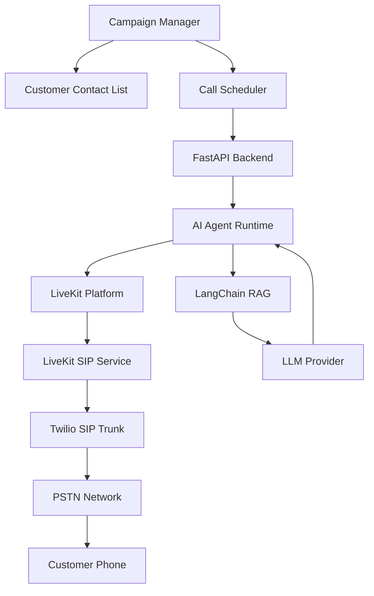
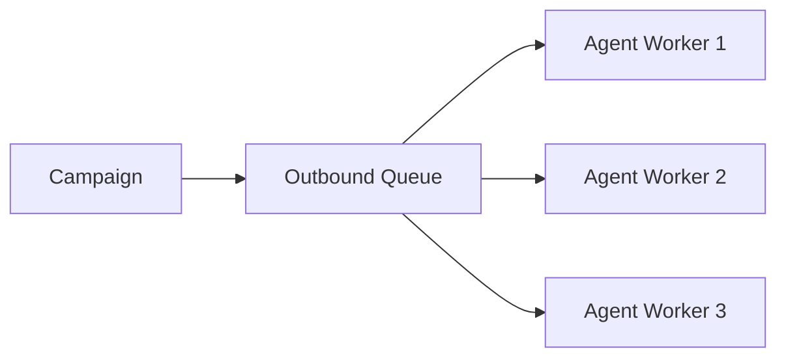

# Outbound Call Flow Architecture

**Document Version:** 1.0
**Project:** AI Voice Agent SaaS Platform
**Phase:** 04 - LiveKit Voice Platform
**Status:** Draft
**Last Updated:** 2026-07-23

---

# 1. Overview

This document defines the outbound calling architecture for the AI Voice Agent SaaS platform.

Outbound calling enables AI agents to proactively contact customers for:

* Sales campaigns
* Appointment reminders
* Lead qualification
* Customer follow-ups
* Surveys
* Notifications
* Collections

The outbound system integrates:

* Campaign management
* FastAPI backend
* Agent Runtime
* LiveKit
* Twilio SIP
* AI services

---

# 2. Outbound Call Architecture



---

# 3. Outbound Call Lifecycle

```text
CALL_CREATED

↓

QUEUED

↓

SCHEDULED

↓

DIALING

↓

RINGING

↓

CONNECTED

↓

AI_CONVERSATION

↓

COMPLETED

↓

ANALYZED
```

---

# 4. Campaign Architecture

A campaign contains:

```text
Campaign

├── Tenant

├── Name

├── Purpose

├── Contact List

├── Agent Assignment

├── Schedule

├── Calling Rules

└── Analytics
```

---

# 5. Contact Management

Customer records:

```text
Contact

├── Contact ID

├── Name

├── Phone Number

├── Status

├── Last Contact

├── Consent Status

└── Custom Attributes
```

---

# 6. Call Scheduling System

The scheduler decides:

* When to call
* Which agent to use
* Priority
* Retry policy

Example:

```text
Campaign

↓

Scheduler

↓

Call Queue

↓

Agent Worker
```

---

# 7. Call Queue Architecture



---

# 8. Call Initiation Flow

```text
Campaign Starts

↓

Select Contact

↓

Create Call Session

↓

Assign Agent

↓

Create LiveKit SIP Participant

↓

Send SIP INVITE

↓

Customer Phone Rings
```

---

# 9. LiveKit Outbound Connection

The AI agent creates an outbound SIP participant:

```text
AI Agent

↓

LiveKit Room

↓

SIP Participant

↓

Twilio

↓

Customer Phone
```

---

# 10. Twilio Call Processing

Twilio handles:

* Number selection
* PSTN connection
* Carrier routing
* Call termination

---

# 11. Agent Preparation

Before dialing, the agent loads:

```text
Agent Context

├── Customer Information

├── Previous History

├── Campaign Goal

├── Conversation Script

├── Knowledge Access

└── Tools
```

---

# 12. Customer Connection Flow

When customer answers:

```text
Customer Answers

↓

SIP Connection Established

↓

LiveKit Room Active

↓

AI Agent Joins

↓

Conversation Starts
```

---

# 13. AI Conversation Flow

```text
Customer Speech

↓

LiveKit Audio Track

↓

STT

↓

Agent Runtime

↓

LangGraph Workflow

↓

RAG Retrieval

↓

LLM

↓

TTS

↓

Customer
```

---

# 14. Retry Strategy

Failed calls:

```text
NO_ANSWER

↓

WAIT

↓

RETRY

↓

MAX_ATTEMPTS

↓

MARK_FAILED
```

---

# 15. Call Disposition

After completion:

```text
Call Result

├── Interested

├── Not Interested

├── Appointment Booked

├── Callback Requested

├── Wrong Number

└── Failed
```

---

# 16. Human Transfer

Outbound escalation:

```text
AI Agent

↓

Customer Request

↓

Transfer Decision

↓

Human Agent

↓

LiveKit Room
```

---

# 17. Compliance Controls

Outbound calling must support:

* Consent tracking
* Calling hours
* Opt-out handling
* Do-not-call lists
* Recording notification

---

# 18. Database Model

Recommended tables:

```text
campaigns

campaign_contacts

outbound_calls

call_attempts

call_dispositions

contact_preferences
```

---

# 19. Usage Tracking

Track:

```text
Outbound Usage

├── Calls Started

├── Successful Connections

├── Minutes

├── AI Tokens

├── Cost

└── Results
```

---

# 20. Monitoring

Monitor:

* Queue length
* Dial success rate
* Answer rate
* Call duration
* Agent performance
* Provider failures

---

# 21. Production Architecture

```text
Campaign System

↓

Scheduler

↓

FastAPI

↓

Agent Runtime

↓

LiveKit

↓

Twilio

↓

Customer
```

---

# 22. Scaling Strategy

Scale:

* Call workers
* Agent workers
* Queue processors
* SIP capacity

---

# 23. Future Enhancements

Future capabilities:

* Predictive dialing
* AI lead scoring
* Automatic campaign optimization
* Voice personalization
* Multi-language campaigns

---

# 24. Related Documents

| Document                          | Purpose             |
| --------------------------------- | ------------------- |
| 06_Inbound_Call_Flow.md           | Incoming calls      |
| 08_Voice_Agent_Session_Model.md   | Session model       |
| 10_Realtime_Media_Pipeline.md     | Media handling      |
| 15_LiveKit_Agent_Worker_Design.md | Worker architecture |

---

# 25. Conclusion

The Outbound Call Flow architecture enables scalable AI-powered customer outreach.

It provides:

* Automated calling
* Intelligent conversations
* Campaign management
* Enterprise voice automation

---

**End of Document**
