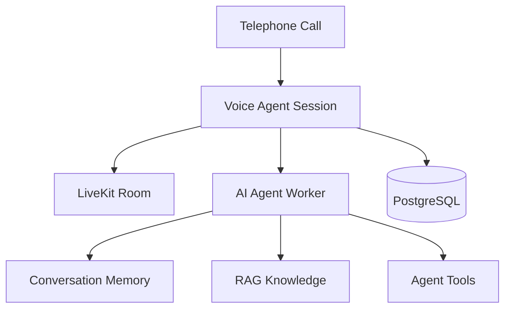
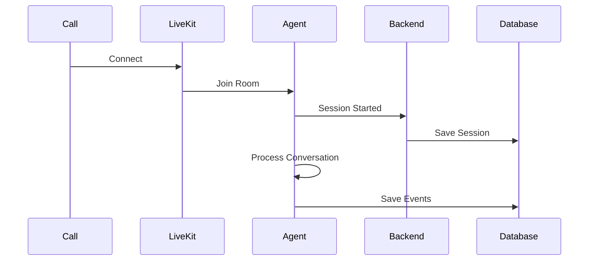

# Voice Agent Session Model

**Document Version:** 1.0
**Project:** AI Voice Agent SaaS Platform
**Phase:** 04 - LiveKit Voice Platform
**Status:** Draft
**Last Updated:** 2026-07-23

---

# 1. Overview

This document defines the session model used by the AI Voice Agent platform.

A voice session represents the complete lifecycle of an AI-powered phone interaction.

It connects:

* Telephony session
* LiveKit room
* AI agent execution
* Conversation memory
* RAG retrieval
* Tool execution
* Call analytics

---

# 2. Session Architecture



---

# 3. Session Definition

A session represents:

```text
Voice Agent Session

=

Phone Call

+

LiveKit Room

+

AI Agent Instance

+

Conversation State

+

Execution Context
```

---

# 4. Session Lifecycle

```text
CREATED

↓

INITIALIZING

↓

CONNECTING

↓

ACTIVE

↓

PROCESSING

↓

TRANSFER_PENDING

↓

COMPLETED

↓

ARCHIVED
```

---

# 5. Session Identity Model

Each session contains:

```text
Session

├── Session ID

├── Tenant ID

├── Agent ID

├── Call ID

├── Room ID

├── Customer ID

├── Created Time

└── Status
```

---

# 6. Session Creation Flow

Inbound:

```text
Customer Call

↓

Twilio SIP

↓

LiveKit SIP

↓

Create Room

↓

Create Session

↓

Assign Agent

↓

Start Conversation
```

---

# 7. Session Context

The agent receives:

```text
Session Context

├── Tenant Information

├── Customer Information

├── Agent Configuration

├── Voice Settings

├── Knowledge Base

├── Conversation History

└── Available Tools
```

---

# 8. Session State Management

Example:

```json
{
  "session_id": "sess_123",
  "status": "active",
  "tenant_id": "tenant_001",
  "agent_id": "sales_agent",
  "room_id": "room_456"
}
```

---

# 9. LiveKit Room Mapping

Relationship:

```text
One Call

↓

One Voice Session

↓

One LiveKit Room
```

Example:

```text
call_123

        |

        |

session_123

        |

        |

room_123
```

---

# 10. Agent Instance Model

Each session creates:

```text
Agent Instance

├── Agent Configuration

├── System Prompt

├── Tools

├── Memory

├── Workflow

└── Runtime State
```

---

# 11. Conversation State

Stored state:

```text
Conversation State

├── Messages

├── Current Intent

├── User Goal

├── Agent Goal

├── Retrieved Context

├── Tool Results

└── Final Outcome
```

---

# 12. Audio Session State

Track:

```text
Audio State

├── Caller Connected

├── Audio Published

├── Audio Subscribed

├── STT Active

├── TTS Active

└── Recording Active
```

---

# 13. Session Event Model

Important events:

```text
SESSION_CREATED

AGENT_JOINED

CALL_CONNECTED

USER_SPEAKING

AGENT_RESPONDING

TOOL_EXECUTED

TRANSFER_STARTED

CALL_ENDED
```

---

# 14. Event Flow



---

# 15. Session Memory

Memory layers:

```text
Memory

├── Short Term

(Current conversation)


├── Session Memory

(Current call)


└── Long Term Memory

(Customer history)
```

---

# 16. RAG Integration

During session:

```text
Customer Question

↓

Agent Runtime

↓

LangGraph

↓

LangChain Retrieval

↓

pgvector

↓

Context

↓

LLM
```

---

# 17. Tool Execution Context

Tools receive:

```json
{
 "session_id":"sess_123",
 "tenant_id":"tenant_001",
 "customer_id":"cust_001"
}
```

---

# 18. Human Handoff State

Transfer workflow:

```text
AI Agent

↓

Transfer Requested

↓

Find Human

↓

Human Joins Room

↓

AI Leaves

↓

Session Continues
```

---

# 19. Database Model

Recommended tables:

```text
voice_sessions

session_events

livekit_rooms

participants

conversation_states

agent_instances
```

---

# 20. Session Security

Every session validates:

* Tenant ownership
* Agent permissions
* Room access
* User identity

---

# 21. Session Analytics

Track:

```text
Analytics

├── Duration

├── Messages

├── Tokens

├── Retrievals

├── Tools Used

├── Outcome

└── Cost
```

---

# 22. Failure Recovery

Examples:

## Agent Failure

```text
Detect

↓

Restart Worker

↓

Reconnect Session
```

## Network Failure

```text
Reconnect

↓

Resume State

↓

Continue Conversation
```

---

# 23. Production Scaling

Scale by:

* Active sessions
* Concurrent calls
* Agent workers
* Tenant workload

---

# 24. Future Enhancements

Future capabilities:

* Session migration
* Cross-agent collaboration
* Advanced memory
* Predictive context loading

---

# 25. Related Documents

| Document                        | Purpose         |
| ------------------------------- | --------------- |
| 03_LiveKit_Room_Architecture.md | Room design     |
| 09_STT_TTS_Pipeline_Design.md   | Speech pipeline |
| 11_Call_State_Management.md     | State lifecycle |
| 05_Agent_Runtime_Platform       | AI execution    |

---

# 26. Conclusion

The Voice Agent Session Model provides the runtime foundation for every AI phone interaction.

It connects:

* LiveKit communication
* Agent execution
* Memory
* RAG
* Business workflows

This model enables scalable enterprise voice automation.

---

**End of Document**
