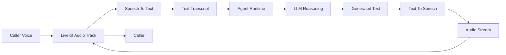

# STT and TTS Pipeline Design

**Document Version:** 1.0
**Project:** AI Voice Agent SaaS Platform
**Phase:** 04 - LiveKit Voice Platform
**Status:** Draft
**Last Updated:** 2026-07-23

---

# 1. Overview

This document defines the Speech-to-Text (STT) and Text-to-Speech (TTS) pipeline architecture for the AI Voice Agent SaaS platform.

The voice pipeline converts:

```text
Human Voice

↓

Text Understanding

↓

AI Reasoning

↓

Generated Voice Response
```

The pipeline is responsible for:

* Real-time speech recognition
* Natural language processing
* Voice generation
* Low-latency conversation

---

# 2. Voice AI Pipeline Architecture



---

# 3. Pipeline Components

```text
Voice Pipeline

├── Audio Capture

├── LiveKit Transport

├── STT Engine

├── Agent Runtime

├── LLM

├── TTS Engine

└── Audio Playback
```

---

# 4. Audio Capture Layer

The caller audio enters through:

```text
Customer Phone

↓

Twilio SIP

↓

LiveKit SIP Gateway

↓

LiveKit Audio Track
```

---

# 5. LiveKit Audio Processing

LiveKit manages:

* Audio streams
* Track publishing
* Track subscription
* Real-time transport

Example:

```text
Caller Participant

↓

Audio Track

↓

AI Agent Participant
```

---

# 6. Speech-to-Text (STT)

STT converts:

```text
Audio

↓

Text
```

Example:

Input:

```text
"Book me an appointment tomorrow"
```

Output:

```json
{
 "text": "Book me an appointment tomorrow",
 "language": "en",
 "confidence": 0.96
}
```

---

# 7. STT Requirements

Production STT must provide:

* Low latency
* Streaming transcription
* High accuracy
* Multi-language support
* Noise handling

---

# 8. STT Pipeline

```text
Audio Stream

↓

Voice Activity Detection

↓

Speech Recognition

↓

Transcript Generation

↓

Agent Runtime
```

---

# 9. Voice Activity Detection

VAD determines:

```text
Speech Started

↓

User Speaking

↓

Speech Ended
```

Benefits:

* Lower latency
* Reduced processing cost
* Better turn-taking

---

# 10. Transcript Processing

After STT:

```text
Transcript

↓

Intent Detection

↓

Context Analysis

↓

Workflow Selection
```

---

# 11. Agent Runtime Integration

The transcript enters:

```text
STT

↓

LangGraph Workflow

↓

Memory

↓

Tools

↓

RAG

↓

LLM
```

---

# 12. Text-to-Speech (TTS)

TTS converts:

```text
AI Generated Text

↓

Human-Like Voice
```

Example:

Input:

```text
"Your appointment has been confirmed."
```

Output:

```text
Audio Waveform
```

---

# 13. TTS Requirements

Production TTS requires:

* Natural voice quality
* Streaming output
* Fast generation
* Voice customization
* Multiple languages

---

# 14. TTS Pipeline

```text
LLM Response

↓

Text Processing

↓

Voice Generation

↓

Audio Stream

↓

LiveKit Track

↓

Caller
```

---

# 15. Streaming Voice Architecture

Real-time response:

```text
User Speaking

↓

Partial Transcript

↓

AI Processing

↓

Partial Response

↓

Immediate Audio Playback
```

---

# 16. Latency Optimization

Target:

```text
User Stops Speaking

↓

STT

↓

Reasoning

↓

TTS

↓

Response

< 1-2 seconds
```

---

# 17. Model Selection Strategy

Different agents may use:

```text
Simple FAQ

↓

Fast STT + Fast TTS


Complex Sales Call

↓

Higher Accuracy Models
```

---

# 18. Voice Configuration Model

Each agent can define:

```text
Voice Configuration

├── Voice Provider

├── Voice ID

├── Language

├── Speed

├── Tone

└── Emotion
```

---

# 19. Multi-Tenant Voice Settings

Example:

```text
Tenant A

↓

Professional Female Voice


Tenant B

↓

Friendly Customer Support Voice
```

---

# 20. Error Handling

Handle:

* STT failure
* TTS timeout
* Audio interruption
* Network issues
* Unsupported language

---

# 21. Interrupt Handling

Voice agents must support:

```text
AI Speaking

↓

Customer Interrupts

↓

Stop TTS

↓

Listen Again
```

---

# 22. Database Model

Recommended tables:

```text
voice_profiles

stt_configurations

tts_configurations

audio_sessions

transcription_events
```

---

# 23. Monitoring Metrics

Track:

```text
Voice Metrics

├── STT Latency

├── STT Accuracy

├── TTS Latency

├── Audio Quality

├── Interruptions

└── Failed Requests
```

---

# 24. Security

Protect:

* Audio streams
* Transcripts
* Voice recordings
* Customer information

---

# 25. Future Enhancements

Future capabilities:

* Emotion detection
* Speaker identification
* Voice cloning
* Real-time translation
* Adaptive voice style

---

# 26. Related Documents

| Document                          | Purpose             |
| --------------------------------- | ------------------- |
| 08_Voice_Agent_Session_Model.md   | Session lifecycle   |
| 10_Realtime_Media_Pipeline.md     | Media transport     |
| 15_LiveKit_Agent_Worker_Design.md | Agent workers       |
| 03_RAG_Knowledge_Platform         | Knowledge retrieval |

---

# 27. Conclusion

The STT/TTS Pipeline provides the real-time voice intelligence layer connecting human speech with AI reasoning.

It enables:

* Natural conversations
* Low-latency responses
* Scalable voice automation
* Enterprise voice experiences

---

**End of Document**
