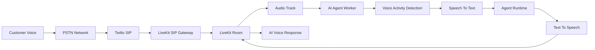
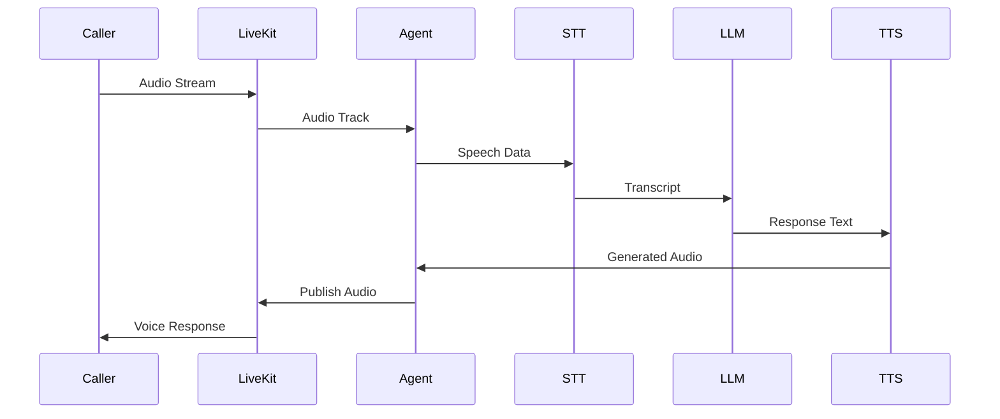

# Real-Time Media Pipeline Architecture

**Document Version:** 1.0
**Project:** AI Voice Agent SaaS Platform
**Phase:** 04 - LiveKit Voice Platform
**Status:** Draft
**Last Updated:** 2026-07-23

---

# 1. Overview

This document defines the real-time media pipeline architecture used by the AI Voice Agent SaaS platform.

The media pipeline is responsible for moving voice data between:

* Telephone networks
* LiveKit infrastructure
* AI voice agents
* Speech processing services
* Human operators

The primary goal is to provide:

* Ultra-low latency communication
* Reliable audio streaming
* Real-time interruption handling
* Scalable voice processing

---

# 2. Media Pipeline Architecture



---

# 3. Media Layer Responsibilities

The media layer manages:

```text
Media Platform

├── Audio Transport

├── Encoding

├── Streaming

├── Synchronization

├── Buffering

├── Quality Control

└── Routing
```

---

# 4. Audio Flow Model

Inbound audio:

```text
Customer Speech

↓

Phone Network

↓

SIP RTP Stream

↓

LiveKit

↓

Audio Track

↓

AI Agent
```

Outbound audio:

```text
AI Response

↓

TTS Generated Audio

↓

LiveKit Audio Track

↓

SIP RTP Stream

↓

Customer Phone
```

---

# 5. Media Components

## RTP Media

RTP carries real-time audio:

```text
RTP Packet

├── Sequence Number

├── Timestamp

├── Payload

└── Audio Data
```

---

## LiveKit Transport

LiveKit manages:

* WebRTC media transport
* Audio tracks
* Participant streams
* Network adaptation

---

# 6. Audio Track Architecture

A LiveKit room contains:

```text
Room

├── Caller Audio Track

├── AI Agent Audio Track

└── Human Agent Audio Track
```

---

# 7. Track Lifecycle

```text
TRACK_CREATED

↓

TRACK_PUBLISHED

↓

TRACK_SUBSCRIBED

↓

ACTIVE_STREAMING

↓

TRACK_UNPUBLISHED

↓

TRACK_REMOVED
```

---

# 8. Real-Time Processing Pipeline



---

# 9. Latency Budget

Target voice latency:

```text
Audio Capture

+

STT Processing

+

AI Reasoning

+

TTS Generation

+

Network Delay


Target:

< 1000-2000ms
```

---

# 10. Audio Buffer Management

The system manages:

* Input buffers
* Output buffers
* Packet ordering
* Jitter handling

---

# 11. Jitter Handling

Network variation can cause:

```text
Packet Arrival

10ms

30ms

15ms

50ms
```

The system uses:

* Jitter buffers
* Packet reordering
* Adaptive playback

---

# 12. Voice Activity Detection Integration

VAD controls conversation flow:

```text
Silence

↓

Speech Detection

↓

Processing

↓

Response

↓

Listening
```

---

# 13. Barge-In Handling

Users can interrupt AI responses.

Flow:

```text
AI Speaking

↓

Customer Starts Speaking

↓

Detect Voice Activity

↓

Stop TTS Playback

↓

Process New Input
```

---

# 14. Echo Cancellation

Required protections:

* Acoustic echo cancellation
* Noise suppression
* Gain control

---

# 15. Audio Quality Monitoring

Monitor:

```text
Audio Quality

├── Packet Loss

├── Jitter

├── Latency

├── Bitrate

├── Disconnects

└── MOS Score
```

---

# 16. Media Session State

Example:

```json
{
  "room_id":"room_123",
  "audio_state":"active",
  "caller_track":"published",
  "agent_track":"subscribed"
}
```

---

# 17. Media Failure Recovery

Examples:

## Network Interruption

```text
Connection Lost

↓

Reconnect

↓

Resume Session
```

---

## Agent Failure

```text
Agent Crash

↓

Restart Worker

↓

Restore Session State
```

---

# 18. Recording Integration

Media recording:

```text
LiveKit Room

↓

Audio Capture

↓

Recording Service

↓

Storage

↓

Call Archive
```

---

# 19. Security Controls

Protect media using:

* Encrypted transport
* Secure tokens
* Access-controlled rooms
* Tenant isolation

---

# 20. Scaling Architecture

```text
Load Balancer

↓

LiveKit Cluster

↓

Multiple Rooms

↓

Agent Workers
```

---

# 21. Database Tracking

Recommended entities:

```text
media_sessions

audio_tracks

media_events

recordings

quality_metrics
```

---

# 22. Observability

Collect:

* Media statistics
* Connection events
* Audio failures
* Latency measurements

---

# 23. Future Enhancements

Future capabilities:

* AI audio enhancement
* Real-time translation
* Advanced noise removal
* Multi-party voice sessions

---

# 24. Related Documents

| Document                          | Purpose         |
| --------------------------------- | --------------- |
| 03_LiveKit_Room_Architecture.md   | Room management |
| 09_STT_TTS_Pipeline_Design.md     | Speech pipeline |
| 11_Call_State_Management.md       | Call states     |
| 12_Call_Recording_Architecture.md | Recording       |

---

# 25. Conclusion

The Real-Time Media Pipeline is the foundation that enables natural AI voice conversations.

It provides:

* Reliable audio transport
* Low-latency processing
* Real-time interaction
* Enterprise voice quality

---

**End of Document**
