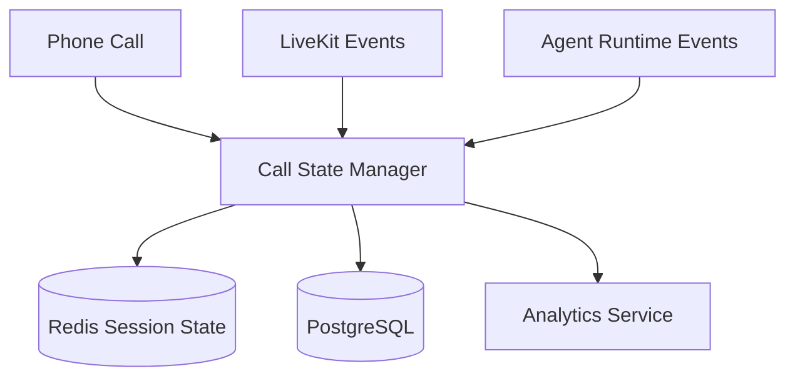
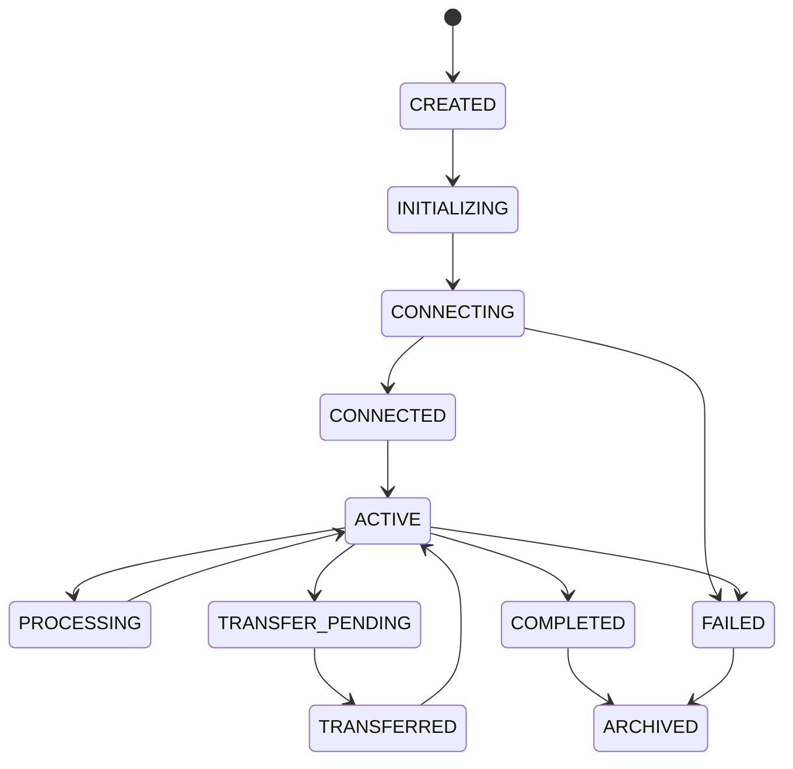

# Call State Management Architecture

**Document Version:** 1.0
**Project:** AI Voice Agent SaaS Platform
**Phase:** 04 - LiveKit Voice Platform
**Status:** Draft
**Last Updated:** 2026-07-23

---

# 1. Overview

This document defines the call state management architecture for the AI Voice Agent SaaS platform.

Call state management tracks the complete lifecycle of a voice interaction from the initial phone connection until final archival.

It provides:

* Reliable call tracking
* Workflow control
* Failure recovery
* Analytics
* Audit history

---

# 2. Call State Architecture



---

# 3. Call Lifecycle

A call moves through defined states:

```text
CREATED

↓

INITIALIZING

↓

CONNECTING

↓

CONNECTED

↓

ACTIVE

↓

PROCESSING

↓

TRANSFER_PENDING

↓

TRANSFERRED

↓

COMPLETED

↓

FAILED

↓

ARCHIVED
```

---

# 4. State Machine Model



---

# 5. State Definitions

## CREATED

Call request exists.

Stored:

* Call ID
* Tenant ID
* Direction
* Phone number

---

## INITIALIZING

System prepares:

* Agent configuration
* Routing rules
* Session context

---

## CONNECTING

Communication setup:

* SIP negotiation
* LiveKit room creation
* Agent connection

---

## CONNECTED

The call connection is established.

Participants:

```text
LiveKit Room

├── Caller

└── AI Agent
```

---

## ACTIVE

Normal conversation state.

Activities:

* Speech processing
* AI reasoning
* Tool execution
* Memory updates

---

## PROCESSING

Temporary state during:

* STT processing
* RAG retrieval
* LLM generation
* TTS generation

---

## TRANSFER_PENDING

The AI decides:

* Human required
* Escalation needed
* Customer requested agent

---

## TRANSFERRED

Human agent joins:

```text
Room

├── Caller

├── Human Agent

└── AI Agent (optional)
```

---

## COMPLETED

Conversation ended normally.

Actions:

* Save transcript
* Save recording
* Calculate usage

---

## FAILED

Unexpected termination:

Examples:

* SIP failure
* Network issue
* Agent crash

---

## ARCHIVED

Final state.

Data moved to:

* Analytics
* Billing
* Reporting

---

# 6. State Storage Strategy

Use two storage layers:

```text
Fast State

↓

Redis


Permanent State

↓

PostgreSQL
```

---

# 7. Redis Session State

Redis stores:

```json
{
 "call_id":"call_123",
 "state":"ACTIVE",
 "room_id":"room_456",
 "agent_id":"sales_agent"
}
```

Purpose:

* Fast lookup
* Real-time updates
* Worker coordination

---

# 8. PostgreSQL Call Record

Permanent record:

```text
call_sessions

├── id

├── tenant_id

├── caller_number

├── direction

├── state

├── started_at

├── ended_at

└── duration
```

---

# 9. State Transition Events

Every change creates an event:

```json
{
 "event":"CALL_CONNECTED",
 "call_id":"call_123",
 "timestamp":"2026-07-23T10:00:00Z"
}
```

---

# 10. Event Timeline

Example:

```text
10:00:00 CALL_CREATED

10:00:02 CONNECTING

10:00:05 CONNECTED

10:00:06 AGENT_JOINED

10:05:20 TRANSFER_REQUESTED

10:06:00 COMPLETED
```

---

# 11. Integration With LiveKit

LiveKit events update state:

Examples:

```text
Participant Joined

↓

CALL_CONNECTED


Room Closed

↓

CALL_COMPLETED
```

---

# 12. Integration With Agent Runtime

Agent events:

```text
AI_STARTED

USER_SPEAKING

TOOL_CALLED

RESPONSE_GENERATED

TRANSFER_REQUIRED
```

---

# 13. Idempotency

State updates must be safe.

Example:

```text
CALL_COMPLETED

received twice

↓

Ignore duplicate
```

---

# 14. Concurrency Handling

Multiple systems may update calls:

Sources:

* LiveKit
* Agent Worker
* Backend API
* Webhooks

Solution:

* Event ordering
* Version numbers
* Distributed locks

---

# 15. Failure Recovery

Example:

```text
Agent Worker Crash

↓

Detect Missing Heartbeat

↓

Restore Session State

↓

Restart Agent

↓

Continue Call
```

---

# 16. Call Termination Flow

```text
Customer Hangs Up

↓

LiveKit Event

↓

Update State

↓

Stop Agent

↓

Save Transcript

↓

Store Recording

↓

Archive
```

---

# 17. Human Transfer State

Transfer process:

```text
ACTIVE

↓

TRANSFER_PENDING

↓

HUMAN_CONNECTED

↓

AI_DISCONNECTED

↓

ACTIVE
```

---

# 18. Billing Integration

Call states trigger usage:

```text
CONNECTED

↓

Start Billing Timer


COMPLETED

↓

Calculate Usage
```

---

# 19. Monitoring Metrics

Track:

```text
Call Metrics

├── Active Calls

├── Failed Calls

├── Average Duration

├── Transfer Rate

├── Completion Rate

└── Error Rate
```

---

# 20. Security

Protect:

* Call metadata
* Customer information
* Tenant boundaries
* Event history

---

# 21. Database Tables

Recommended:

```text
call_sessions

call_state_events

call_participants

call_events

call_failures
```

---

# 22. Future Enhancements

Future capabilities:

* AI-driven recovery
* Automatic fallback routing
* Predictive failure detection
* Advanced call analytics

---

# 23. Related Documents

| Document                          | Purpose        |
| --------------------------------- | -------------- |
| 08_Voice_Agent_Session_Model.md   | Session model  |
| 10_Realtime_Media_Pipeline.md     | Media handling |
| 12_Call_Recording_Architecture.md | Recording      |
| 15_LiveKit_Agent_Worker_Design.md | Agent workers  |

---

# 24. Conclusion

The Call State Management Architecture provides reliable lifecycle control for every voice interaction.

It ensures:

* Correct session tracking
* Fault tolerance
* Accurate analytics
* Production-grade call handling

---

**End of Document**
