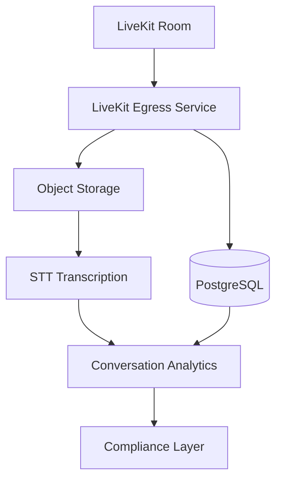

# Call Recording Architecture

**Document Version:** 1.0
**Project:** AI Voice Agent SaaS Platform
**Phase:** 04 - LiveKit Voice Platform
**Status:** Draft
**Last Updated:** 2026-07-23

---

# 1. Overview

This document defines the call recording architecture for the AI Voice Agent SaaS platform.

Call recording captures and stores voice interactions for:

* Quality assurance
* Customer support review
* Compliance requirements
* AI analysis
* Training improvements
* Conversation intelligence

The recording system integrates with:

* LiveKit Egress
* Object Storage
* PostgreSQL metadata
* Transcription services
* Analytics pipeline

---

# 2. Recording Architecture



---

# 3. Recording Objectives

The system must provide:

* Reliable recording capture
* Secure storage
* Fast retrieval
* Tenant isolation
* Retention management
* Compliance controls

---

# 4. Recording Lifecycle

```text
RECORDING_PENDING

↓

STARTING

↓

ACTIVE

↓

PROCESSING

↓

AVAILABLE

↓

ARCHIVED

↓

DELETED
```

---

# 5. Recording Start Flow

```text
Call Connected

↓

LiveKit Room Active

↓

Recording Policy Checked

↓

Start Egress

↓

Capture Audio

↓

Store Recording
```

---

# 6. Recording End Flow

```text
Call Completed

↓

Stop Recording

↓

Finalize File

↓

Generate Metadata

↓

Create Transcript

↓

Store Archive
```

---

# 7. LiveKit Egress Architecture

LiveKit Egress handles:

* Room recording
* Audio capture
* File generation
* Recording lifecycle

Architecture:

```text
LiveKit Room

↓

Egress Worker

↓

Recording File

↓

Storage
```

---

# 8. Recording Formats

Supported formats:

```text
Audio:

├── WAV

├── MP3

└── OGG


Video (Future):

├── MP4

└── WebM
```

For voice agents:

Recommended:

```text
Mono WAV

16kHz

PCM Audio
```

---

# 9. Storage Architecture

Recommended:

```text
LiveKit Egress

↓

Object Storage

↓

Recording Archive
```

Storage options:

* AWS S3
* Google Cloud Storage
* Azure Blob Storage
* Self-hosted S3 compatible storage

---

# 10. Recording Metadata Model

Example:

```json
{
  "recording_id":"rec_123",
  "call_id":"call_456",
  "tenant_id":"tenant_001",
  "duration":320,
  "format":"wav",
  "storage_path":"recordings/2026/07/call_456.wav"
}
```

---

# 11. Database Design

Recommended tables:

```text
recordings

recording_files

recording_events

retention_policies

storage_locations
```

---

# 12. Recording Permissions

Access controlled by:

```text
Tenant

↓

User Role

↓

Permission

↓

Recording Access
```

Roles:

* Tenant Admin
* Supervisor
* Agent
* Auditor

---

# 13. Multi-Tenant Isolation

Recording path:

```text
storage/

├── tenant_001/

│   └── recordings/

├── tenant_002/

│   └── recordings/
```

---

# 14. Recording Security

Protect recordings using:

* Encryption at rest
* Encryption in transit
* Signed URLs
* Access policies
* Audit logging

---

# 15. Retention Policy

Each tenant can configure:

```text
Retention Policy

├── Keep Duration

├── Auto Delete

├── Archive Rules

└── Compliance Requirements
```

Example:

```text
Standard:

90 Days


Enterprise:

7 Years
```

---

# 16. Transcript Integration

Recording pipeline:

```text
Audio Recording

↓

Speech-to-Text

↓

Transcript

↓

Conversation Analysis
```

---

# 17. AI Analysis Pipeline

After recording:

```text
Recording

↓

Transcript

↓

LLM Analysis

↓

Insights

↓

CRM Updates
```

---

# 18. Quality Analysis

Analyze:

* Agent performance
* Customer sentiment
* Resolution rate
* Compliance adherence

---

# 19. Recording Events

Track:

```text
RECORDING_STARTED

RECORDING_STOPPED

RECORDING_FAILED

RECORDING_READY

RECORDING_DELETED
```

---

# 20. Failure Handling

## Storage Failure

```text
Recording Failed

↓

Retry Upload

↓

Alert System
```

---

## Egress Failure

```text
Egress Error

↓

Restart Worker

↓

Resume Recording
```

---

# 21. Monitoring Metrics

Track:

```text
Recording Metrics

├── Active Recordings

├── Failed Recordings

├── Storage Usage

├── Processing Time

└── Retrieval Count
```

---

# 22. Compliance Considerations

Support:

* Recording consent
* Regional requirements
* Data deletion requests
* Audit history

---

# 23. Billing Integration

Storage usage:

```text
Tenant

↓

Recording Minutes

↓

Storage Size

↓

Monthly Cost
```

---

# 24. Future Enhancements

Future capabilities:

* Real-time transcription
* Automatic summaries
* AI coaching
* Redaction of sensitive data
* Voice analytics

---

# 25. Related Documents

| Document                      | Purpose           |
| ----------------------------- | ----------------- |
| 09_STT_TTS_Pipeline_Design.md | Speech processing |
| 11_Call_State_Management.md   | Call lifecycle    |
| 13_Conversation_Analytics.md  | AI analysis       |
| 37_Observability              | Monitoring        |

---

# 26. Conclusion

The Call Recording Architecture provides secure and scalable storage of AI voice conversations.

It enables:

* Compliance
* Quality monitoring
* AI analysis
* Enterprise reporting

---

**End of Document**
