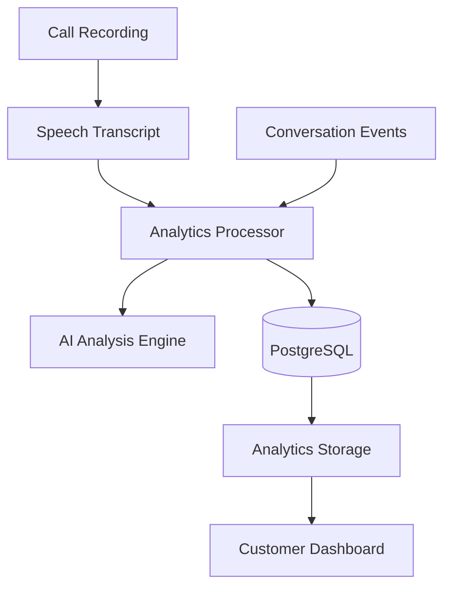

# Conversation Analytics Architecture

**Document Version:** 1.0
**Project:** AI Voice Agent SaaS Platform
**Phase:** 04 - LiveKit Voice Platform
**Status:** Draft
**Last Updated:** 2026-07-23

---

# 1. Overview

This document defines the conversation analytics architecture for the AI Voice Agent SaaS platform.

Conversation analytics transforms raw voice interactions into actionable business intelligence.

The analytics system processes:

* Audio recordings
* Transcripts
* Agent actions
* Customer intent
* Sentiment
* Outcomes
* Performance metrics

---

# 2. Analytics Architecture



---

# 3. Analytics Objectives

The system provides:

* Call summaries
* Customer intent detection
* Agent performance scoring
* Sentiment analysis
* Quality monitoring
* Business insights

---

# 4. Analytics Pipeline

```text
Call Completed

↓

Recording Available

↓

Transcript Generated

↓

Conversation Processing

↓

AI Analysis

↓

Metrics Stored

↓

Dashboard Display
```

---

# 5. Conversation Data Model

A conversation contains:

```text
Conversation

├── Call Session

├── Participants

├── Transcript

├── Events

├── Actions

├── Outcome

└── Analytics Results
```

---

# 6. Transcript Processing

Input:

```text
Customer:
"I need to schedule an appointment"

Agent:
"I can help you with that"
```

Processing:

```text
Transcript

↓

Language Processing

↓

Intent Detection

↓

Entity Extraction

↓

Summary Generation
```

---

# 7. Intent Analysis

Identify:

* Customer goal
* Reason for calling
* Requested action
* Buying signals

Example:

```json
{
 "intent":"appointment_booking",
 "confidence":0.94
}
```

---

# 8. Entity Extraction

Extract business information:

```text
Entities

├── Customer Name

├── Date

├── Location

├── Product

├── Order Number

└── Account ID
```

---

# 9. Sentiment Analysis

Analyze:

```text
Customer Emotion

├── Positive

├── Neutral

├── Negative

└── Frustrated
```

Example:

```json
{
 "sentiment":"positive",
 "score":0.86
}
```

---

# 10. Call Summary Generation

AI generates:

```text
Summary

├── Reason For Call

├── Discussion Points

├── Actions Taken

├── Next Steps

└── Final Outcome
```

---

# 11. Agent Performance Analytics

Measure:

```text
Agent Metrics

├── Response Time

├── Accuracy

├── Resolution Rate

├── Transfer Rate

├── Customer Satisfaction

└── Compliance Score
```

---

# 12. Customer Analytics

Track:

```text
Customer Insights

├── Previous Calls

├── Preferences

├── Problems

├── Purchase Intent

└── History
```

---

# 13. AI Quality Evaluation

The AI evaluator checks:

* Correct responses
* Policy compliance
* Conversation quality
* Goal completion

Example:

```text
Score:

87/100
```

---

# 14. RAG Analytics

Track knowledge usage:

```text
Question

↓

Retrieved Documents

↓

Answer

↓

Feedback
```

Metrics:

* Retrieval accuracy
* Citation usage
* Missing knowledge

---

# 15. Tool Usage Analytics

Track:

```text
Tool Execution

├── Tool Name

├── Success

├── Duration

├── Errors

└── Result
```

---

# 16. Conversation Timeline

Example:

```text
10:00:01 Call Started

10:00:05 Greeting

10:01:10 Intent Detected

10:02:30 Tool Executed

10:03:20 Appointment Created

10:04:00 Call Completed
```

---

# 17. Database Model

Recommended tables:

```text
conversation_analytics

conversation_summaries

sentiment_scores

intent_results

agent_scores

quality_reviews
```

---

# 18. Analytics Processing Architecture

```text
Real-Time

↓

Redis Streams

↓

Event Processor


Batch

↓

Data Pipeline

↓

Analytics Database
```

---

# 19. Dashboard Metrics

Customer dashboard displays:

```text
Overview

├── Total Calls

├── Successful Calls

├── Average Duration

├── Resolution Rate

├── Customer Sentiment

└── Agent Performance
```

---

# 20. Multi-Tenant Analytics

Every metric includes:

```json
{
 "tenant_id":"tenant_001",
 "metric":"resolution_rate"
}
```

---

# 21. Privacy Controls

Protect:

* Audio data
* Transcripts
* Customer information

Controls:

* Data masking
* Access permissions
* Retention rules

---

# 22. Event-Driven Analytics

Sources:

```text
LiveKit Events

+

Agent Events

+

Tool Events

+

Conversation Events
```

---

# 23. Monitoring

Track:

```text
Analytics Metrics

├── Processing Time

├── Failed Jobs

├── AI Accuracy

├── Storage Usage

└── Queue Size
```

---

# 24. Future Enhancements

Future capabilities:

* Predictive customer behavior
* Automated coaching
* Sales intelligence
* Real-time supervisor alerts
* Advanced scoring models

---

# 25. Related Documents

| Document                          | Purpose             |
| --------------------------------- | ------------------- |
| 12_Call_Recording_Architecture.md | Recording system    |
| 08_Voice_Agent_Session_Model.md   | Session data        |
| 03_RAG_Knowledge_Platform.md      | Knowledge analytics |
| 37_Observability                  | Monitoring          |

---

# 26. Conclusion

Conversation Analytics converts voice interactions into measurable business intelligence.

It enables:

* Better customer experiences
* AI improvement
* Agent optimization
* Enterprise reporting

---

**End of Document**
