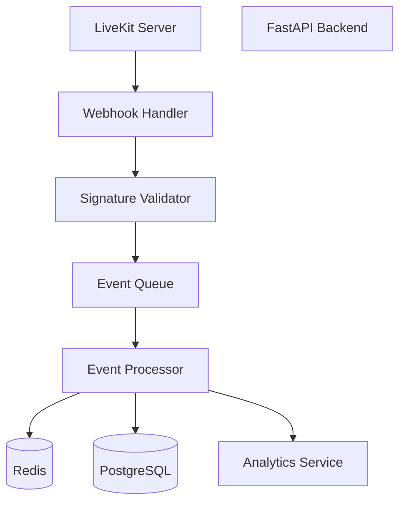

# LiveKit Webhook Event Architecture

**Document Version:** 1.0
**Project:** AI Voice Agent SaaS Platform
**Phase:** 04 - LiveKit Voice Platform
**Status:** Draft
**Last Updated:** 2026-07-23

---

# 1. Overview

This document defines the LiveKit webhook event architecture used by the AI Voice Agent SaaS platform.

LiveKit webhooks provide asynchronous notifications about real-time communication events.

The webhook system allows the backend platform to react to:

* Room lifecycle events
* Participant events
* Track events
* Recording events
* SIP events
* Agent events

---

# 2. Webhook Architecture



---

# 3. Webhook Objectives

The webhook system provides:

* Event-driven architecture
* Reliable state synchronization
* Real-time call tracking
* Audit history
* Integration triggers

---

# 4. Webhook Event Flow

```text
LiveKit Event

↓

Webhook Delivery

↓

Signature Verification

↓

Event Validation

↓

Event Queue

↓

Business Processing

↓

Database Update
```

---

# 5. Supported Event Categories

```text
LiveKit Events

├── Room Events

├── Participant Events

├── Track Events

├── Recording Events

├── SIP Events

└── Agent Events
```

---

# 6. Room Events

## Room Created

Triggered when:

* New voice session starts

Example:

```json
{
 "event":"room_started",
 "room":"tenant_001_call_123"
}
```

---

## Room Finished

Triggered when:

* Call ends
* Room closes

Actions:

* Update call state
* Stop agent
* Save analytics

---

# 7. Participant Events

Track:

```text
Participant Events

├── Joined

├── Left

├── Connection Changed

└── Permissions Changed
```

Example:

```json
{
 "event":"participant_joined",
 "participant":"AI_AGENT"
}
```

---

# 8. Track Events

Track lifecycle:

```text
Track Published

↓

Track Subscribed

↓

Track Unpublished
```

Used for:

* Audio monitoring
* Media state
* Debugging

---

# 9. Recording Events

Recording events:

```text
RECORDING_STARTED

RECORDING_PROGRESS

RECORDING_COMPLETED

RECORDING_FAILED
```

Actions:

* Store metadata
* Update recording state
* Trigger processing

---

# 10. SIP Events

SIP related events:

```text
SIP_CONNECTED

SIP_DISCONNECTED

SIP_FAILED

SIP_TRANSFERRED
```

Used for:

* Telephony monitoring
* Failure handling

---

# 11. Agent Events

Agent lifecycle:

```text
AGENT_CONNECTED

AGENT_READY

AGENT_DISCONNECTED

AGENT_ERROR
```

---

# 12. Webhook Security

All webhook requests must validate:

* Signature
* Timestamp
* Source
* Payload integrity

Flow:

```text
Request

↓

Verify Signature

↓

Accept Event

↓

Process
```

---

# 13. FastAPI Webhook Endpoint

Example:

```text
POST /api/webhooks/livekit
```

Request:

```json
{
 "event":"room_finished",
 "room":"room_123",
 "timestamp":"2026-07-23T10:00:00Z"
}
```

---

# 14. Event Processing Model

Events should be processed asynchronously.

Architecture:

```text
Webhook Receiver

↓

Message Queue

↓

Worker

↓

Database
```

Benefits:

* Faster response
* Retry support
* Failure isolation

---

# 15. Event Storage

Store all events:

```text
livekit_events

├── id

├── event_type

├── payload

├── room_id

├── tenant_id

├── processed_at

└── status
```

---

# 16. Idempotent Processing

The same webhook may arrive multiple times.

Example:

```text
ROOM_FINISHED

received twice

↓

Process once

↓

Ignore duplicate
```

---

# 17. Retry Strategy

Failed processing:

```text
Event Failed

↓

Retry Queue

↓

Retry Processing

↓

Dead Letter Queue
```

---

# 18. Event Ordering

Maintain order using:

* Event timestamps
* Sequence numbers
* Version checks

Example:

```text
Participant Joined

must happen before

Participant Left
```

---

# 19. Integration With Call State

Example:

```text
LiveKit:

Room Finished

↓

Webhook

↓

Call State Manager

↓

CALL_COMPLETED
```

---

# 20. Integration With Analytics

Events trigger:

* Metrics updates
* Conversation analysis
* Usage tracking

---

# 21. Monitoring

Track:

```text
Webhook Metrics

├── Events Received

├── Processing Time

├── Failed Events

├── Retry Count

└── Queue Size
```

---

# 22. Failure Handling

Possible failures:

* Invalid signature
* Backend unavailable
* Database failure
* Queue failure

Recovery:

* Retry
* Alert
* Manual replay

---

# 23. Multi-Tenant Processing

Every event must contain:

```json
{
 "tenant_id":"tenant_001",
 "room_id":"room_123"
}
```

Tenant isolation is mandatory.

---

# 24. Future Enhancements

Future capabilities:

* Real-time event streaming
* Advanced event replay
* Event sourcing architecture
* Cross-region processing

---

# 25. Related Documents

| Document                          | Purpose          |
| --------------------------------- | ---------------- |
| 11_Call_State_Management.md       | Call lifecycle   |
| 12_Call_Recording_Architecture.md | Recording events |
| 13_Conversation_Analytics.md      | Analytics        |
| 15_LiveKit_Agent_Worker_Design.md | Agent runtime    |

---

# 26. Conclusion

The LiveKit Webhook Event Architecture provides the event backbone for the voice platform.

It ensures:

* Reliable synchronization
* Real-time updates
* Fault-tolerant processing
* Production-grade observability

---

**End of Document**
