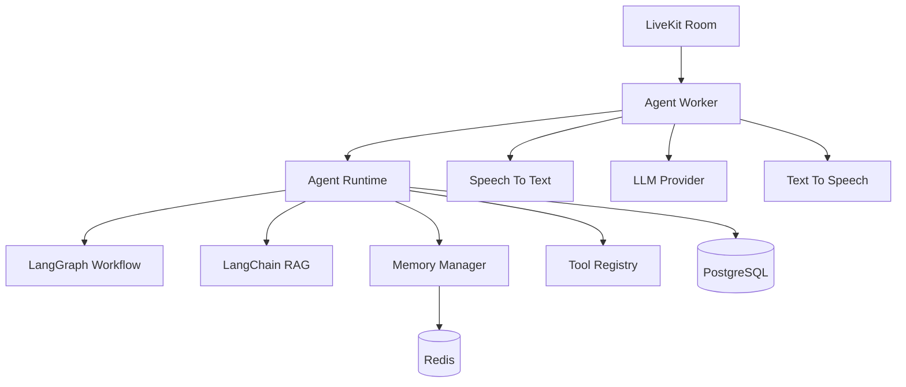
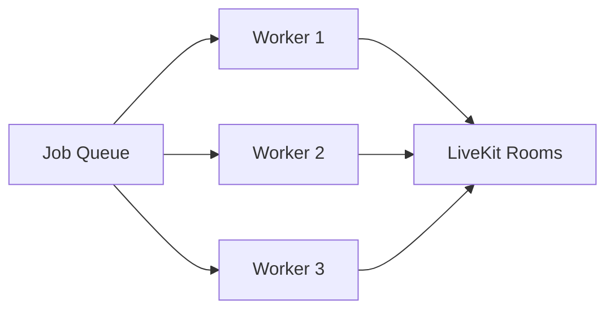

# LiveKit Agent Worker Design

**Document Version:** 1.0
**Project:** AI Voice Agent SaaS Platform
**Phase:** 04 - LiveKit Voice Platform
**Status:** Draft
**Last Updated:** 2026-07-23

---

# 1. Overview

This document defines the architecture and runtime design of LiveKit Agent Workers.

Agent Workers are the execution layer responsible for running AI voice agents inside LiveKit rooms.

They provide:

* Real-time conversation processing
* STT/TTS integration
* LLM reasoning
* LangGraph workflow execution
* LangChain RAG retrieval
* Tool execution
* Memory management

---

# 2. Agent Worker Architecture



---

# 3. Agent Worker Responsibilities

The worker manages:

```text id="0e8i2x"
Agent Worker

├── Connect to LiveKit

├── Receive Audio

├── Run AI Pipeline

├── Manage State

├── Execute Tools

├── Handle Errors

└── Disconnect Cleanly
```

---

# 4. Worker Lifecycle

```text id="t3az0p"
STARTING

↓

REGISTERING

↓

WAITING

↓

ASSIGNED

↓

CONNECTING

↓

ACTIVE

↓

PROCESSING

↓

STOPPING

↓

TERMINATED
```

---

# 5. Worker Startup Flow

```text id="8xq3mx"
Application Start

↓

Load Configuration

↓

Initialize Models

↓

Connect LiveKit

↓

Register Worker

↓

Wait For Jobs
```

---

# 6. Job Assignment Model

A worker receives:

```json id="1g8w1b"
{
 "job_id":"job_123",
 "room_id":"room_456",
 "agent_id":"sales_agent",
 "tenant_id":"tenant_001"
}
```

---

# 7. Worker Connection Flow

```text id="0h3tq7"
Job Received

↓

Validate Context

↓

Join LiveKit Room

↓

Subscribe Audio

↓

Initialize Agent

↓

Start Conversation
```

---

# 8. Agent Runtime Components

Each worker loads:

```text id="4qf7yv"
Agent Runtime

├── System Prompt

├── Agent Configuration

├── Conversation State

├── Memory

├── Tools

├── Knowledge Base

└── Policies
```

---

# 9. LangGraph Integration

LangGraph controls:

```text id="5m1v8x"
Conversation Workflow

START

↓

Understand Intent

↓

Retrieve Context

↓

Execute Action

↓

Generate Response

↓

END
```

---

# 10. LangChain RAG Integration

The worker connects to:

```text id="8x5gqm"
User Question

↓

LangChain Retriever

↓

Vector Database

(pgvector)

↓

Relevant Documents

↓

LLM Context
```

---

# 11. Memory Integration

Memory layers:

```text id="3n5r1h"
Short-Term Memory

Current Conversation


Session Memory

Current Call


Long-Term Memory

Customer History
```

Storage:

```text id="1lq4nw"
Redis

+

PostgreSQL
```

---

# 12. Tool Execution

Workers execute:

Examples:

* CRM lookup
* Appointment booking
* Payment processing
* Calendar access
* Database queries

Flow:

```text id="x6c3pv"
LLM Decision

↓

Tool Registry

↓

Tool Execution

↓

Result

↓

LLM
```

---

# 13. Worker Pool Architecture

Production:



---

# 14. Horizontal Scaling

Scale workers based on:

* Active calls
* CPU usage
* Memory usage
* Concurrent sessions

Example:

```text id="u6r3jz"
10 Active Calls

↓

5 Workers


100 Active Calls

↓

50 Workers
```

---

# 15. Worker Isolation

Each worker session is isolated:

```text id="z4x7hm"
Tenant A

↓

Agent Worker A


Tenant B

↓

Agent Worker B
```

---

# 16. Health Monitoring

Workers expose:

```text id="h5q8kd"
Health

├── Status

├── Active Calls

├── Memory Usage

├── CPU Usage

├── Latency

└── Errors
```

---

# 17. Failure Recovery

Worker failure:

```text id="w3p9cz"
Worker Crash

↓

Detect Failure

↓

Save State

↓

Restart Worker

↓

Reconnect Session
```

---

# 18. Configuration Model

Agent configuration:

```json id="p6y3r9"
{
 "agent_id":"support_agent",
 "voice":"professional",
 "language":"en",
 "model":"gpt",
 "knowledge_base":"support_docs"
}
```

---

# 19. Security

Workers must enforce:

* Tenant isolation
* Secure tokens
* Tool permissions
* Data access rules

---

# 20. Logging

Worker logs:

```text id="k9x2mv"
Logs

├── Session Start

├── Model Calls

├── Tool Calls

├── Errors

├── Latency

└── Shutdown
```

---

# 21. Cost Tracking

Measure:

* LLM tokens
* STT usage
* TTS characters
* Call duration
* Worker resources

---

# 22. Deployment Model

Recommended:

```text id="m8k3fq"
Docker Container

↓

Kubernetes Pod

↓

Agent Worker Instance
```

---

# 23. Future Enhancements

Future capabilities:

* Dynamic worker scaling
* Multi-model routing
* GPU acceleration
* Agent collaboration
* Regional deployment

---

# 24. Related Documents

| Document                        | Purpose               |
| ------------------------------- | --------------------- |
| 08_Voice_Agent_Session_Model.md | Session management    |
| 09_STT_TTS_Pipeline_Design.md   | Voice pipeline        |
| 03_RAG_Knowledge_Platform.md    | Knowledge system      |
| 31_Proto_gRPC_Definitions       | Service communication |

---

# 25. Conclusion

LiveKit Agent Workers are the execution engine of the AI Voice Agent platform.

They connect:

* LiveKit real-time communication
* LangGraph workflows
* LangChain RAG
* LLM reasoning
* Business tools

This architecture enables scalable, production-grade AI voice automation.

---

**End of Document**
